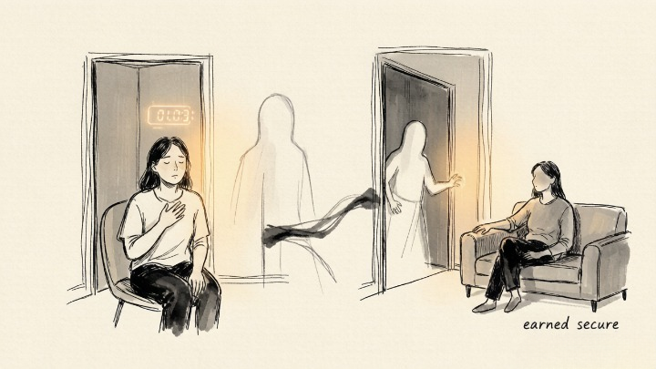
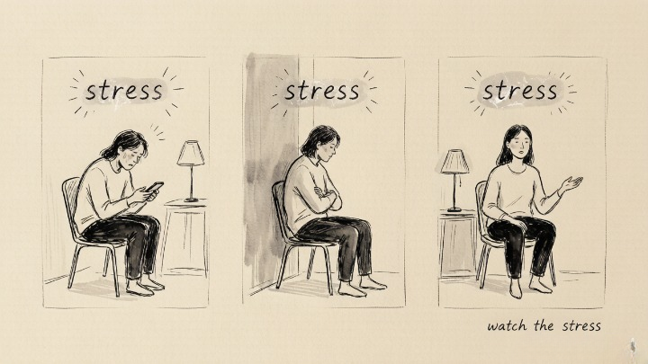

> You're not too sensitive. You just fell for someone who can't give you what you need.

## What are the attachment styles in Attached?

Amir Levine breaks adult attachment into four categories: **secure, anxious, avoidant, and fearful-avoidant.**

Secure people are comfortable with closeness and fine on their own. Anxious people crave intimacy but constantly worry their partner doesn't feel the same. Avoidant people experience closeness as a threat to their independence—the moment it intensifies, they pull back. Fearful-avoidants are caught in the middle: they want closeness and are terrified of it at the same time.

The book's central claim: **the anxiety and avoidance we experience in relationships aren't personality flaws. They're survival strategies we learned early.** A child whose cries are consistently met with comfort tends toward security. A child who gets warmth sometimes and coldness other times learns to cling. A child whose needs are routinely dismissed learns to stop asking.

## Why do anxious and avoidant people keep finding each other?

This pairing is so common Levine calls it the **anxious-avoidant trap.**

Anxious types are looking for someone who can keep confirming "I care about you." Avoidant types are looking for someone who won't invade their space. Early on, this looks like a match. The anxious person's warmth feels accepting. The avoidant person's independence feels intriguing.

Then the relationship deepens, and the script flips. The anxious person leans in. The avoidant person leans out. The anxious person panics and leans in harder. **Both people are using their most practiced survival moves to protect the relationship—and those moves are each other's poison.** Recognizing the loop is step one.

## How do you identify your own attachment style?

No complex test required. Watch what you do under relationship stress.

When conflict rises, the anxious style reaches—more texts, demands for conversation, even a breakup threat to test commitment. The avoidant style retreats—silence, withdrawal, logic used to wall off feeling. The secure style states the need directly while leaving room for the other person.

**The point of knowing your style isn't to label yourself. It's to understand what fear is driving the behavior.** A person who goes silent isn't always being cold—their system may be sounding an alarm. A person who keeps asking isn't always controlling—their fear may have just been activated.

## Can attachment styles change?

Yes, but it takes time and deliberate practice. Levine calls the goal **earned secure attachment.**

For anxious attachers, the core practice is self-soothing. When panic rises, resist the reflex to reach for the phone. Give yourself ten minutes. Bring attention back to your body and breath. For avoidant attachers, the core practice is staying. When the urge to flee kicks in, stay one extra minute. Say something like: "I feel the urge to withdraw right now. It's not about you."

The most useful thing Attached does is remove relationships from the courtroom of moral judgment. **Our anxiety doesn't make us weak. Their distance doesn't make them cruel.** Seeing the pattern is where the pattern starts to loosen.

*Core concepts from Amir Levine and Rachel Heller, Attached. The book also includes a detailed attachment style quiz and communication strategies for each pairing type.*
