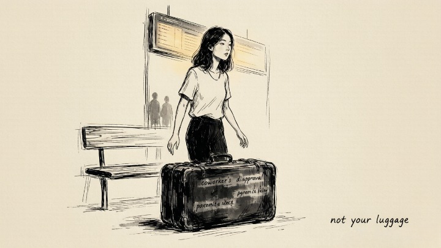
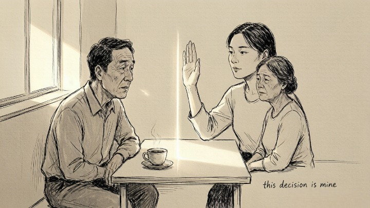

> Other people's opinions are their business. How you live is yours.

## TL;DR

What we actually know is this: a large slice of everyday stress isn't a reaction to a real problem, it's a reaction to someone else's problem that we've quietly taken on as ours. Alfred Adler called this the **separation of tasks**—the simple test that whoever lives with the consequences of a decision owns the emotional bill. The reason it lands hard is that most of us were taught the opposite: that being a good person means carrying the feelings of everyone around us. It doesn't. Caring about someone and being responsible for their feelings are two different things, and Adler's framework is mostly a request to notice the difference.

## What exactly is separation of tasks?

Adler believed that a surprising amount of our misery comes from a simple confusion: we can't tell whose problem is whose.

The test is straightforward: **whoever lives with the consequences owns the task.** Your coworker doesn't like your proposal? That's his emotional consequence—his task. You chose a career your parents disapprove of? Your consequence—your task. You decide to come home an hour late—yours. You can't decide how your partner reacts to the news—his.

This blurring happens everywhere. A friend borrows money and never brings up repayment. A partner is in a bad mood, and we immediately feel responsible for fixing it. A colleague gives one-word replies to your email and you spend two hours rewriting yourself into a knot. These situations look different, but underneath they're the same pattern: **we're paying for someone else's bill.**

One way to make this concrete: write down the situation that's bothering you. Next to it, write the name of the person whose life will be most directly changed by what happens next. If it isn't you, the situation is informational for you at most. You can choose to care about it, you just can't be *responsible* for it.

## Where does this idea actually come from?

Alfred Adler (1870–1937) was a contemporary of Freud, but he split with the psychoanalytic mainstream early. The break came over a basic disagreement about why people suffer. Freud traced misery back to early childhood events and the drives they left behind. Adler said the past is real, but it's never the deciding factor. What decides a life is the **goal a person is moving toward**—the meaning they're constructing right now, sometimes in spite of the past. He called this **teleology** (telos is Greek for "purpose"), and it's the spine underneath most of what the book is selling as "Adlerian psychology."

Two related concepts are worth knowing, because they keep showing up in this conversation:

- **Social interest (Gemeinschaftsgefühl).** Adler's word for a person's felt sense of belonging and contribution to a community. People who develop it are less trapped in the pursuit of personal superiority, because their self-worth is anchored somewhere other than winning.
- **Lifestyle (Lebensstil).** Adler used this not for habits, but for the deep operating story each person constructs around three questions: *Who am I? What's the world like? What do I do with the gap?* That story is mostly unconscious, formed in early childhood, and remarkably hard to change by willpower alone. Separation of tasks is one of the few tools that reliably pokes at it. (For a fuller treatment of how early operating stories get uncovered, see our [shadow work guide](/psych/shadow-work/shadow-work-guide/); Adler and Jung arrived at similar territory through different doors.)

Ichiro Kishimi and Fumitake Koga—the Japanese authors of *The Courage to Be Disliked* (2013)—built their dialogue book almost entirely on this Adlerian frame. A reader expecting Freudian or attachment-theory content will be surprised. The book isn't interested in how you were parented in detail; it's interested in whether you'll use that past as a reason, or as a starting point.

## Why does this idea make people uncomfortable?

Because most of us were raised to "consider other people's feelings." Kishimi points out that two separate things got tangled up: **considering someone's feelings is not the same as being responsible for them.**

If someone is angry at us, that's how they've chosen to respond. We can be polite, respectful—but we don't owe them emotional compensation. Adler went further. He argued that when we obsess over what others think, we're not actually being considerate. **We're chasing approval.** Wanting everyone to like us—that's the real source of the anxiety, and it's also the real source of most of the resentment that follows.

The discomfort usually comes from one of three places. The first is a fear that drawing lines will make us cold, selfish, "like our difficult parent." But Adler's frame is the opposite of cold: a person who constantly manages other people's feelings isn't being warmer, they're being more afraid. The second is a worry that we won't be loved if we stop over-functioning. Sometimes that's true—and Adler would say that's information, not a reason to keep going. The third is the worry that we're abandoning people. Which is a fair concern, and worth taking seriously. The next section is for that.

There's also a useful counter-question worth asking: *is the person whose feelings I'm managing actually asking me to manage them?* Most of the time, the answer is no. We're modeling their inner state and adjusting ourselves in advance. That modeling can be generous, but it isn't required—and if you're interested in the long, slow process of why some of us become wired to do it, [the same machinery shows up in attachment patterns too](/psych/book-insights/attached/).

## When you still do have responsibility

Separation of tasks is not a license to opt out. There are situations where the consequences are clearly yours, even when the other person is upset. A few worth naming so the framework doesn't get weaponized:

- **When you caused harm.** If you said something that landed badly, that repair work is yours—not the recipient's job to get over.
- **With children.** A seven-year-old's tantrum is her emotional reality, but whose job is it to feed, clothe, and emotionally regulate that child? Yours. The line between "I'm responsible for the outcome" and "I'm responsible for their feelings" doesn't apply cleanly until adolescence, and even then, not completely.
- **With dependents or ill family members.** Caregiving has a real emotional bill. You can ask for help, and you should, but the work itself doesn't go away just because it's hard.
- **At work, when you hold the role.** A manager's bad mood isn't a subordinate's task, but a manager's decisions are. If a direct report is upset by feedback you gave, that response is theirs—yours is whether the feedback was fair and how it was delivered.

The line isn't "stop caring." The line is "stop *carrying*." There's a real difference, and most of the misuse of this idea comes from people who skip the second half.

## How does this work in everyday life?

Start small.

Someone hasn't replied to your message. Don't immediately run the script: "What did I say wrong?" The silence could mean anything—busy, distracted, just not in the mood, drafting a longer reply, asleep. None of that information is in your hands. **The only question that's yours is: does this message actually matter to the work or the relationship?** If yes, send a follow-up. If no, let it go.

Take something bigger. Parents pushing you to get married. You can hear them out, say "I know you worry, but this decision is mine," and leave it there. No arguing. No proving. **All you're doing is refusing to carry their anxiety on your own shoulders.** That's not coldness. That's accountability—for the one line you can actually draw.

A real decision most people face at least once: career. If you picked a field your family disapproves of, you'll get the same script from somewhere—*when are you going to do something real?*—forever. The cheap move is to absorb that script and let it steer. The honest move is to notice that you live with the 8 a.m. and the 10 p.m. and the slow Tuesday; the people asking don't. If you want a sounding board for the actual decision, outside opinions can help, but the choice itself remains yours. For readers who want a structured reflection on a career path or a crossroad, the <a href="https://bargestech.go2cloud.org/aff_c?offer_id=191&aff_id=2559&url_id=90" target="_blank" rel="sponsored nofollow noopener">Kasamba career and life-path category</a> collects live advisors who work in this exact territory. Use them as a mirror, not a verdict.

A useful daily check-in: at the end of the day, write down one moment you felt responsible for something that wasn't really yours. You don't have to fix it. Just label it. Over a few weeks, the same patterns usually show up—and that's the start of being able to choose differently.

## FAQ

**Does separation of tasks mean I should stop being considerate?**
No. Consideration is paying attention; responsibility is owning the outcome. You can pay attention without owning. Adler's point is that these were taught as the same thing, and they aren't.

**What if the other person is hurt because of something I did?**
That's on you to repair, not them to manage. The framework says you own the consequences you caused—not the feelings of whoever happens to be in the room.

**Is this just a way to avoid dealing with conflict?**
It can become one, yes. If you find yourself reaching for "it's not my task" the moment anything uncomfortable comes up, that's a sign of avoidance, not clarity. The honest version of this idea asks you to look at *whose consequences* something is, which is a slower, more careful question than "I don't want to deal with this."

**What about people with anxiety or trauma—they say they can't tell whose feelings are whose.**
That's a real limit, and it's not solved by reading more. If the wiring to over-carry is strong, working with a therapist who knows attachment or Internal Family Systems can be much more useful than another self-help book. This is one of those times where a book idea is a good map, not a substitute for a guide.

**How is this different from Carl Jung's shadow work?**
It isn't, exactly. Jung's shadow is the part of the self we don't want to own—usually disowned traits, projected outward. Adler's framework points at the same place from a different door: the unowned emotional labor we keep paying for. The Adlerian angle is more behavioral ("stop carrying that bag"), the Jungian angle is more developmental ("notice why you took it in the first place"). They tend to work well together. If you want the deeper "why," [Carl Jung and the Shadow Self](/psych/shadow-work/carl-jung-shadow/) is the long version.

## A small, concrete starting point

If this is your first time trying the framework, pick one situation this week—not the biggest, not the loudest, just the one that's been sitting in your chest for a while. Write it down in two lines:

- **The situation:**
- **The person whose life is most directly changed by what happens next:**

If the second line is someone else's name, you've just been given back a small piece of your day. If it's yours, you have a real problem to work on, and the only person who can solve it is you.

Adler isn't telling anyone to become unshakable. He's saying something simpler: **you have a finite amount of weight you can carry. Someone else's luggage doesn't belong on your back.**

*Core idea from Ichiro Kishimi and Fumitake Koga, The Courage to Be Disliked (2013). The book also explores Adlerian concepts including teleology, lifestyle, social interest, and horizontal vs. vertical relationships. For a deeper Jungian counterpart to the "what you keep carrying" idea, see [Carl Jung and the Shadow Self](/psych/shadow-work/carl-jung-shadow/).*
