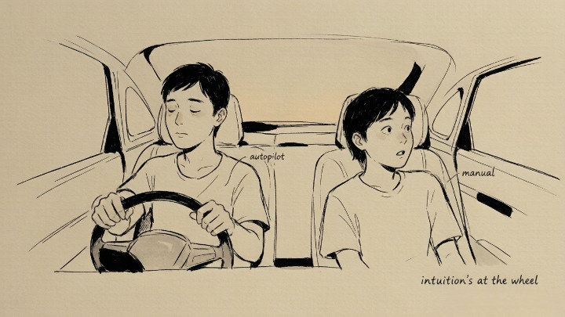
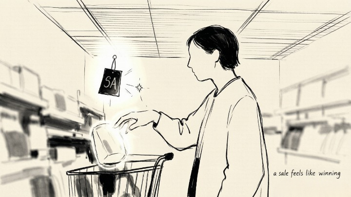
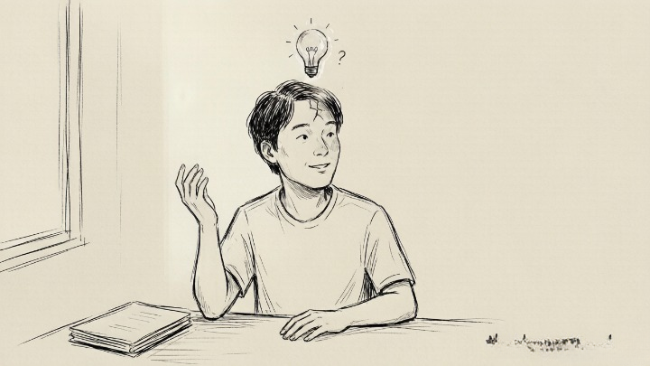

> We think reason is driving. Intuition has been at the wheel the whole time.

## What are System 1 and System 2?

Think of your brain as two people sharing the driver's seat.

**System 1 is autopilot.** It's fast, effortless, always on. You see 2+2 and "four" appears before you can blink. You hear a sudden noise and your head turns automatically. Someone frowns and you know they're upset without a second of analysis.

**System 2 is manual control.** It's slow, effortful, and needs to be summoned. Calculating 17×24 in your head. Focusing on one voice in a noisy room. Weighing a major decision—that's System 2 clocking in.

Kahneman's discovery wasn't that these two systems exist. People had noticed that before. His insight was more unsettling: **we believe System 2 is in charge of our lives. System 1 has been running the show the entire time.**

## Why is this discovery uncomfortable?

Because System 1 is a **pattern-matching machine.** It doesn't analyze or verify—it just slots whatever's in front of it into the closest available pattern and reports back: "this is what's happening."

That's why a sale feels like winning, even when you didn't need the item. Why you trust someone more because your first impression was good. Why watching one plane crash on the news makes flying feel dangerous, even though the data says it's far safer than driving.

System 1 is brilliant for survival—if something looks like a snake, you jump first and figure out it's a rope later. That algorithm kept our ancestors alive. But when the problem is an investment decision or a relationship dynamic, **System 1 is still running the same "jump first" code.**

## How do you get System 2 to show up more often?

You can't keep it online all day—it burns too much energy. But you can wake it up at key moments.

**First, pause when you feel completely certain.** System 1's most dangerous move is making you feel like you don't need to think anymore. If a judgment arrives unusually fast and feels unusually solid, **System 1 is probably doing your thinking for you.**

**Second, sleep on important decisions.** System 1's intuition doesn't factor in time. Letting a night pass gives System 2 a chance to quietly review things in the background.

**Third, ask yourself: am I reacting to a story or to data?** A moving interview on the news will sway your judgment more than a statistic—but the interview is one person's experience, and the statistic represents thousands.

## Does knowing this actually change anything?

Honest answer: **knowing doesn't equal doing.** Kahneman himself said he spent a lifetime studying cognitive biases and still falls for them.

But knowing gives you a small pause button. The next time you hear yourself say "I'm absolutely certain about this," a quiet voice might respond: **that's System 1 talking.** The doubt itself—that flicker—is System 2 waking up.

*Core insight from Daniel Kahneman, Thinking, Fast and Slow. The book also unpacks anchoring, loss aversion, regression to the mean, and dozens of other cognitive quirks worth knowing about.*
