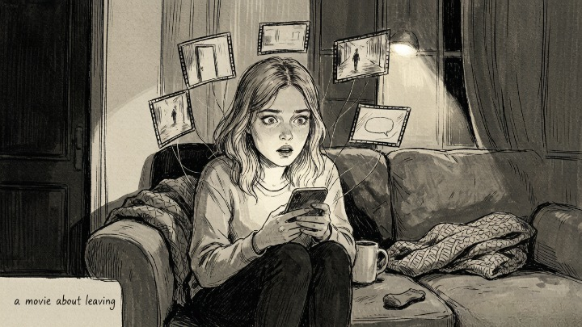
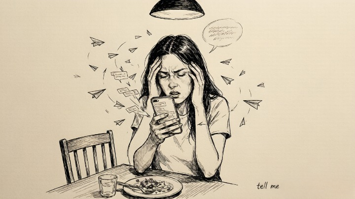
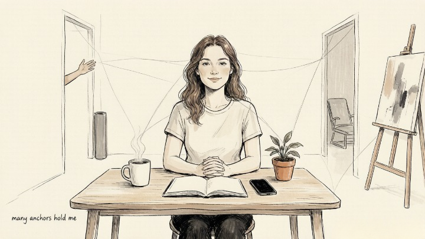

> The anxiety isn't really about whether they love you. It's about whether you believe you're worth loving.

## What does anxious attachment actually look like?

The classic scene: three hours without a reply, and your brain has already produced a full movie about being left.

Anxious attachers are hypersensitive to the smallest shifts in a relationship. Their tone was a little flat. The reply took longer than usual. They glanced at their phone during dinner. Any of these triggers a full-body alarm. The message the alarm plays: **"Something's wrong. They're pulling away. I need to fix this right now."**

To quiet the alarm, anxious attachers develop what psychologists call **protest behaviors.** Repeated texting. Picking fights to test whether the other person will stay. Threatening to leave just to see if they'll chase. These actions look like anger on the surface. Underneath is a single unspoken sentence: **"Please tell me you're still here."**

## Where does anxious attachment come from?

Attachment theory traces this back to inconsistent early care.

If a caregiver was warm sometimes and cold other times—with no predictable pattern—the child learns one rule: **love is unreliable, and I have to stay on high alert to catch it.** That rule doesn't expire in adulthood. The partner becomes the new caregiver, and the old surveillance system stays online.

Psychologists call this **hyperactivation.** When distance is detected, the nervous system cranks the anxiety to maximum, forcing a search for reconnection. This isn't weakness or drama. **It's a brain running survival software that was installed decades ago.**

## What actually helps reduce the overthinking?

**First, learn to spot protest behavior and hit pause.** When the urge to fire off five follow-up texts hits, stop and ask: am I expressing a need right now, or am I dumping fear? If it's fear, write it in your notes app. Don't send it.

**Second, say what you need directly.** Anxious attachers often package needs inside accusations. Try swapping "Why are you ignoring me?" for "I'm feeling a little anxious today—can we talk for five minutes?" The first makes someone want to retreat. The second tells them exactly how to help.

**Third, spread your emotional safety net wider.** Anxious attachers tend to route all their emotional needs through one person. When that channel goes quiet, panic sets in. Build multiple anchors—friends, exercise, creative work, a therapist. **When security comes from several sources, one line going silent doesn't sink the ship.**

## When should you get professional help?

If the anxiety is interfering with sleep, work, or basic functioning—or if protest behaviors have escalated into things like tracking locations or checking phones without permission—self-regulation alone may not be enough.

A therapist can help trace the attachment patterns back to their source and offer something these patterns never had: a relationship where being responded to consistently is the norm, not the exception. **Anxious attachment isn't a diagnosis. But if it's making life painful, it's worth taking seriously.**
