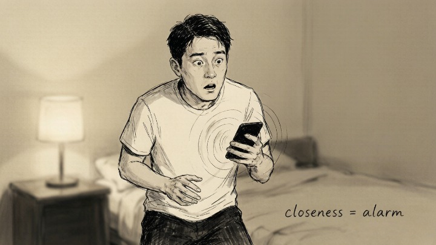
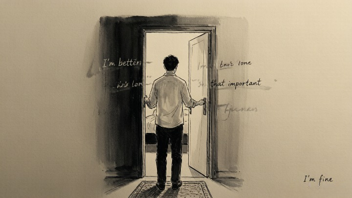
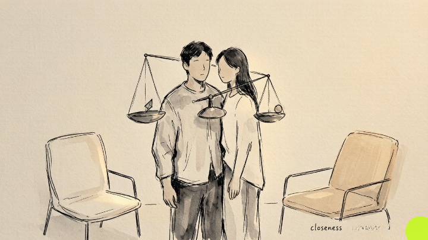

> It's not a lack of love. It's closeness itself that sets off the alarm.

## What does avoidant attachment actually look like in a relationship?

The defining trait isn't "not caring"—it's **fear of being too close.**

The closer you get, the more he retreats. You send three paragraphs; he replies with a thumbs-up. After an argument, you want to talk it through; he says "I'm fine" and shuts the bedroom door. He doesn't experience this as the silent treatment—he experiences it as **an inability to handle the pressure of being needed.**

Avoidant attachers learn one rule early in life: **depending on people is unreliable. Better to handle things alone.** By adulthood, that rule has calcified into an unspoken message: nobody gets too close.

## What's the psychological mechanism behind the pulling away?

**It has almost nothing to do with how much he loves you. It's an automatic response.**

When intimacy escalates—someone cries, expresses strong emotion, asks for deeper commitment—his nervous system registers danger and activates retreat. The thinking brain doesn't get a vote. By the time he could reflect on what's happening, he's already gone.

Psychologists call this **deactivation.** The moment closeness feels threatening, the brain automatically suppresses attachment needs and downgrades the partner's importance. "She's not that important anyway." "I'm better off alone." These thoughts aren't his actual assessment—**they're a self-protection script running on autopilot.**

## What can you actually do about it?

**First, stop chasing.** The chase fuels your anxiety and sharpens his defenses. He pulls back; you lean in; the spiral gets worse. Pause. Give space.

**Second, trade accusations for observations.** "Why won't you talk to me?" lands as an attack. "I notice you might need some space—I'm here whenever you want to talk" is a door instead of a wall.

**Third, make coming back feel less costly.** If he returns to a calm response instead of an anxious interrogation, **his brain slowly starts revising the equation: closeness does not equal danger.**

## When should you consider professional help?

If you've tried the approaches above and the loop keeps spinning—every approach triggers retreat, every retreat deepens your anxiety—**the pattern has likely gone beyond what the two of you can break alone.**

When the push-pull has gone on for months. When your anxiety is bleeding into other parts of your life—sleeplessness, inability to focus, work slipping. When the retreat has turned into belittling or emotional withholding. These aren't communication problems anymore.

A relationship counselor can give both people a third space that feels safe—and for avoidant-attachment dynamics, that matters because **the safe space between the two of you may no longer exist.**
