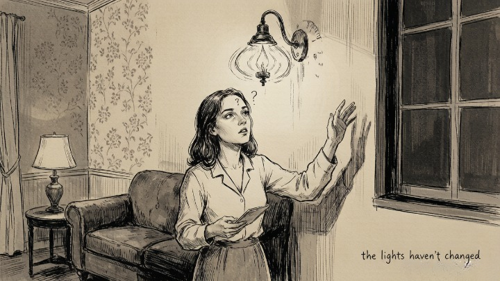
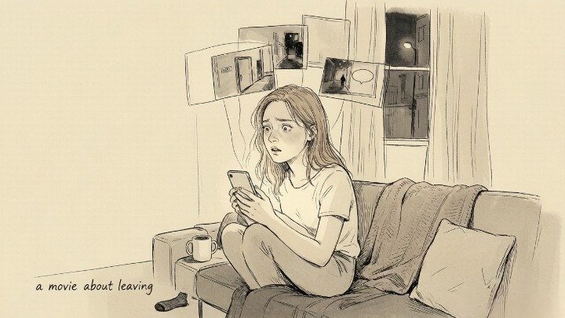

> The scariest part of gaslighting isn't that you start believing their lies. It's that you stop believing your own memory.

## How does gaslighting actually work?

Gaslighting's core mechanism isn't lying. It's **making you question your own perception.**

The term comes from the 1944 film Gaslight, where a husband slowly dims the gas lamps in the house and then insists the lighting hasn't changed. His wife eventually believes her own eyes are failing her.

Real-world gaslighting is subtler. Nobody says "the lights aren't dimmer." Instead: "I never said that. You're remembering it wrong." "That didn't happen. You're making things up again." "We agreed on this. You're the one backing out now."

One or two instances could be memory differences. But when it's a pattern, the victim starts relying on the gaslighter's version to construct their own reality. **That's the core of gaslighting: one person's perception gets systematically overwritten by another person's narrative.**

## What are the common gaslighting tactics?

There are several variations beyond flat denial.

**Deflection.** When confronted about harmful behavior, the gaslighter pivots to your reaction. "You're being too sensitive." "Why do you always make everything a big deal?" The original issue disappears. The conversation becomes about your supposedly flawed emotional response.

**Rewriting history.** The gaslighter replaces what happened with a completely different story. "I was trying to help you—don't you remember?" After enough repetitions, you genuinely can't recall what the original intention was.

**Triangulation.** The gaslighter brings in a third party to reinforce their version. "Even Sarah thinks you're overreacting." This doubles the isolation—now it's not just one person invalidating your experience.

**The common thread: your reality gets denied.** When someone hears "your memory is wrong" and "your feelings are unreasonable" often enough, the most adaptive response is to stop trusting yourself.

## How do you know if you're being gaslit?

The clearest diagnostic isn't analyzing the other person's behavior. It's **observing changes in yourself.**

Are you saying "maybe I remembered wrong" more than you used to? Do you spend hours after every argument trying to reconstruct what happened, trying to figure out whose fault it was? Do you need to check with someone else before making decisions because you don't trust your own judgment? Have you started screenshotting conversations in case you need proof later?

**If your trust in your own perception has been steadily declining inside a specific relationship—that's the signal.** Healthy relationships don't make you doubt your own mind.

## What do you do once you recognize gaslighting?

**First, stop debating the facts.** You can't win an argument about reality with someone whose strategy is to deny yours. They won't suddenly admit what they said or did. Every round of debate costs you energy and chips away at your self-trust.

**Second, rebuild external reference points.** Tell a trusted friend, family member, or therapist what's happening. Not to get a verdict on who's right—just to give your perception an outlet that doesn't get immediately denied. When someone says "you're not crazy, this isn't normal," an anchor starts to form.

**Third, reduce this person's influence over your sense of reality.** This doesn't necessarily mean leaving immediately—some situations require time and planning. But you can begin the psychological separation: stop expecting this person to validate what you know to be true.

The deepest damage gaslighting inflicts isn't making you believe the lies. **It's making you stop believing yourself.** Recovery isn't about proving the gaslighter wrong. It's about rebuilding your relationship with your own perception.
