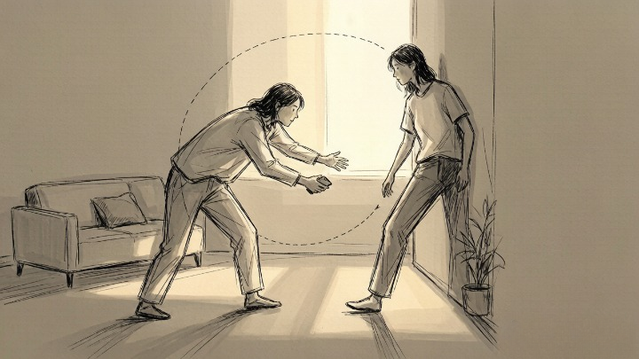
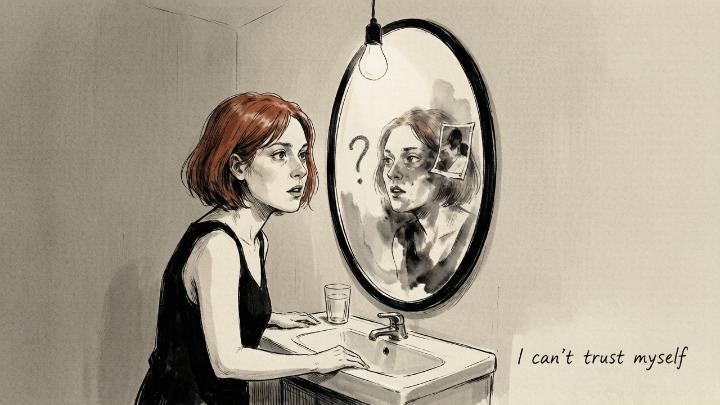

> It's not arrogance. It's a self so fragile it can't survive without constant outside validation.

## What is narcissistic personality disorder, really?

Most people think it means being self-obsessed. **That misses the point.**

The core of narcissistic personality isn't loving yourself too much—it's **needing continuous external attention and approval to hold together a fragile sense of self.** They need more praise than most people. They can't handle criticism the way most people can. And they have a striking inability to perceive what other people are feeling.

**This isn't selfishness. Selfishness means you know what someone needs and choose not to give it. Narcissism means you never registered the need in the first place.**

## What are the signs worth paying attention to?

**1. The early-stage magnetism is almost too much.** They're exceptionally good at mirroring—reflecting back whatever you like and becoming that person. It's not an act. They believe it too. This charm pulls people in fast, but it's sprinter energy. It doesn't run marathons.

**2. Every conversation eventually orbits back to them.** You share something painful; they tell you about something worse they went through. You share an accomplishment; they one-up it. It's not empathy followed by "I've been there too." It's "my turn now."

**3. Criticism registers as an attack.** Even mild feedback—"Could you call a bit later? I'm exhausted tonight"—gets interpreted as a wholesale rejection. What follows is either rage or the silent treatment.

**4. There's no internal guilt mechanism.** They can apologize, but nothing changes afterward. **The apology is a tool. It's not a feeling.**

**5. They have a constant need for superiority.** They have to win—not competitions, but the contest of who's more right, who's suffered more, who's been more misunderstood. In a relationship, this shows up as endless comparison and subtle put-downs.

**6. Your boundaries get eroded systematically.** Not in one dramatic violation, but in a pattern. You accept one unreasonable request today; tomorrow's is worse. **You think you're compromising. You're being conditioned.**

**7. When you finally leave, you wonder if you were the problem.** This is the most dangerous sign. Long-term exposure to a narcissistic partner creates what psychologists call **cognitive fog**—you stop trusting your memory, your feelings, your version of events. "Maybe I was too sensitive" becomes your default thought.

## What do you do if you're in a relationship like this?

If you keep feeling "I'm becoming less and less myself"—**trust that feeling before you try to analyze it.**

**Step one isn't leaving. It's recovering your own judgment.** Tell a trusted friend the full story. Don't make excuses for him. Don't fill in the gaps with generous interpretations. Just notice: does the relationship sound different when you say it out loud? **If you hear yourself and it sounds off—it is off.**

**Step two: set one small, specific boundary.** Something like, "I'm not taking calls Thursday and Friday evenings." Don't negotiate it. Just state it. Watch his response. A healthy person respects it. A narcissistic person challenges it—with emotion, with logic, with guilt. The method varies, but the goal is always the same: make your boundary fail.

## When should you get outside help?

When you start believing things like "this is just how relationships are," "all love is painful," or "I probably don't deserve better"—**these aren't your actual beliefs. They're the result of sustained psychological manipulation.** At that point, getting out of the cognitive fog on your own becomes nearly impossible.

---

## The clinical picture (and why "narcissist" is overused)

In clinical terms, **narcissistic personality disorder (NPD)** is a specific diagnosis. The DSM-5 describes it with three overlapping themes: a **grandiose sense of self-importance**, a **deep need for admiration**, and a **notable lack of empathy** — patterns that begin by early adulthood and show up across contexts.

But here's the nuance the internet usually skips: **traits and disorder aren't the same thing.** Almost everyone has *some* narcissistic traits — a bit of defensiveness, a dash of ego. That's human. NPD sits on the far, rigid end of that spectrum, and only a qualified professional can diagnose it.

There's also a distinction worth knowing: **grandiose vs. covert narcissism.** The grandiose type is loud — charming, dominant, "look at me." The covert type is quiet — the martyr, the perpetual victim, the person who weaponizes guilt and self-pity. Covert narcissism is often missed precisely because it doesn't look like the stereotype. It wears humility like a costume.

> Related: narcissists often use gaslighting to maintain control. If you recognize phrases like "that never happened," read [Gaslighting: 12 Phrases That Reveal Someone Is Rewriting Your Reality](/psych/relationship/gaslighting/).

---

## What if you're not sure whether it's them or you?

This is the question that keeps people stuck. A useful test:

- **Narcissistic behavior is a pattern, not an incident.** One bad fight isn't a diagnosis. A *pattern* of mirroring-then-devaluing, boundary-eroding, and blame-shifting is.
- **Your confusion is itself a signal.** Long-term exposure to narcissistic dynamics reliably produces self-doubt. If you spend most of your time trying to figure out whether you're "too sensitive," that's not proof you are — it's a symptom of the dynamic.
- **Say it out loud to someone you trust.** Patterns that feel normal in your head often sound obviously wrong the moment they leave your mouth.

**If you're looking for certainty, you won't find it from the inside.** Get an outside perspective — a therapist, not just a friend who agrees with you — because the whole structure of the relationship is designed to make your own judgment unreliable.

---

## Frequently asked questions

**Is "narcissist" the same as NPD?**
No. "Narcissist" is a colloquial label for someone with high narcissistic traits; NPD is a clinical diagnosis with specific, pervasive criteria. Most people you'd call narcissistic don't have a diagnosis — and don't need one for their behavior to be harmful.

**Can a narcissist change?**
Change is possible but rare, because the condition is partly defined by the inability to tolerate the vulnerability that change requires. The realistic question isn't "will they change?" but "can I live with them exactly as they are right now?"

**What's the difference between confidence and narcissism?**
Confidence doesn't need you to shrink. A confident person can celebrate your win; a narcissistic person experiences it as a loss. Confidence is self-assured; narcissism is self-*preoccupied* — and threatened by anything that isn't.

**What should I do if I think I'm the narcissistic one?**
Wondering about it is already a meaningful difference — genuine narcissism rarely includes that kind of self-doubt. If the pattern concerns you, that's a good reason to bring it to a therapist, not a reason to self-flagellate.

---

*This article is part of our relationship cluster. Start with [Attachment Styles: The 4 Ways We Love](/psych/relationship/attachment-styles/), or read [Gaslighting](/psych/relationship/gaslighting/) to understand the control tactics that often accompany narcissism.*
