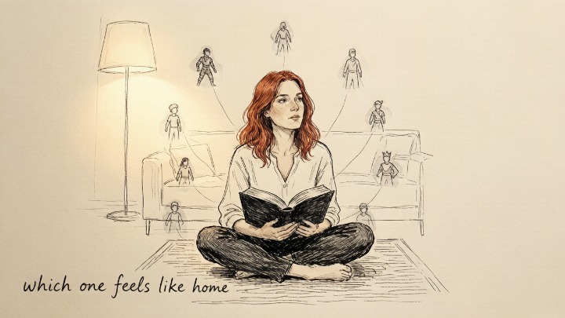
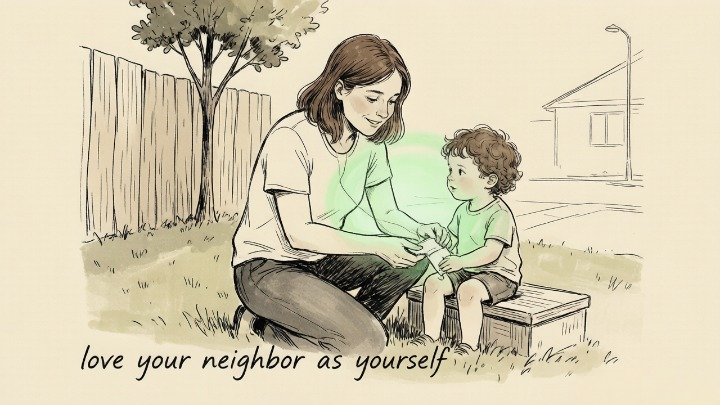
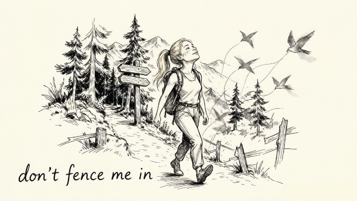
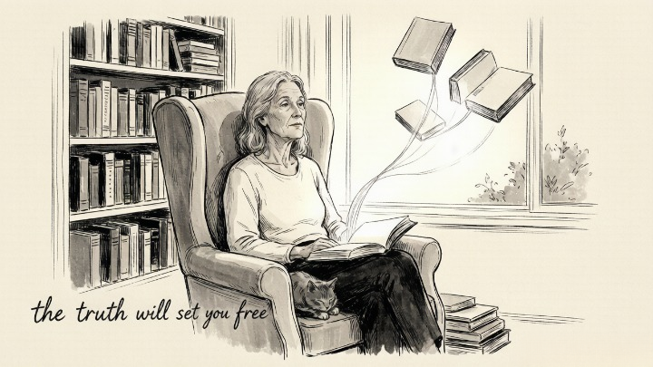
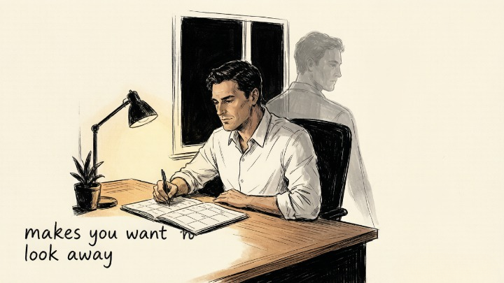

# 12 Classic Jungian Archetypes: A Simple Introduction

Carl Jung believed that beneath our individual personalities lie universal patterns — archetypes — shared by all humans across cultures and time. These archetypes live in what Jung called the *collective unconscious*, shaping how we think, feel, and act without us even noticing.

Here are the 12 classic archetypes, grouped into four categories. Read through them and notice which ones feel familiar. That recognition is the first step toward understanding yourself at a deeper level.

## The Ego Types — Driven by a Need for Structure and Control

### 1. The Innocent

The Innocent seeks happiness, safety, and simplicity. They believe the world is fundamentally good and that things will work out. Their gift is optimism. Their blind spot is naivety — avoiding harsh truths because they threaten their sense of peace.

**Motto:** *"Life is good."*

### 2. The Orphan (Everyman)

The Orphan understands that life is hard and that connection is survival. They value belonging, realism, and solidarity with ordinary people. Their gift is empathy. Their blind spot is cynicism — expecting disappointment so they won't be hurt by it.

**Motto:** *"All people are created equal."*

### 3. The Hero

The Hero believes in rising to the challenge. They are disciplined, courageous, and driven to prove their worth through action. Their gift is competence. Their blind spot is arrogance — assuming they must do everything alone, or that weakness is failure.

**Motto:** *"Where there's a will, there's a way."*

### 4. The Caregiver

The Caregiver is driven by compassion and a deep need to protect others from harm. They express love through service and sacrifice. Their gift is generosity. Their blind spot is martyrdom — giving until there's nothing left of themselves.

**Motto:** *"Love your neighbor as yourself."*

## The Soul Types — Driven by a Need for Connection and Meaning

### 5. The Explorer

The Explorer craves freedom, adventure, and authenticity. They fear being trapped — by routine, by expectation, by a life that feels too small. Their gift is independence. Their blind spot is restlessness — always seeking the next horizon, never arriving.

**Motto:** *"Don't fence me in."*

### 6. The Rebel (Outlaw)

The Rebel challenges systems they see as broken or unjust. They are disruptive, passionate, and unafraid of conflict. Their gift is transformation. Their blind spot is destruction — tearing things down without knowing what to build in their place.

**Motto:** *"Rules are meant to be broken."*

### 7. The Lover

The Lover seeks intimacy, beauty, and deep connection — with people, with art, with life itself. Their gift is passion. Their blind spot is losing themselves in the object of their desire, forgetting that love must include the self.

**Motto:** *"You're the only one."*

### 8. The Creator

The Creator is driven to bring something new into existence — art, ideas, structures, businesses. They fear mediocrity and stagnation. Their gift is imagination. Their blind spot is perfectionism — the fear that what they make will never be good enough.

**Motto:** *"If you can imagine it, you can create it."*

---

## The Self Types — Driven by a Need for Knowledge and Truth

### 9. The Jester

The Jester finds truth through humor. They use play, wit, and irreverence to say what others are afraid to say. Their gift is perspective. Their blind spot is hiding pain behind laughter — using humor to avoid what's actually hurting.

**Motto:** *"You only live once."*

### 10. The Sage

The Sage seeks wisdom, not just information. They believe that understanding the truth will set you free — and they pursue that truth with discipline and depth. Their gift is insight. Their blind spot is detachment — studying life instead of living it.

**Motto:** *"The truth will set you free."*

### 11. The Magician

The Magician believes in transformation — that reality can be changed through knowledge, vision, and will. They see connections others miss. Their gift is vision. Their blind spot is manipulation — using their understanding to control rather than to serve.

**Motto:** *"I make things happen."*

---

## The Order Type — Driven by a Need for Stability and Legacy

### 12. The Ruler

The Ruler seeks order, control, and prosperity — not for selfish gain, but to create a stable world where people can thrive. Their gift is leadership. Their blind spot is rigidity — believing their way is the only way, and losing touch with those they lead.

**Motto:** *"Power isn't everything. It's the only thing."*

## Which One Resonates?

Most people identify with two or three archetypes, not just one. The archetypes that feel most familiar are usually your dominant patterns. The ones that make you uncomfortable — those are often the ones worth examining more closely. Jung called this shadow work: facing the parts of yourself you've been avoiding.

---

We're developing a more precise AI-powered archetype assessment tool. Until it's ready, start by reading through the descriptions above. Notice which archetype feels like home — and which one makes you want to look away. That second one is probably worth exploring.

[[Shadow Work Guide for Beginners]] · [[Jungian Psychology and the Collective Unconscious]]
