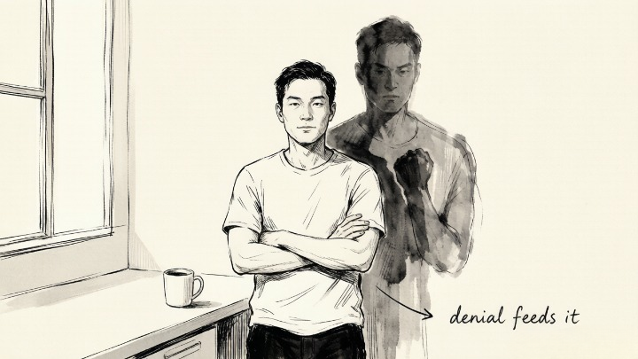
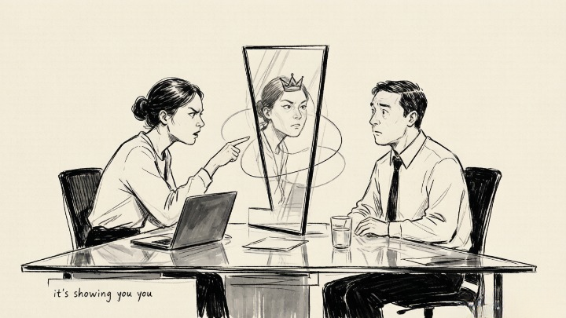
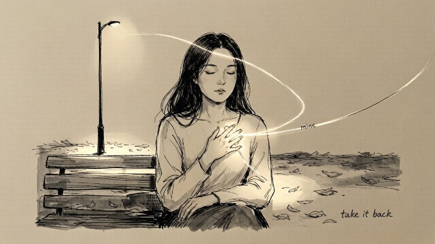

> What you can't face in yourself, you'll keep meeting in other people.

## What did Jung actually mean by "the shadow"?

The shadow is not some evil twin lurking in the basement of the psyche. It's simpler—and more uncomfortable—than that.

**The shadow is everything about yourself that you've learned to reject.** Traits you were shamed for as a child. Desires you decided were unacceptable. Emotions you were told made you weak. None of this material disappears when you push it away. It goes underground and finds other ways to surface.

Jung's observation: **the more vigorously you deny a trait, the more power it gains over you.** The person who insists "I'm not an angry person" is often the one whose rage erupts unpredictably. The person who prides themselves on never being jealous is often the one obsessively checking their partner's phone. Denial doesn't erase the shadow. It hands the shadow the keys.

## Why does the shadow matter in everyday life?

Because **the shadow doesn't stay hidden. It projects.**

Projection is Jung's term for what happens when we unconsciously offload our unwanted traits onto other people. The coworker whose arrogance drives us up the wall might be showing us our own suppressed ambition. The friend whose neediness irritates us might be reflecting our own disowned longing for connection.

Projection creates a peculiar kind of blindness: **we can spot a trait with laser precision in someone else while being completely unable to see it in ourselves.** The louder the emotional reaction to another person, the more likely something personal is being stirred.

## How can you recognize your own shadow material?

The shadow won't announce itself. But it leaves a trail.

**Follow the emotional overreaction.** When someone's behavior provokes a response that feels outsized—fury at a minor slight, contempt for a stranger, disproportionate irritation at a colleague—pause and ask: what exactly about this person bothers me? Now ask the harder question: is there any version of that trait in me that I don't want to acknowledge?

**Notice who you judge most harshly.** The judgments we pass on others are often disowned self-judgments. A person who considers themselves exceptionally rational may have particular contempt for people who seem emotional—not because emotionality is objectively bad, but because they've spent a lifetime suppressing their own.

**Track your recurring frustrations.** If you keep running into the same irritating personality type—different jobs, different cities, different social circles—the common denominator is you. The shadow is loyal. It will keep arranging the same encounter until you finally look at it.

## What do you do once you recognize the shadow?

Nothing dramatic. You don't need to integrate, heal, or transform anything. **The single most powerful thing you can do with shadow material is acknowledge that it's yours.**

Jung called this "withdrawing projections"—taking back the traits you've been outsourcing to other people. It doesn't require a ceremony or a breakthrough. It happens the moment you say: "That thing I can't stand in them—some version of that exists in me too."

That acknowledgment shifts something structurally. The shadow loses some of its grip. The people who used to provoke you become less charged. And you gain access to energy you were spending on denial—energy that can now go toward being more whole. **You don't defeat the shadow. You make room for it. And making room for it is how it stops running the show.**

---

## Where Jung actually got this

The shadow is one of Jung's central ideas, developed across his work in the early 1900s and named most directly in his later writings on **individuation** — the lifelong process of becoming fully yourself. Jung's point was deceptively simple: the personality you show the world (what he called the *persona*, or "mask") is only half of who you are. The other half — everything that didn't fit the mask — goes into the shadow.

Crucially, Jung did **not** see the shadow as evil. He described it as morally neutral — it contains not just our "negative" traits, but also undeveloped gifts: the ambition the "nice girl" wasn't allowed to have, the anger the "good boy" learned to swallow, the creativity buried under a life of being responsible. **The shadow isn't the worst of you. It's the parts of you that never got to be.**

This is why Jung insisted the work isn't about *defeating* the shadow — it's about *meeting* it. You don't become good by suppressing your shadow. You become whole by integrating it.

> The full how-to is here: [Shadow Work for Beginners: A Complete Guide](/psych/shadow-work/shadow-work-guide/).

---

## Frequently asked questions

**Is the shadow evil?**
No. Jung was explicit that the shadow is morally neutral — a container for whatever the conscious self rejected, including positive qualities. The danger isn't the shadow itself; it's *unexamined* shadow, which operates outside your awareness.

**How is shadow work different from therapy?**
They overlap but aren't the same. Therapy is a structured, licensed relationship for mental health; shadow work is a self-reflective practice rooted in Jung's framework. Shadow work can complement therapy — and for heavy material, it should be done *with* therapeutic support, not instead of it.

**How do I actually start?**
Start small: journal on the three questions in the section above (overreaction, judgment, recurring frustration). Name one disowned trait out loud. You don't need a ritual — you need honesty. The [complete guide](/psych/shadow-work/shadow-work-guide/) has ten structured prompts.

**What if it feels overwhelming?**
Take it slower, and get support. Shadow work surfaces difficult material, and if it's destabilizing, that's a signal to work with a therapist rather than alone. The goal is integration, not flooding yourself.

---

*More in this cluster: [Shadow Work Guide](/psych/shadow-work/shadow-work-guide/) · [Projection: Why Other People's Flaws Make You So Angry](/psych/shadow-work/projection/) · [Shadow Work Prompts for Childhood Trauma](/psych/shadow-work/childhood-trauma/)*
