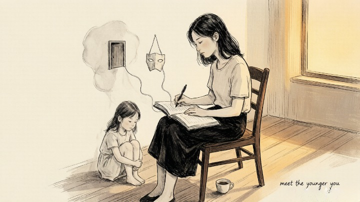
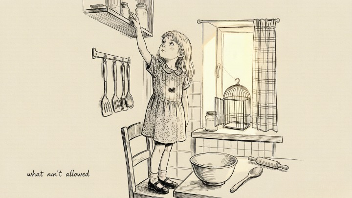
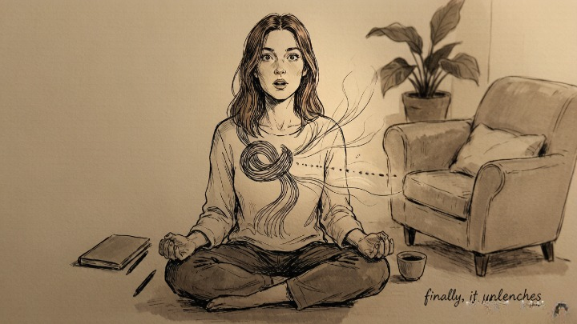

> Childhood wounds don't speak—but they run your choice in partners.

## How are childhood trauma and the shadow connected?

Jung believed that the feelings we couldn't safely express as children get pushed into the shadow—and they stay there, frozen in time.

If anger got you punished, anger went underground. If sadness was met with ridicule, sadness became something to hide. As adults, these buried emotions don't just sit quietly. **They leak out in ways we don't recognize as connected to old wounds.** A sudden rage over a small slight. A paralyzing fear of abandonment when a partner seems distant. An aversion to a certain kind of person we can't quite explain.

Shadow work offers a way to meet these old feelings on safer terms. Not to relive the trauma, but to stop letting it drive the car.

## What do you need before starting?

**An uninterrupted hour and an agreement with yourself not to judge what comes up.**

This isn't about writing beautifully or solving anything. It's about honesty. If the emotions get too intense, stop. There's no prize for pushing through pain. Shadow work works at the pace the nervous system can handle.

Below are five prompts. Start with whichever one pulls at you.

## Prompt 1: The forbidden emotion

Think back to your childhood home. Which emotion wasn't allowed? Anger? Sadness? Fear? What happened when you expressed it? Now ask yourself: as an adult, what do you do with that same emotion when it rises?

## Prompt 2: The relationship rerun

Is there a conflict pattern that keeps showing up in your current relationships—romantic, work, or family? Does this pattern remind you of a dynamic from childhood? **What are you afraid will happen again if you stop playing your usual role?**

## Prompt 3: A letter to the younger you

Close your eyes and picture yourself at the age when things were hardest. If your adult self could sit down next to that kid, what would you say? What does that younger version of you need to hear? Write it down. Write it like a real letter.

## Prompt 4: The mask you built to survive

What personality did you develop to protect yourself as a child? The good one? The funny one? The invisible one? That mask worked back then—it kept you safe. **Is it still working now? Or is it keeping you from being fully known?**

## Prompt 5: The life you'd live if you didn't have to please anyone

Imagine a world where you owe nobody anything. No parents to make proud. No partner to reassure. No friends to perform for. What would your day look like? What would you say no to? What would you finally choose?

## What should you expect after doing these exercises?

You might cry. You might feel anger you didn't know was there. You might also feel a strange stillness—like something that was clenched for decades just unclenched a little.

**All of these are normal.** The point of shadow work isn't to erase the past. It's to bring the exiled parts of yourself back into view. When they're visible, they don't need to run things from the dark anymore.
