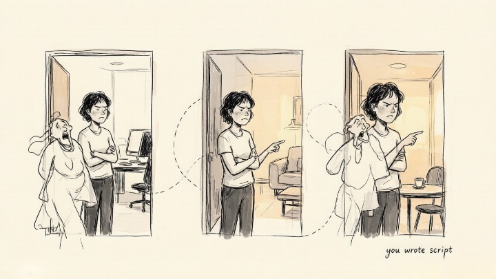
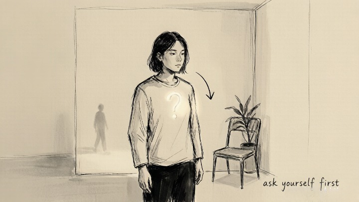

> The things we most fiercely reject in others are usually the parts of ourselves we can least bear to admit.

## What does Jung mean by "projection"?

Projection is one of the easiest Jungian ideas to spot in everyday life. In plain terms: we take the traits, desires, or emotions that belong to us but that we refuse to own, and we "throw" them onto someone else.

Here's an example. Say a person feels ashamed of the aggression inside them, because they were taught from childhood that "you must never lose your temper." As an adult, they feel an outsized disgust toward people who speak bluntly or show their anger. They'll say, "That person is so aggressive — it's unbearable."

Jung would argue they aren't reacting to the other person at all. They're reacting to their own suppressed aggression. The other person is just a screen, and their shadow has been projected onto it.

Projection is essentially a filtering mechanism. Because our shadow content is too painful to face, the mind "outsources" it to the outside world. That way we get to experience our own darkness as something "out there" — as other people we dislike — without ever having to admit it's ours.

## What does projection look like in daily life?

Three features tend to give projection away: a disproportionate emotional charge, a repeating pattern, and a specific type of person it lands on.

"Disproportionate emotional charge" means our reaction to someone is wildly out of step with the situation. Someone is five minutes late, and we explode. That almost certainly isn't about the lateness — it's because they've brushed against an old wound around "not being respected."

"A repeating pattern" means we keep getting triggered by the same kind of person. No matter how many jobs we change, there's always that "irresponsible coworker." No matter how many friends we make, there's always that "attention-seeking show-off." When the same script keeps playing out in different settings, odds are we're the ones writing it.

The feature that helps us locate the shadow most precisely is "landing on a specific type of person." Jung pointed out that the traits we notice most easily in others are exactly the parts of ourselves most in need of integration. Someone who has repressed their own ambition will be hyper-sensitive to "show-offs." Someone who won't allow themselves to be vulnerable will have zero patience for "drama queens."

## How do I know I'm projecting?

The hardest part of projection is that we may be describing the other person's trait perfectly accurately. That coworker may genuinely be irresponsible. That friend may genuinely love the spotlight. The problem was never whether our observation is correct — it's the intensity of the reaction.

Here's a practical check. The next time you feel a strong aversion to someone, ask yourself two questions. One: do I have this trait myself? Two: if I did, how would I judge myself for it?

If the answer to the first is "maybe a little," and the answer to the second is "I'd hate myself" — projection is almost certainly at work. It's not that the other person lacks the trait; it's that half of our anger at that trait is coming from inside us.

## What do I do once I spot it?

Spotting projection isn't about beating yourself up. It's about reclaiming the parts of yourself you'd "outsourced" to other people.

Jung called this "withdrawing projections." Concretely: the moment a certain trait in someone triggers a strong emotion, pause. Pull your attention back from them and ask yourself, "In what form does this trait live in me? When did I first decide I wasn't allowed to have it?"

You don't need to answer right away. The question is the work. The moment you start asking it, the projection is already being withdrawn.

This is where shadow work and relationship psychology meet. Often what hurts in a relationship isn't the relationship itself — it's the part of ourselves we'd rather not see, glimpsed through it. Every flash of strong revulsion is an invitation to meet our own shadow.
