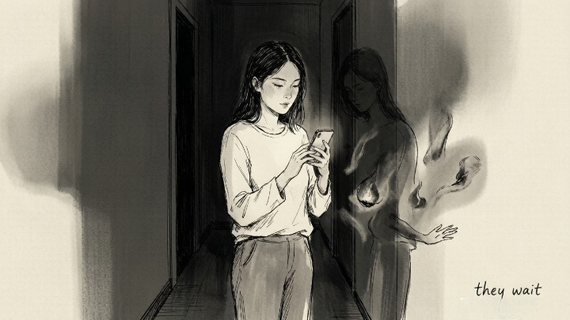
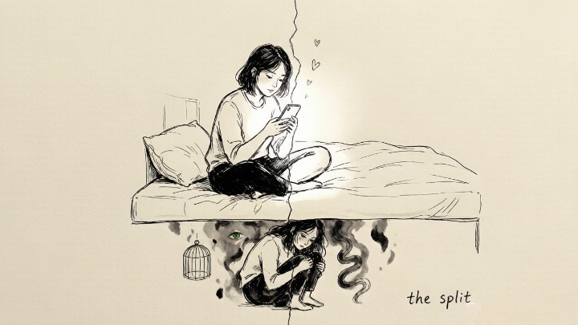
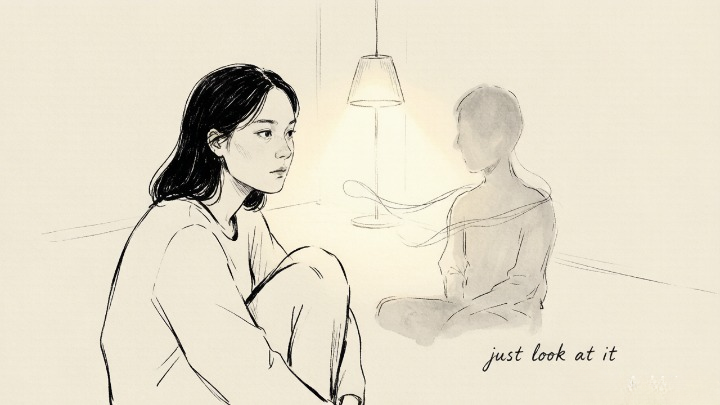

> The parts of yourself you try hardest to hide don't disappear. They wait.

## What did Jung actually mean by "the shadow"?

Every person has a version of themselves they'd rather not look at.

Friendly at work, impatient at home. Claiming you don't care about money, but feeling a twinge when someone else gets a raise. Telling yourself you're over the ex, but still checking their social media.

Jung called this material **the shadow.** It's not a dark personality or some hidden monster—it's just **the parts of you that you've learned to disown.** Anger you were punished for as a kid. Neediness you decided was weak. Ambition you're afraid looks selfish.

The more you insist "I'm not that kind of person," the louder the shadow gets pushed underground. But the shadow doesn't evaporate. **It runs the show when you're exhausted, caught off guard, or too vulnerable to keep up the performance.**

## Why is shadow work suddenly everywhere?

Because **social media split us in half.**

We curate our best selves online—gratitude, growth, good vibes. Then we close the app and the rest of the emotional spectrum is still there: jealousy, loneliness, resentment. The more polished the public persona, **the deeper the private self gets buried.**

Shadow work is about admitting the split exists and sitting down with the part of yourself you've been avoiding.

## How do you actually start shadow work?

No equipment needed. A notebook, a pen, and a pact with yourself to not censor what comes up. Here are three prompts to try:

**1. What do I hope nobody notices about me?**

Write down the traits you work hardest to mask. Not to fix them—just to name them. **Naming something you've suppressed for years is already a form of permission.**

**2. The last time I lost my temper—what was I really angry about?**

Push past the obvious answer. "They were out of line" is surface-level. Go deeper. Did they touch an old wound? **Was the intensity of the reaction out of proportion to what actually happened?** That gap between trigger and response is where the shadow lives.

**3. Who irritates me the most, and what specific trait do they have?**

Jung was blunt about this: **"Everything that irritates us about others can lead us to an understanding of ourselves."** The trait you despise in someone else is often the trait you've buried in yourself.

## What does it feel like to actually do this?

Some people feel relief—finally, permission to look. Some people feel raw—**seeing the parts you've denied isn't comfortable.** Both reactions are correct.

The point isn't to "fix" anything. The shadow doesn't need to be erased. It needs to be acknowledged. The moment you look at it and stop pretending it's not there, **it already has less control over you.**
