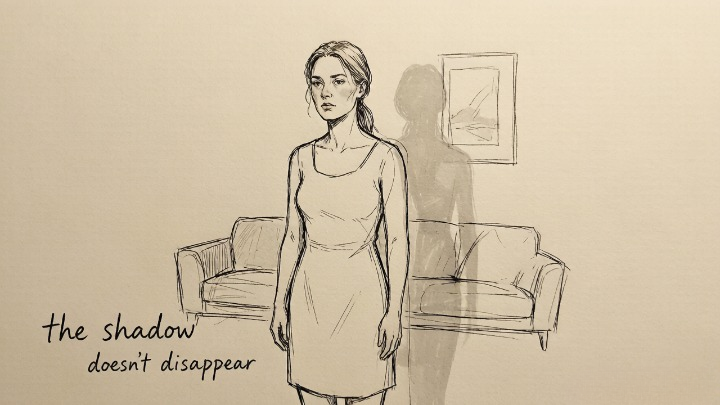
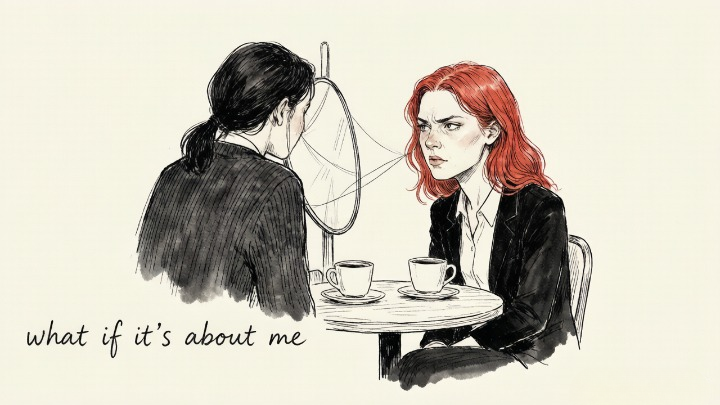
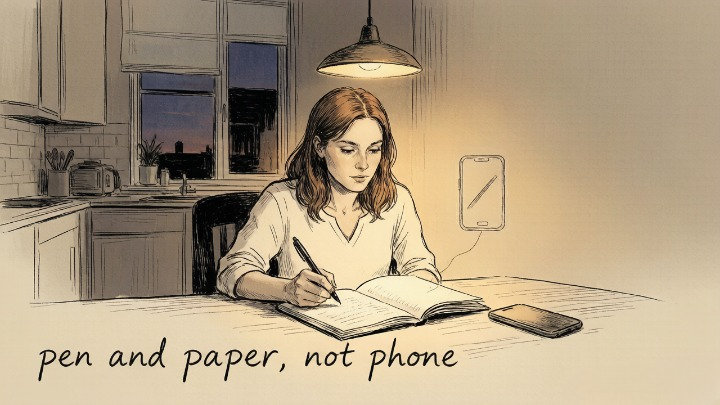
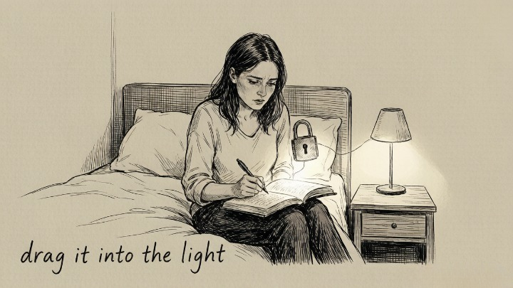
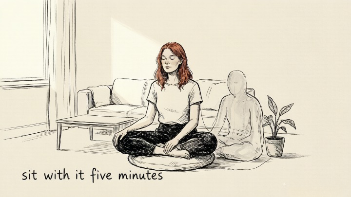

## TL;DR

There's a quiet space here for you. The shadow isn't something you need to fight or fix. It's the part of you that's been waiting to be seen — the anger you were told was too much, the fear you learned to hide, the desires you decided were unacceptable. This guide won't ask you to become someone new. It'll invite you to meet who you've always been, including the parts you've spent years running from. You're not broken. You're just unfinished, like all of us.

## What Is the Shadow?

[Carl Jung](/psych/shadow-work/carl-jung-shadow/) gave us the term *shadow* to describe the parts of ourselves we've learned to hide — the emotions we suppress, the desires we deny, the memories we bury, the qualities we judge in others because we can't accept them in ourselves.

The shadow isn't evil. It's just everything you decided, at some point, was unacceptable. Your anger. Your neediness. Your ambition. Your sexuality. Your fear. The parts of you that didn't fit the person you were told to be.

**The shadow doesn't disappear when you ignore it.** It leaks out. In your reactions. In your relationships. In the people and situations that trigger you for reasons you can't quite explain. The more you push it down, the more control it has over you.

Shadow work is the practice of turning around and facing it — not to eliminate it, but to integrate it. To become whole.

## Why Shadow Work Matters

Every time you react disproportionately to something small — a comment, a look, a minor inconvenience — your shadow is talking. The rage that doesn't match the situation. The shame that floods in for no apparent reason. The judgment you feel toward certain people that feels almost automatic.

Jung believed that **what we refuse to see in ourselves, we [project onto others](/psych/shadow-work/projection/).** The qualities you most despise in other people are often the qualities you've disowned in yourself. Shadow work pulls those projections back. It asks: *what if this isn't about them — what if it's about me?*

The payoff is significant: less reactivity, deeper self-understanding, more authentic relationships, and a sense of inner peace that comes not from being "good" but from being *whole.*

## Why Is Shadow Work Suddenly Everywhere?

Because **social media split us in half.**

We curate our best selves online — gratitude, growth, good vibes. Then we close the app and the rest of the emotional spectrum is still there: jealousy, loneliness, resentment. The more polished the public persona, **the deeper the private self gets buried.**

Shadow work is about admitting the split exists and sitting down with the part of yourself you've been avoiding. It's not a trend because it's trendy. It's a trend because the conditions that create the shadow — performance, comparison, the pressure to be more likable than you are — have never been louder.

## How to Start — The Basic Practice

Shadow work doesn't require a therapist, a retreat, or years of study. It requires one thing: **honesty.** The willingness to look at yourself without flinching.

The most accessible entry point is journaling with specific, probing questions. Not "how do I feel today?" — that's surface-level. Shadow work questions are designed to bypass your defenses and access what you normally keep hidden.

### The Setup

- Find thirty minutes of uninterrupted time. No phone. No distractions.
- Use pen and paper — not a laptop, not a phone. Handwriting slows you down enough to bypass the censoring mind.
- Answer each question without editing. If you feel resistance, write about the resistance. If you feel nothing, write "I feel nothing" and keep going. The resistance itself is information.
- **Do not read back through your answers immediately.** Let them sit for at least a day before returning to them. Distance reveals what proximity hides.

## 10 Self-Reflection Questions to Begin

Work through these one at a time. Don't rush. Some will land immediately. Others will feel like hitting a wall. Both responses are useful.

### 1. What quality in other people triggers the strongest negative reaction in me — and have I ever exhibited that quality myself?

This is the foundational shadow work question. The person who infuriates you with their arrogance, their neediness, their laziness — that reaction is often a mirror. The question isn't whether you're *exactly like them.* It's whether you've disowned that quality so thoroughly that seeing it in someone else feels unbearable.

### 2. What am I afraid people will find out about me if they really knew me?

Not your curated vulnerabilities — the ones you share to seem relatable. The deeper ones. The secret you've never told anyone. The fear that if people saw the real you — unfiltered, unperformed — they'd leave. Write it down. Name it. The shadow loses power when it's dragged into the light.

### 3. When was the last time I felt truly angry — and what was the anger covering?

Anger is almost never the primary emotion. It's a shield. Beneath anger is usually hurt, fear, or shame. Trace the anger back to what it was protecting. What were you actually feeling before the anger showed up?

### 4. What childhood message about myself do I still believe, even though I know intellectually it isn't true?

"You're too much." "You're not enough." "You're difficult to love." "You have to earn your place." These messages were planted early, usually by people who were doing their best with what they had. But they're not true. If you recognize a pattern here that feels deeper than a single belief — something that shaped how you show up in relationships, how you handle conflict, what you're afraid to want — [childhood wounds often live in exactly this territory](/psych/shadow-work/childhood-trauma/). Write down the message. Then write: *this was never about me.*

### 5. Who in my life have I not forgiven — and what would it cost me to let it go?

Forgiveness isn't about absolving someone of what they did. It's about releasing the weight you've been carrying. The person who hurt you may never apologize. Waiting for them to make it right keeps you tethered. What would happen if you released the grudge — not for them, but for yourself?

### 6. In what area of my life am I performing rather than being honest?

The job you pretend to love. The relationship you pretend is fine. The happiness you perform on social media while falling apart in private. Where are you acting instead of showing up? The shadow feeds on performance. Honesty starves it.

### 7. What do I judge most harshly in myself — and where did I learn that judgment?

You weren't born ashamed of your body, your emotions, or your desires. Someone taught you. A parent. A religion. A culture. A partner. Trace the judgment back to its source. Once you see that you learned it, you can begin to unlearn it.

### 8. If I fully accepted myself — every part, including the ones I hide — what would change in my life tomorrow?

This question reveals what's at stake. Because shadow work isn't just about self-knowledge. It's about what that knowledge makes possible. More honest relationships. Less internal conflict. The freedom to stop performing and start existing. What would actually shift?

### 9. What pattern keeps repeating in my relationships — and what might I be contributing to it?

The partners who are always emotionally unavailable. The friends who always let you down. The bosses who always undervalue you. If the same pattern keeps appearing with different people, the common denominator isn't them. It's you — not because you're broken, but because something in you keeps choosing, attracting, or tolerating the same dynamic. [Attachment patterns](/psych/relationship/attachment-styles/) drawn in early life often become the invisible script we follow without realizing it. What is it?

### 10. What part of myself am I most afraid to meet — and what would happen if I sat with it for five minutes?

Close your eyes. Ask this question silently. The answer will arrive as an image, a memory, a sensation in your body, or a word. Don't analyze it. Just notice it. That's the shadow. And the fact that you're willing to look at it — even for five minutes — means you've already started the work.

## What to Expect After You Start

The first few sessions of shadow work can feel heavy. You're opening doors you've kept locked for years. That's normal. That's the point.

Some people experience an emotional release — crying, anger, grief. Others feel nothing at first and wonder if they're doing it wrong. Both responses are valid. The shadow reveals itself on its own timeline, not yours.

After a few weeks of consistent practice, most people notice:
- Less reactivity in situations that used to trigger them
- More compassion for others — and themselves
- A growing sense that they're not fighting themselves anymore
- Dreams becoming more vivid and meaningful (the unconscious starts communicating more freely)

## A Note on Safety

Shadow work surfaces difficult material. If you have a history of trauma, severe depression, or other mental health challenges, consider doing this work with a therapist rather than alone. Shadow work is powerful — but power without support can be destabilizing. There's no shame in asking for help.

---

[12 Jungian Archetypes Introduction](/psych/shadow-work/12-jungian-archetypes-intro/) · [What Your Dreams Mean](/astrology/dream-meanings/)
