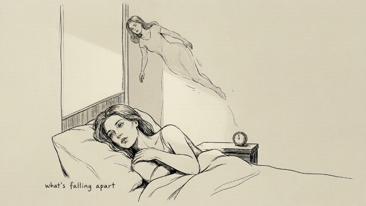
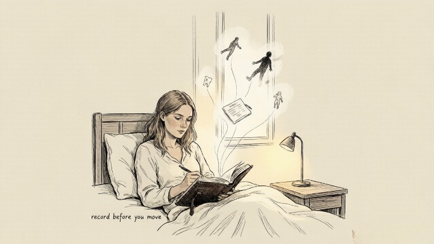
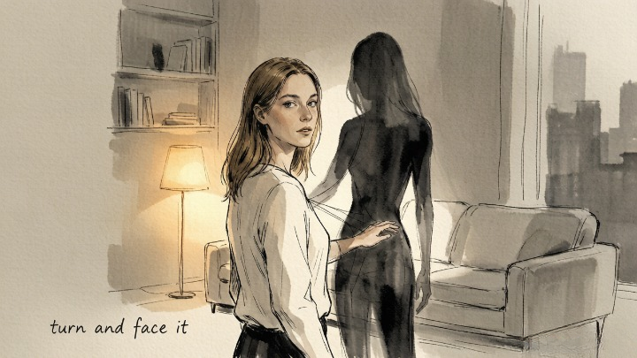

> A recurring dream isn't a glitch. It's a letter your unconscious won't stop sending.

---

Nia dreamed about falling. Not once or twice — every few weeks for six months, the same sensation: the ground disappearing beneath her feet, the stomach-drop of freefall, the violent jolt of waking just before impact. She'd lie in the dark at 3 AM, heart pounding, telling herself it was just stress. Work had been intense. Life had been a lot. It meant nothing.

Her therapist asked: "What in your life feels like it's falling apart right now?"

She started to say "nothing" — and then stopped. Her marriage. She'd been avoiding the word for months, but there it was, sitting in the room between them. Her marriage was falling apart. She'd known it. She just hadn't let herself say it. **The dream had been saying it for her, every few weeks, at 3 AM, for six months.**

### 🌌 The Unconscious Speaks in Symbols

Freud called dreams "the royal road to the unconscious." Jung went further: he argued that dreams don't just reveal repressed desires — they *compensate* for what the conscious mind refuses to see. If you're ignoring something during the day, the dream will show it to you at night. If you keep ignoring it, the dream will keep showing it.

> Jung believed that recurring dreams were among the most clinically significant — precisely because their repetition signals an unresolved conflict. The unconscious isn't trying to torment you. It's trying to get your attention. A dream that returns is a message that hasn't been received.

The symbols in dreams aren't universal codes you can look up in a dictionary. Water means emotion. Teeth mean anxiety. That's the surface. **What actually matters is what the symbol means to *you* — your personal history, your emotional associations, your specific life context.** What follows are the most common recurring dream themes and their psychological undercurrents. Treat them as starting points, not answers.

---

### 🌀 The Five Most Common Recurring Dreams

---

### 😱 Falling

**The core pattern:** The sensation of falling — from a height, into emptiness, through space — followed by the physical jolt of waking.

**The psychological current:** Falling dreams almost always coincide with periods where you feel **out of control** in some area of your waking life. The ground beneath you — the stability you depended on — has disappeared, and your psyche is processing that loss of foundation in the most visceral way available.

It's not about heights. It's about the sensation that there's nothing solid beneath you anymore — financially, relationally, professionally. Something you were counting on has become unreliable. The dream isn't predicting disaster. It's describing a current emotional reality.

**The question:** What in my life feels like it's crumbling — and have I admitted that to myself yet?

---

### 🏃 Being Chased

**The core pattern:** Someone — or something — is pursuing you. You run. You can't run fast enough. You wake with your heart pounding.

**The psychological current:** The chaser in a chase dream is almost never a literal person. It's a disguised version of something you're avoiding — a fear, a responsibility, a conversation, a part of yourself you don't want to face.

> Jung would identify the chaser as an aspect of the shadow — the parts of yourself you've rejected, disowned, or refused to integrate. The shadow doesn't disappear when you ignore it. It follows you. The longer you run, the closer it gets.

**The intervention that works:** next time you wake from a chase dream, before you open your eyes, ask yourself: *if I turned around and faced whatever was chasing me, what would it look like? What would it want?* The answer — which will arrive before your rational mind can filter it — is almost always the key to the dream.

**The question:** What have I been running from in my waking life — and how long have I been running?

### 📝 Being Unprepared for an Exam

**The core pattern:** You're back in school. An exam is about to start. You haven't studied. You don't even know what subject it is. You're going to fail.

**The psychological current:** This dream rarely has anything to do with actual academic performance. It's about **imposter syndrome** — the fear that you're going to be exposed as inadequate, that you've been faking competence and everyone is about to find out.

It surfaces during periods of evaluation: a performance review, a new role, a relationship where you feel like you're not measuring up. The exam in the dream is the judgment you fear is coming in real life. The unpreparedness is your internal belief that you're not ready — even when you are.

**The question:** Where in my life do I feel like I'm about to be "found out" — and is that fear based on reality or on an old story I keep telling myself?

---

### 🦷 Teeth Falling Out

**The core pattern:** Your teeth loosen, crumble, or fall out — often accompanied by a visceral sensation of loss or exposure.

**The psychological current:** This is one of the most universally reported dream themes, and it carries several layers.

At the surface: anxiety about **appearance and presentation.** Teeth are how we show ourselves to the world — the smile that greets people, the face we present. Losing them connects to fear of being seen as unattractive, aging, or diminished.

Deeper: anxiety about **powerlessness.** Teeth are tools for survival — we use them to eat, to defend, to process. Losing them signals a loss of agency or effectiveness — the sense that you can't "bite into" life the way you used to.

Deeper still: something is **loosening** that needs to loosen. A belief. A relationship. A version of yourself you've been holding onto. The teeth aren't always a warning. Sometimes they're a release.

**The question:** What am I afraid of losing — and is it something I actually need to let go of?

### 👤 Being Naked in Public

**The core pattern:** You're suddenly naked — or partially dressed — in a public place. Everyone can see you. You're exposed. You can't cover yourself fast enough.

**The psychological current:** This dream is about **vulnerability** — the terror of being seen as you actually are, without the protective layers of presentation, status, or performance.

It often surfaces when you're entering a new environment where you don't yet feel established — a new job, a new social circle, a new relationship. The fear is: they're going to see through me. They're going to know I don't belong here.

But there's a secondary reading worth considering: the dream may also express a **desire to be seen.** Not exposed in a humiliating way, but acknowledged. Accepted without the armor. The nakedness isn't just shame. It's also honesty. The dream might be asking: *what would happen if you let people see you — really see you — without the performance?*

> *The privilege of a lifetime is to become who you truly are.* — Carl Jung

**The question:** Where am I hiding behind a performance — and what would happen if I stopped?

---

### 🚪 Locked Doors and Recurring Locations

**The core pattern:** You're in the same place again — the same house, the same hallway, or standing before a locked door you never seem to open.

**The psychological current:** Locked doors in dreams almost always represent access to something you're keeping from yourself — a memory, a feeling, a truth you know but refuse to acknowledge. A friend of mine dreamed about a locked door for three years. Same hallway. Same brass handle. Same feeling of something behind it — something important, something she both needed and dreaded. When her therapist asked, "What would happen if you opened it?" she started crying. The door was a conversation she needed to have with her mother.

If a location recurs, ask yourself: what was happening in my life the first time I was in a place like this? The dream isn't sending you back to that location. It's sending you back to what you felt there.

**The question:** What am I keeping locked — and what would happen if I opened it?

---

### 💧 Water and What It Carries

**The core pattern:** Water in all its forms — calm, murky, flooding, drowning.

**The psychological current:** Water often represents the emotional layer of the psyche — what's flowing, what's stagnant, what's flooding, what's been dammed up. Calm, clear water usually signals emotional peace or clarity. Murky water — something unprocessed, something you can't quite see yet. Flooding — emotional overwhelm, feelings you've been suppressing that are now spilling past their containment. Drowning — the sensation of being consumed by something you can't control.

Your own history with water outweighs any universal meaning. **Someone who nearly drowned as a child will have an entirely different relationship with water in dreams than someone who grew up swimming in the ocean.** The symbol's meaning lives in *your* memory, not in a dictionary.

**The question:** What's flowing in my life right now — and what's been dammed up?

---

### 🕊️ Flying

**The core pattern:** You're airborne — effortless, weightless, looking down at the world.

**The psychological current:** Flying dreams often signal liberation — the sense of breaking free from a constraint that's been holding you. They frequently appear during periods of perspective shift: after making a hard decision, after releasing something heavy, after finally seeing a situation clearly. The flying isn't about escape. It's about **elevation — rising above something that used to trap you at ground level.**

If flying dreams come during difficult periods — a breakup, a career crisis, a period of grief — they're usually telling you that part of you is already free, even if the rest of you hasn't caught up yet.

**The question:** What has been holding me down — and what part of me is already free?

---

### 📖 How to Work With Your Dreams

Dreams don't need a professional interpreter. They need your attention.

**The practice — four steps:**

1. **Record immediately.** Keep a notebook and pen next to your bed. The moment you wake — before you move, before you check your phone — write down whatever you remember. A fragment is enough. A single image. A color. An emotion. Dreams dissolve within minutes. Catch them before they do.

2. **Don't interpret right away.** For the first week, just record. No analysis. No "what does this mean." Just gather data. After seven days, look back. **Patterns that are invisible in individual dreams become obvious across a week of entries.**

3. **Ask the dream directly.** Active imagination — a technique Jung developed — invites you to re-enter the dream while awake. Close your eyes. Return to the scene. Ask the figure or symbol: *what are you trying to tell me?* Let the answer come however it comes. Don't judge it. Your unconscious speaks in images because that's its native language.

4. **Look for the waking-life parallel.** Every recurring dream has a corresponding situation in your conscious life. The connection may not be literal, but it's there. The question isn't "what does this symbol mean in general?" It's "what does this symbol mean *in the context of my life right now?*"

---

#### 🧪 Quick Self-Check

Identify your most frequent recurring dream:

* Which theme resonates — falling, being chased, unpreparedness, teeth, nakedness?
* When did this dream first start — and what was happening in my life at that time?
* If this dream were a message from the part of me that knows the truth, what would it be saying?
* What have I been avoiding during the day that my dreams keep serving back to me at night?

---

## 🧭 The Only Question That Unlocks Almost Any Dream

Forget dream dictionaries. Forget universal symbols. Here's the only question you need:

> *"If this dream were a message about my waking life, what would it be saying?"*

Not what the water means. Not what the teeth represent. What is the dream, taken as a whole, trying to tell you about where you are right now? **The answer will almost always be something you already know — something you just haven't been willing to face.**

---

## 🛒 Tools for Deeper Dream Work

Working with dreams becomes a practice when you have the right tools:

**A dedicated dream journal.** Not a Notes app. Something physical — a notebook that lives on your nightstand and nowhere else. The act of handwriting slows the mind down and captures details that typing skips over. Look for something with a cover you want to touch. It matters more than you think.

**Jung's *Man and His Symbols.*** Written for a general audience in the last year of Jung's life, it's still the most accessible introduction to dream analysis and symbolic thinking. Available on Amazon for under $15.

**A sleep ritual kit.** Lavender sleep spray. A silk eye mask. A white noise machine or app. These aren't just comfort items — they improve sleep quality, which directly increases dream recall. The deeper you sleep, the more vividly you dream.

And when a dream keeps returning and you can't decode it on your own — when the symbol is too close for you to see clearly — a skilled dream interpreter or psychic reader can help. Oranum screens every reader through a live demonstration reading. First session costs less than lunch. No subscription.

---

Nia told her husband she wanted a separation about three weeks after that session with her therapist. The conversation was brutal. The months that followed were harder. But the falling dreams stopped almost immediately — not because her life had stabilized, but because she'd finally admitted what the dreams had been trying to tell her for six months. The ground *was* falling away. She just hadn't been willing to name it.

She still dreams. Everyone does. But the dreams that come now are different — open fields, wide skies, once a dream about flying that didn't feel like falling. She writes them down in a leather journal her therapist recommended. Every morning. First thing.

"The unconscious doesn't stop talking," she told me. "You just learn to listen before it has to scream."

---

*Explore [Shadow Work](/psych/shadow-work/) to continue the descent into your unconscious, or read our guide to the [Major Arcana's archetypal messages](/tarot/major-arcana-archetypes/) for a tarot-based framework for psychological exploration.*
