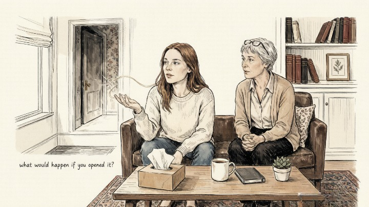
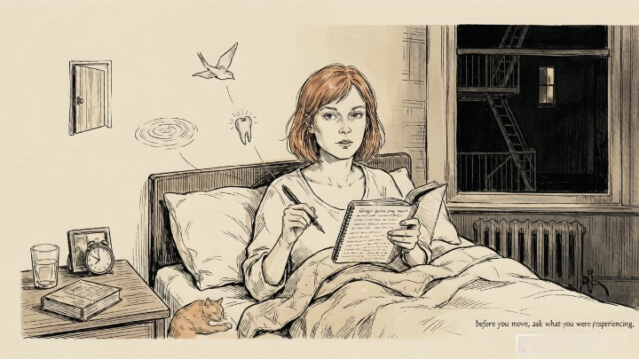
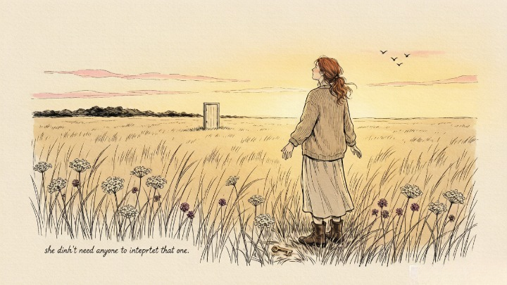

> Dreams are your unconscious painting in symbols what it can't say in words.

---

A friend of mine dreamed about a locked door for three years. Same hallway. Same brass handle. Same feeling of something behind it — something important, something she both needed and dreaded.

She mentioned it to her therapist once, almost as an afterthought. The therapist asked: *"What would happen if you opened it?"*

She started crying. Not because the dream was scary. Because she already knew the answer — and had known for years. The door was a conversation she needed to have with her mother. The dream had been telling her the whole time.

## 🌌 Why Dreams Aren't Random

For most of the twentieth century, mainstream neuroscience dismissed dreams as meaningless neural static — random firing during REM sleep with no psychological significance. This was the "activation-synthesis" model: images firing, cortex stitching them into stories, nothing to see here.

That model has largely collapsed. Modern sleep science confirms that REM sleep is essential for **emotional processing, memory consolidation, and creative problem-solving.** The brain during REM is not randomly firing. It's integrating — pulling apart emotional experiences, recombining them with stored memories, and trying to make sense of what the waking mind can't resolve.

> Carl Jung called dreams "the small hidden door to the deepest and most intimate sanctum of the soul." He argued that dreams speak in the native language of the unconscious — symbols, images, emotional atmospheres — not because they're trying to confuse us, but because that's the only language the unconscious has. The conscious mind works in narrative. The unconscious works in metaphor.

> *Who looks outside, dreams; who looks inside, awakes.* — Carl Jung

---

### 🗝️ The Most Common Dream Symbols (That Aren't What You Think)

Dream dictionaries will tell you that water means emotion and teeth falling out means anxiety about aging. Sometimes that's true. Often it's not — because **a symbol's meaning depends on the dreamer's personal associations, not a universal code.**

What follows are the most commonly reported dream themes and the psychological currents they usually carry. Treat these as starting points, not answers.

---

### 🚪 Recurring Locations and Locked Doors

**The core answer:** Locked doors in dreams almost always represent access to something you're keeping from yourself — a memory, a feeling, a truth you know but refuse to acknowledge.

My friend's locked door was a conversation. For someone else it might be a career change, a buried grief, a part of their identity they've never let surface. The door is never actually locked — that's the dream's fundamental message. **You have the key. You're choosing not to turn it.**

If a location recurs — the same house, the same hallway, the same room — ask yourself: what was happening in my life the first time I was in a place like this? The dream isn't sending you back to that location. It's sending you back to what you felt there.

### 💧 Water and What It Carries

**The core answer:** Water in dreams often represents the emotional layer of the psyche — what's flowing, what's stagnant, what's flooding, what's been dammed up.

Calm, clear water usually signals emotional peace or clarity. Murky water — something unprocessed, something you can't quite see yet. Flooding — emotional overwhelm, feelings you've been suppressing that are now spilling past their containment. Drowning — the sensation of being consumed by something you can't control.

> *What is essential is invisible to the eye.* — Antoine de Saint-Exupéry

But here's the crucial nuance: **your personal history with water matters more than any universal meaning.** Someone who nearly drowned as a child will have an entirely different relationship with water in dreams than someone who grew up swimming in the ocean. The symbol's meaning lives in *your* memory, not in a dictionary.

---

### 🦷 Teeth Falling Out

**The core answer:** One of the most universal dream themes. Usually signals anxiety about loss of control, powerlessness, or fear around how others perceive you.

Teeth are about appearance and function — how we present ourselves and how we process the world. Losing them in a dream often coincides with periods where we feel exposed, vulnerable, or unable to "digest" what's happening around us.

But here's a less common take I've found useful: losing teeth sometimes signals that **something you've been holding onto is finally loosening.** A belief. A grudge. A story about yourself that no longer fits. The dream isn't always about loss. Sometimes it's about release.

### 🏃 Being Chased

**The core answer:** You're avoiding something in waking life — and the harder you run, the closer the chaser gets.

The chaser is almost never a literal person. It's a disguised version of a fear, a responsibility, a conversation, or a part of yourself you don't want to face. The dream repeats because **the thing chasing you won't stop until you turn around.**

> *The cave you fear to enter holds the treasure you seek.* — Joseph Campbell

One way to work with chase dreams: the next time you wake from one, before you move or open your eyes, ask yourself — *if I turned around and faced whatever was chasing me, what would it look like? What would it want?* The answer that comes isn't from the dream. It's from you.

---

### 🕊️ Flying

**The core answer:** Flying dreams often signal liberation — the sense of breaking free from a constraint that's been holding you.

They frequently appear during periods of perspective shift: after making a hard decision, after releasing something heavy, after finally seeing a situation clearly. The flying isn't about escape. It's about **elevation — rising above something that used to trap you at ground level.**

If flying dreams come during difficult periods — a breakup, a career crisis, a period of grief — they're usually telling you that part of you is already free, even if the rest of you hasn't caught up yet.

---

#### 🧪 Quick Self-Check

Before bed tonight, place a notebook and pen next to your bed. Set an intention — just say to yourself: *"I will remember my dreams."*

When you wake, before you move, ask yourself:

* What was I just experiencing?
* Was there a color, an emotion, a person, a place?
* If I could name the feeling of the dream in one word, what would it be?

Write down whatever you remember — even a single word. Don't interpret. Just record. After seven days, look back at the week. **Patterns will surface that individual dreams don't reveal.**

---

## 🧭 The Only Question That Unlocks Almost Any Dream

Forget dream dictionaries. Forget universal symbols. Here's the only question you need:

> *"If this dream were a message about my waking life, what would it be saying?"*

Not what the water means. Not what the teeth represent. What is the dream, taken as a whole, trying to tell you about where you are right now? **The answer will almost always be something you already know — something you just haven't been willing to face.**

---

## 🔮 When You Want Help Decoding What Keeps Showing Up

Sometimes a dream repeats because the message is urgent. Sometimes it repeats because the message is uncomfortable and you're dodging it. Either way, an outside perspective can help.

A skilled psychic or dream interpreter can reflect patterns back to you that you're too close to see. Oranum screens every reader through a **live demonstration reading** before they can accept paid clients. Their refund policy is straightforward: if it doesn't feel right, ask for your money back within twenty-four hours. Your first session costs less than lunch.

**Try it once.** Share the dream — just the images, no interpretation — and see what comes back. You might be surprised by how much someone can see that you've been walking past every day.

---

My friend with the locked door finally opened it. Not in the dream — in real life. She had the conversation with her mother. It was hard. It was overdue. It didn't fix everything.

But she stopped dreaming about the door.

A year later, she had a new dream — an open field, wide and green, nothing chasing her, nothing locked. She didn't need anyone to interpret that one.

---

*That's Week 1. Next week: tarot for absolute beginners — where to start, what deck to choose, and the simplest spread that'll teach you more than any book.*
