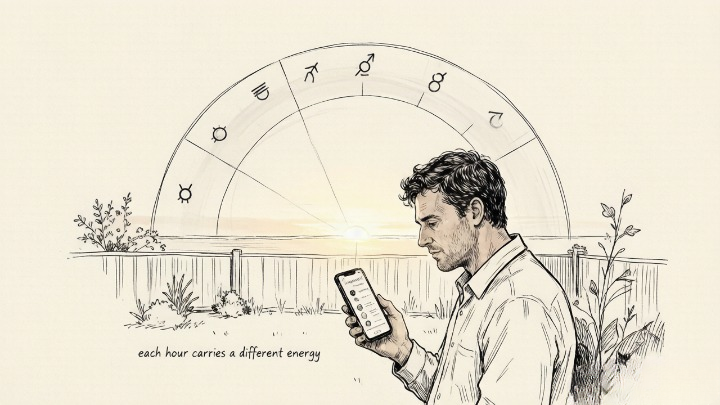
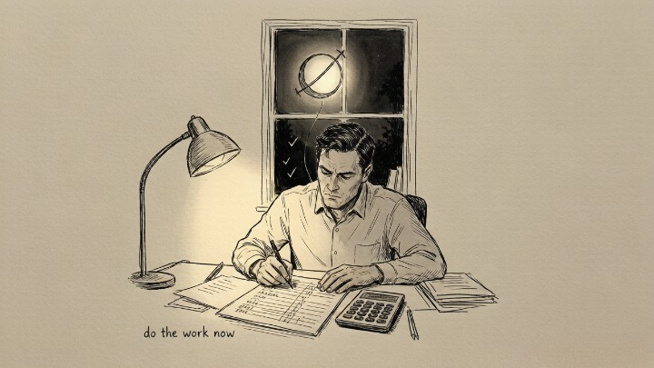

> Time isn't just linear. Each hour carries a different energy — and you can learn to work with it.

---

David scheduled his job interview for 10 AM on a Tuesday, which happened to fall during a Venus hour. He got the offer. When he told a friend about the timing, she rolled her eyes. "So now you're scheduling your life around planets?"

He kept doing it anyway. Mercury hours for writing and emails. Jupiter hours for big-picture planning. Mars hours for workouts and difficult conversations. A month in, he had enough anecdotal evidence that he stopped telling people — not because it wasn't working, but because the results spoke for themselves.

He wasn't practicing magic. He was practicing **alignment.** And the ancient system of planetary hours — developed in Hellenistic Egypt, refined through the Islamic Golden Age, preserved in Renaissance grimoires — is one of the oldest frameworks for doing exactly that.

---

### 🌌 As Above, So Below

The Hermetic principle — "as above, so below" — isn't poetry. It's a functional statement about correspondence: the patterns of the cosmos are reflected in the patterns of daily life. The sun rises. The moon waxes and wanes. The planets trace their orbits. And within those rhythms, specific moments carry specific energetic qualities.

> The planetary hours system is based on a simple observation: the seven classical planets — Saturn, Jupiter, Mars, Sun, Venus, Mercury, Moon — govern time in a repeating sequence that begins anew each day at sunrise. The first hour of each day belongs to the planet that rules that day. Sunday starts with the Sun. Monday with the Moon. Tuesday with Mars. And so on, through the week, in an unbroken chain that's been calculated for millennia.

The system doesn't require belief in astrology. It requires willingness to experiment — to treat time not as a blank container into which any activity can be poured, but as a medium with its own texture and momentum.

### 🕰️ How Planetary Hours Actually Work

A planetary "hour" isn't sixty minutes. It's one-twelfth of the time between sunrise and sunset (for day hours) or sunset and sunrise (for night hours). In summer, day hours are longer. In winter, they're shorter. **The system adjusts to the actual rhythm of daylight where you are.**

Each day begins at sunrise with the hour of the planet that rules that day. The sequence then follows the Chaldean order — Saturn → Jupiter → Mars → Sun → Venus → Mercury → Moon — cycling continuously through day and night.

You don't need to calculate this by hand. Apps like Hours, Planetary Times, and Time Nomad calculate your local planetary hours automatically. Enter your location, check the app, and you'll know which planet rules the current hour.

> *Time is the substance from which I am made. Time is a river which carries me along, but I am the river.* — Jorge Luis Borges

---

### 🔥 The Seven Planetary Hours — Energy and Action Guide

---

### ☀️ Hour of the Sun

**Planetary energy:** Vitality, self-expression, leadership, visibility, personal power.

The Sun hour is when you are most radiant — when your presence carries weight and your words land with authority. This is the hour for **putting yourself forward:** job interviews, presentations, asking for a raise, posting work publicly, having the conversation where you need to be seen and heard.

**Best for:** Self-promotion, creative expression, leadership, physical vitality, confidence-building activities.

**Avoid:** Hiding. Procrastinating on visibility. The Sun hour won't wait for you to feel ready.

---

### 🌙 Hour of the Moon

**Planetary energy:** Intuition, emotion, receptivity, the inner world, the body's quiet signals.

The Moon hour is when the rational mind softens and the felt sense sharpens. This is the hour for **listening inward:** meditation, journaling, dream recall, tarot pulls, anything that requires you to receive rather than project.

**Best for:** Intuition work, emotional processing, connecting with family, rest, dream journaling, ritual.

**Avoid:** Major decisions that require sharp logic. The Moon hour favors feeling over analysis — save the spreadsheets for Mercury.

### ☿ Hour of Mercury

**Planetary energy:** Communication, intellect, learning, commerce, travel, technology.

The Mercury hour is when your mind is fastest, your words are clearest, and information flows most freely. This is the hour for **thinking and connecting:** writing, editing, emails that matter, negotiations, learning something new, signing contracts.

**Best for:** Writing, meetings, negotiations, studying, teaching, any form of communication.

**Avoid:** Emotional conversations that require empathy over clarity. Mercury is sharp, not soft.

---

### ♀ Hour of Venus

**Planetary energy:** Love, beauty, harmony, pleasure, attraction, social grace.

The Venus hour is when connection flows, when you're most magnetic, when beauty and pleasure feel accessible rather than frivolous. This is the hour for **relationships and self-care:** dates, difficult conversations that need to stay kind, creative work, anything involving aesthetics.

**Best for:** Dating, social events, beauty rituals, artistic work, reconciliation, self-care.

**Avoid:** Conflict, criticism, high-pressure negotiations. Venus wants harmony — force will backfire.

---

### ♂ Hour of Mars

**Planetary energy:** Action, courage, drive, assertion, physical power, confrontation.

The Mars hour is when your will is sharpest and your tolerance for passivity is lowest. This is the hour for **doing the hard thing:** workouts, difficult conversations you've been avoiding, competitive situations, anything that requires you to push through resistance.

**Best for:** Exercise, competition, taking decisive action, setting boundaries, starting projects that require momentum.

**Avoid:** Delicate emotional conversations. Mars doesn't do gentle. Save those for Venus or the Moon.

---

### ♃ Hour of Jupiter

**Planetary energy:** Expansion, abundance, optimism, wisdom, long-term vision.

The Jupiter hour is when your perspective widens and possibility feels real. This is the hour for **thinking big:** strategic planning, vision boarding, learning something expansive, making decisions that affect your long-term trajectory.

**Best for:** Planning, studying philosophy or spirituality, teaching, generosity, celebrating, expanding your worldview.

**Avoid:** Details, budgets, fine print. Jupiter sees the forest, not the trees.

---

### ♄ Hour of Saturn

**Planetary energy:** Discipline, structure, responsibility, patience, mastery through repetition.

The Saturn hour is when focus sharpens and distractions fade. This is the hour for **doing the work:** the task you've been avoiding, the practice session, the budget review, the difficult commitment that requires showing up when motivation is absent.

**Best for:** Focused work, planning, accountability, finishing projects, establishing routines, facing reality.

**Avoid:** Launching new projects, creative brainstorming. Saturn wants you to finish, not begin.

### 🧭 How to Apply This Without Obsessing

You don't need to schedule your entire life around planetary hours. Most people who use this system pick **one or two key activities** and time them deliberately. The rest of the day unfolds on its own.

**The minimalist approach — three applications:**

1. **Schedule your most important weekly task during its ideal hour.** Writing? Mercury. Presentation? Sun. Hard conversation? Mars. Strategy session? Jupiter. Pick one thing and experiment for two weeks.
2. **Check the hour before big decisions.** Before you hit send on that email, before you walk into that meeting, before you have that conversation — glance at the current planetary hour. If it's aligned, proceed with confidence. If it's not, you can still proceed — but you'll do it with awareness.
3. **Use the daily rhythm as a diagnostic.** If you consistently feel resistance during certain hours, check what planet is active. Are you trying to do Mercury work during a Moon hour? Mars work during a Venus hour? The friction may not be about the task. It may be about the timing.

---

#### 🧪 Quick Self-Check

For the next week, try this:

* Download a planetary hours app (Hours, Planetary Times, or Time Nomad).
* Check the current planetary hour three times a day — morning, midday, evening.
* Note whether the energy of the hour matches what you're actually doing.
* Experiment with scheduling one task during its aligned hour. Notice the difference.

**The system doesn't require belief. It rewards experimentation.**

---

## 🛒 Tools for Working With Planetary Time

You don't need much to work with planetary hours. One app and maybe one physical tool are enough:

**A planetary hours app.** Hours (iOS) and Time Nomad (iOS/Android) are the two best options — clean interfaces, automatic local calculation, no esoteric clutter. Both are free with optional paid upgrades.

**An astrology planner.** A physical weekly planner that shows moon phases, planetary ingresses, and void-of-course periods alongside your daily schedule. The Magic of I and Honeycomb planners are beautifully designed and built for this exact purpose. $30–$50, released annually.

**Planetary ritual candles.** If you want to deepen the practice, candles dressed with oils and herbs corresponding to each planet can anchor the ritual dimension of the hours. Available on Etsy from independent makers. A set of seven covers the full week.

And when you're working with timing but still feeling stuck — when you know which action to take but can't seem to align the energy — a session with an astrologer or intuitive reader can help identify what's blocking the flow. Oranum screens every reader through a live demonstration reading. Refund policy: twenty-four hours. First session costs less than lunch.

---

David still schedules his interviews during Venus or Sun hours. He doesn't tell people anymore — not because he's embarrassed, but because the results are consistent enough that he doesn't need to convince anyone. His last performance review mentioned his "uncanny timing" in closing deals.

He smiled. Didn't explain.

"The planets aren't doing the work for me," he said. "They're just pointing to when the current is flowing in my direction. You still have to paddle. But paddling downstream is a lot easier than paddling up."

---

*Explore our full Astrology & Symbols series, or read about Venus retrograde to understand what happens when the planet of love and timing appears to move backward.*
