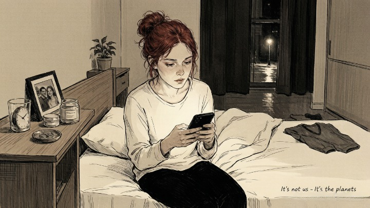
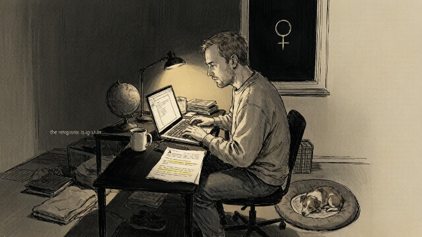
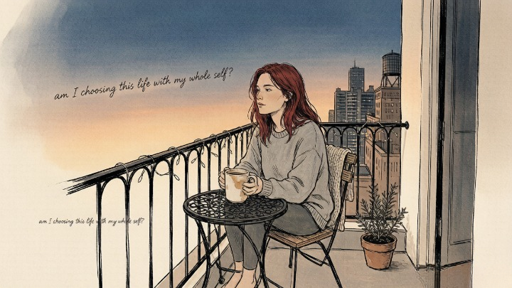

> Venus retrograde doesn't break relationships — it reveals what was already cracked.

---

A friend called me in a panic during the last Venus retrograde. She'd just had the worst fight of her two-year relationship — screaming, tears, someone sleeping on the couch. The next morning, she googled "what is happening to my relationship" and landed on an astrology site that told her Venus was retrograde and all relationships were under review.

She texted her boyfriend: "It's not us — it's the planets."

He didn't reply for two days.

When they finally talked, it wasn't about Venus. It was about the six months of resentment they'd been piling up, the conversations they'd been avoiding, the distance that had been growing long before any planet changed direction. **The retrograde didn't cause the fight. It just made it impossible to keep pretending everything was fine.**

---

### 🌌 What Venus Retrograde Actually Is

Venus goes retrograde approximately every eighteen months, and the transit lasts about six weeks. During that period, from Earth's perspective, Venus appears to move *backward* across the sky. It doesn't actually reverse course — it's an optical illusion caused by the relative speeds of Earth and Venus in their orbits.

Astrologically, Venus governs love, beauty, values, money, and pleasure. When it's retrograde, the energy of those domains turns inward. Instead of pursuing new love, new purchases, new pleasures, the retrograde asks: *what do you already have — and is it actually working?*

> In psychological terms, Venus retrograde functions like a mandatory relationship audit. The same way Saturn return forces a career and identity reckoning around age twenty-nine, Venus retrograde periodically forces us to examine our closest connections. The transit isn't causing problems. It's removing the coping mechanisms that let us ignore them.

### 🔥 What Actually Happens During Venus Retrograde

People report four patterns during this transit. I've seen all of them, repeatedly:

- **Exes resurface.** Suddenly you're hearing from someone you dated three years ago. Not because the universe is reuniting soulmates — because the retrograde energy pulls unfinished emotional business to the surface. The question isn't "should I get back together with them?" It's "what's still unresolved between us?"
- **Current relationships get pressure-tested.** The things you've been tolerating, ignoring, or papering over suddenly become unbearable. Not because they got worse. Because your tolerance for them dropped.
- **New relationships feel unstable.** Starting something during Venus retrograde is notoriously tricky. The initial chemistry might be real, but the foundation is shaky — because you're not seeing the person clearly. You're seeing them through the lens of whatever you're still processing from the past.
- **Self-worth issues surface.** Venus also rules how you value yourself. During retrograde, old insecurities about your attractiveness, desirability, or lovability can resurface — not to torture you, but to be examined and released.

> *The first step toward change is awareness. The second step is acceptance.* — Nathaniel Branden

---

### 🪞 The Retrograde Is Asking One Question

Every Venus retrograde, beneath all the chaos and drama, asks the same thing:

> *"Are you in this because you want to be — or because you're afraid of leaving?"*

That's it. Not "do they love you." Not "are you compatible." Not "will it work out." Just: are you choosing this relationship with your whole self, or are you staying because leaving is harder?

**If that question makes you uncomfortable, the retrograde is already working.**

### 🧭 How to Work With It (Instead of Against It)

Most astrology advice tells you to avoid major relationship decisions during Venus retrograde. Don't get married. Don't start a new relationship. Don't get a dramatic haircut. That advice is practical but it misses the deeper opportunity.

**The retrograde isn't something to survive. It's something to use.**

Here's what actually helps:

* **Let the exes surface — then let them go.** If someone from the past reaches out, the retrograde isn't saying "try again." It's saying "there's still something here that needs to be released." Reply if you want. Closure is real. But don't mistake the reopening of an old wound for a second chance.
* **Have the conversation you've been avoiding.** The thing you haven't said — about the distance, the resentment, the way they talk to you in front of their friends — the retrograde has made it harder to keep swallowing. That's not punishment. That's permission. Say it.
* **Re-evaluate what you want — not what you're settling for.** A lot of people emerge from Venus retrograde realizing they don't want the relationship they're in. They've just been too scared to admit it. The retrograde clears the fog. What you do with that clarity is up to you.

---

#### 🧪 Quick Self-Check

If Venus retrograde is hitting your relationship right now:

* Is this fight actually new — or is it the same fight you've been having for months, finally boiling over?
* Am I staying because I want to — or because I'm scared of what happens if I leave?
* If I knew I'd be okay alone — completely, fully okay — would I still choose this person?
* What's the thing I haven't said because saying it would change everything?

**The retrograde isn't the problem. It's the spotlight. What it illuminates is up to you.**

## 🔮 When You Need Help Sorting Through What the Retrograde Is Showing You

Sometimes the retrograde brings so much to the surface — old relationships, current tensions, buried feelings — that you can't sort through it alone. Everything feels urgent and nothing feels clear.

A skilled astrologer or tarot reader can help you identify what's actually emerging versus what's just noise. Oranum screens every reader through a **live demonstration reading** before they accept clients. Refund policy: twenty-four hours, no questions. First session costs less than lunch. No subscription.

**Try it once.** Ask about what's surfacing for you right now. See what comes back.

---

My friend and her boyfriend broke up. Not because of Venus retrograde — but because the retrograde made it impossible to keep ignoring what she'd been feeling for months. He wasn't a bad person. They just weren't right for each other. And admitting that was harder than blaming the planets.

She doesn't dread retrogrades anymore. She uses them. Every eighteen months, she sits down and asks herself the same question Venus asks: *am I choosing this life with my whole self?*

She says it's the most honest conversation she has all year.

---

*Tomorrow: [tarot cards that signal a new relationship](/tarot/tarot-love-cards/) — which cards actually point toward love, and why The Lovers usually isn't one of them.*
