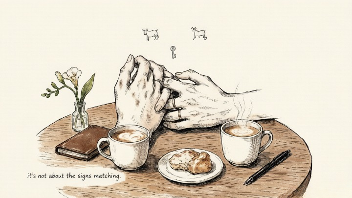
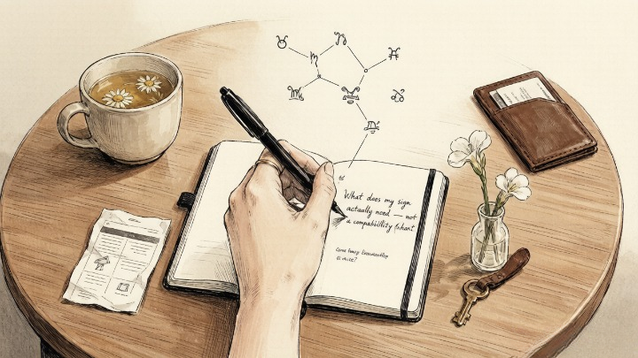

> Compatibility isn't about matching signs. It's about meeting needs.

---

My Taurus friend dated a Sagittarius for two years. Every astrology blog told her it was a terrible match. Earth and fire. Stability and wildness. Home and the open road. She spent those two years trying to convince herself the charts were wrong. She loved him. He loved her. Shouldn't that be enough?

The problem wasn't that they were incompatible signs. The problem was that she needed *consistency* to feel safe — plans, routines, knowing what was happening next week. He needed *spontaneity* to feel alive — last-minute trips, changing plans, the thrill of not knowing.

Neither was wrong. They just needed fundamentally different things from a partnership. And love, it turns out, isn't always enough to bridge the gap between what two people require to feel seen.

---

### 🌌 Why Sun Sign Compatibility Charts Miss the Point

Most compatibility advice focuses on which signs "go together." Taurus and Cancer, Leo and Sagittarius, Virgo and Capricorn. These pairings are based on elemental harmony — earth with earth, fire with air — but they miss something crucial: **two people can share perfect elemental alignment and still fail to meet each other's core needs.**

What actually determines relationship success isn't whether your signs match. It's whether you understand what the other person fundamentally requires — and whether you're capable of offering it.

> In psychological terms, compatibility is about attachment needs meeting in a way that soothes rather than triggers. Your sun sign describes your core identity — what you need to feel like yourself in the world. If that need isn't being met by your partner, no amount of love will compensate.

### 🔥 What Each Sign Actually Needs

### ♈ Aries

**Core need:** A partner who doesn't dim their fire.

Aries doesn't need someone who agrees with them. They need someone who can match their intensity without being consumed by it. The worst partner for Aries is someone who makes them feel like their passion is "too much." The best partner is someone who sees the fire and says *more.*

Not about: being controlled, passive partners, people who can't make decisions.

---

### ♉ Taurus

**Core need:** A partner who makes them feel safe.

Taurus needs consistency. Predictability. Someone who shows up when they say they will, who means what they say, who doesn't keep them guessing. Taurus doesn't need grand gestures. They need the small, repeated evidence of reliability — the text goodnight, the remembered detail, the steady presence.

Not about: chaos, unpredictability, emotional whiplash.

---

### ♊ Gemini

**Core need:** A partner who keeps their mind engaged.

Gemini doesn't need romance as much as they need *conversation.* Someone who's curious, who asks questions, who doesn't get bored or dismissive when the topic shifts for the third time in ten minutes. Gemini feels loved when their mind is being seen — not just their body or their heart.

Not about: intellectual laziness, routine without variety, being shut down.

### ♋ Cancer

**Core need:** A partner who honors their emotional depth.

Cancer feels everything deeply — and they need a partner who doesn't make them feel ashamed of that. Someone who can hold space for the tears without fixing, who understands that Cancer's moodiness isn't drama but processing. The worst thing you can do to Cancer is tell them they're "too sensitive." The best thing: sit with them in the feeling.

Not about: emotional dismissal, cold logic, being made to feel like a burden.

---

### ♌ Leo

**Core need:** A partner who sees and celebrates them.

Leo doesn't need to be the center of the universe. They need to be the center of *your* universe — and they need you to show it. Not with empty compliments, but with genuine attention. Notice them. Celebrate them. Don't take them for granted. Leo withers in relationships where they feel invisible.

Not about: being ignored, taken for granted, partners who compete for the spotlight.

---

### ♍ Virgo

**Core need:** A partner who appreciates their devotion without exploiting it.

Virgo expresses love through acts of service — remembering your schedule, fixing the thing you mentioned was broken, anticipating what you need before you ask. They need a partner who *notices* this and values it — not someone who treats it as invisible labor. Virgo's love language is effort. Ignore the effort, and you'll lose them.

Not about: being taken for granted, chaos they're expected to manage, partners who don't pull their weight.

---

### ♎ Libra

**Core need:** A partner who creates beauty and balance with them.

Libra needs harmony — not the absence of conflict, but the presence of mutual respect, aesthetic pleasure, and genuine partnership. They need someone who values fairness, who cares about how things *feel* as much as how they function. Libra can't thrive in a relationship that's constantly off-balance.

Not about: ugliness, disrespect, constant conflict without resolution.

---

### ♏ Scorpio

**Core need:** A partner who isn't afraid of their depth.

Scorpio needs emotional honesty — the unvarnished, sometimes uncomfortable truth. They need someone who doesn't flinch when things get real, who can hold intensity without running. Scorpio would rather be alone than in a surface-level relationship. The worst thing: dishonesty. The best thing: someone who matches their capacity for depth.

Not about: superficiality, betrayal, partners who can't handle the dark.

---

### ♐ Sagittarius

**Core need:** A partner who expands their world.

Sagittarius needs growth — new ideas, new places, new ways of seeing. They need someone who wants to explore with them, not someone who wants them to stay put. Sagittarius feels trapped when their partner becomes a cage. They feel loved when their partner becomes a doorway.

Not about: restriction, routine without adventure, being tied down.

---

### ♑ Capricorn

**Core need:** A partner who respects their ambition.

Capricorn needs someone who values what they're building — not someone who resents the time they spend working, or dismisses their goals as "just a job." Capricorn expresses love through provision and protection. Acknowledge that. Respect that. They'll move mountains for you if you do.

Not about: belittling their work, laziness, partners who don't have their own direction.

---

### ♒ Aquarius

**Core need:** A partner who gives them space to be different.

Aquarius needs freedom — not from the relationship, but within it. They need someone who doesn't try to make them "normal," who celebrates their oddness, who understands that needing alone time isn't rejection. Aquarius is fiercely loyal — but only when they're not being controlled.

Not about: conformity, emotional suffocation, being told they're "too detached."

---

### ♓ Pisces

**Core need:** A partner who grounds them without crushing their dreams.

Pisces needs someone who honors their imagination while helping them stay tethered to reality. They need a partner who doesn't mock their sensitivity or dismiss their intuition as "too much." Pisces feels safe when someone holds their hand through the fog without trying to drag them out of it.

Not about: cynicism, being dismissed as "unrealistic," partners who can't hold emotion.

#### 🧪 Quick Self-Check

Look at your current or most recent relationship:

* Did my partner meet my sign's core need — or were they offering something I didn't actually require?
* Have I been blaming "incompatibility" for what was actually a failure of understanding?
* If I described my core need to my partner tomorrow, would they be capable of meeting it?
* Am I meeting *theirs* — or offering the kind of love I'd want, not the kind they need?

**Compatibility isn't a chart you look up. It's a conversation you keep having.**

---

## 🔮 When You Need Help Understanding the Dynamic

Sometimes you're too inside the relationship to see the dynamic clearly. A skilled astrologer or tarot reader can reflect back what's really happening between you — what each of you needs, where the friction is, and whether the gap is bridgeable.

Oranum screens every reader through a **live demonstration reading** before they accept clients. Refund policy: twenty-four hours, no questions. First session costs less than lunch. No subscription.

**Try it once.** Ask about the dynamic — not "are we compatible," but "what does each of us actually need — and are we capable of offering it?"

---

My Taurus friend is with a Capricorn now. Two earth signs. The compatibility charts all say "perfect match." But she told me what actually works isn't the elemental alignment — it's that he shows up when he says he will. He remembers the small things. He makes her feel safe.

"The charts were right," she said. "But not for the reasons they think. It's not about the signs matching. It's about him understanding what I actually need — and being willing to offer it."

---

*Tomorrow: how to manifest love without obsessing — the letting-go method that works better than vision boards, and the counterintuitive reason chasing love pushes it further away.*
