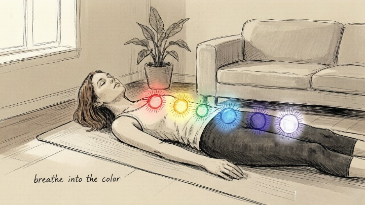
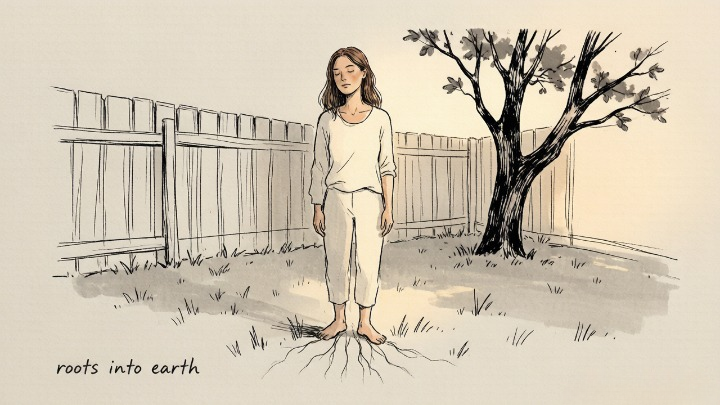

> Your energy isn't broken. It's just stuck — and stuck energy can move.

---

Maya came to me exhausted. Not sleepy-tired — the kind of tired that lives in your bones and makes every conversation feel like work. She'd been to her doctor. Blood work was normal. Thyroid was fine. Sleep study came back clean. "There's nothing wrong with you," they told her. Which only made it worse — because if nothing was wrong, why did everything feel so heavy?

I asked her one question: "Where in your body do you feel it most?"

She put her hand on her throat. "Here. Like something's stuck. Like there are things I need to say but can't."

Her throat chakra had been screaming for months. She'd been swallowing her truth at work, in her relationship, with her family — and her body had finally stopped cooperating. The energy wasn't broken. It was blocked. And blocked energy, it turns out, is something you can work with.

### 🌀 Why You're Tired (The Energy Perspective Nobody Talks About)

Western medicine treats the body as a machine — parts that can be tested, scanned, and measured. It's brilliant at what it does. But it has a blind spot: **energy.**

The chakra system comes from ancient Indian traditions — a map of seven energy centers aligned along the spine, each governing different aspects of physical, emotional, and spiritual well-being. The word *chakra* means "wheel" in Sanskrit. When the wheels are spinning freely, energy flows. When they're blocked, energy stagnates — and stagnation eventually becomes symptoms.

> Modern research on the mind-body connection — from the gut-brain axis to the measurable effects of meditation on nervous system regulation — increasingly validates what the chakra system described thousands of years ago: your emotional state affects your physical health, and the connection runs through the body's energy centers. Whether you understand chakras literally or metaphorically, the diagnostic framework is remarkably useful.

---

### 🧭 The Seven Chakras: A Self-Diagnostic Map

---

### 🔴 Root Chakra (Muladhara) — Base of Spine

**Governs:** Safety, survival, grounding, belonging.

**When balanced:** You feel secure, stable, and at home in your body. Money and basic needs feel manageable.

**When blocked:** Chronic anxiety about survival — money, housing, safety. Physical symptoms: lower back pain, leg or foot issues, constant fatigue.

**Quick check:** Do you feel fundamentally safe in your life right now — or is there a low-grade hum of insecurity running beneath everything?

---

### 🟠 Sacral Chakra (Svadhisthana) — Below Navel

**Governs:** Creativity, pleasure, sexuality, emotional flow.

**When balanced:** You feel creative, connected to your desires, able to experience pleasure without guilt.

**When blocked:** Creative blocks, emotional numbness, guilt around pleasure, sexual disconnection. Physical symptoms: lower abdominal pain, reproductive issues.

**Quick check:** When was the last time you did something purely for pleasure — not productivity, not obligation, just joy?

---

### 🟡 Solar Plexus Chakra (Manipura) — Upper Abdomen

**Governs:** Personal power, confidence, self-esteem, will.

**When balanced:** You trust your own judgment, feel confident in your decisions, and own your space in the world.

**When blocked:** Self-doubt, indecision, feeling powerless, chronic people-pleasing. Physical symptoms: digestive issues, stomach pain.

**Quick check:** Do you make decisions based on what you want — or what you think others expect?

---

### 🟢 Heart Chakra (Anahata) — Center of Chest

**Governs:** Love, compassion, connection, forgiveness.

**When balanced:** You give and receive love freely, hold boundaries without guilt, and feel connected to others.

**When blocked:** Difficulty trusting, holding grudges, fear of intimacy, self-isolation. Physical symptoms: chest tightness, heart palpitations, upper back pain.

**Quick check:** Is there someone you need to forgive — and is that person yourself?

---

### 🔵 Throat Chakra (Vishuddha) — Throat

**Governs:** Communication, self-expression, truth.

**When balanced:** You speak your truth clearly and without apology, and you listen deeply to others.

**When blocked:** Difficulty expressing yourself, fear of speaking up, feeling unheard. Physical symptoms: sore throat, neck pain, jaw tension.

**Quick check:** What have you been wanting to say that you keep swallowing?

---

### 🟣 Third Eye Chakra (Ajna) — Between Eyebrows

**Governs:** Intuition, insight, imagination, vision.

**When balanced:** You trust your intuition, see situations clearly, and feel connected to a sense of purpose.

**When blocked:** Overthinking, inability to trust gut feelings, feeling lost or directionless. Physical symptoms: headaches, eye strain, sleep issues.

**Quick check:** When was the last time you trusted a gut feeling without immediately talking yourself out of it?

---

### ⚪ Crown Chakra (Sahasrara) — Top of Head

**Governs:** Spiritual connection, higher purpose, transcendence.

**When balanced:** You feel connected to something larger than yourself, at peace with life's uncertainties.

**When blocked:** Cynicism, spiritual disconnection, feeling meaningless or adrift. Physical symptoms: chronic fatigue, sensitivity to light or sound.

**Quick check:** Do you feel connected to a purpose beyond your daily routine — or is life starting to feel hollow?

---

### 🔥 Four Techniques to Start Clearing Blockages

---

### 🎵 Technique 1: Vibrational Healing — Sound and Mantra

**The core practice:** Each chakra resonates with a specific sound frequency — a bija mantra, or "seed syllable." Chanting these sounds, even quietly, can shift stuck energy.

- Root: **LAM** (deep, grounding hum)
- Sacral: **VAM** (fluid, creative flow)
- Solar Plexus: **RAM** (bright, confident fire)
- Heart: **YAM** (open, expansive love)
- Throat: **HAM** (clear, resonant truth)
- Third Eye: **OM** (or SHAM — the vibration of inner vision)
- Crown: **Silence** (or the universal OM)

Practice: sit comfortably. Start at the root. Chant LAM three times, feeling the vibration in the base of your spine. Move upward through each chakra. Five minutes, start to finish.

### 🌈 Technique 2: Color Breathing and Visualization

**The core practice:** Each chakra is associated with a color. Visualizing that color flowing through the corresponding area can shift energetic blockages in minutes.

Lie down or sit comfortably. Close your eyes. Starting at the base of your spine, visualize a spinning wheel of **red** light. Breathe into it — three slow breaths, imagining the red becoming brighter, clearer, spinning more freely.

Move up: **orange** at the sacral. **Yellow** at the solar plexus. **Green** at the heart. **Blue** at the throat. **Indigo** at the third eye. **Violet or white** at the crown.

You'll know you've hit a stuck chakra when the color feels dim, the wheel feels sluggish, or the breathing feels constricted. Stay there an extra minute. Don't force it. Just breathe and visualize.

---

### 💎 Technique 3: Crystals and Aromatherapy

**The core practice:** Specific crystals and essential oils are associated with each chakra. Using them together during meditation or simply carrying a stone can anchor the intention to balance.

| Chakra | Crystal | Essential Oil |
|--------|---------|---------------|
| Root | Red Jasper, Hematite | Cedarwood, Patchouli |
| Sacral | Carnelian, Orange Calcite | Ylang Ylang, Sweet Orange |
| Solar Plexus | Citrine, Tiger's Eye | Lemon, Ginger |
| Heart | Rose Quartz, Green Aventurine | Rose, Bergamot |
| Throat | Lapis Lazuli, Blue Lace Agate | Peppermint, Eucalyptus |
| Third Eye | Amethyst, Labradorite | Clary Sage, Frankincense |
| Crown | Clear Quartz, Selenite | Lavender, Sandalwood |

Place the crystal on the corresponding area of your body while lying down. Diffuse the oil nearby. Breathe. Ten minutes. That's the whole practice.

---

### 🧘 Technique 4: Body Practice — Grounding and Movement

**The core practice:** Blocked energy often needs physical release — not just visualization, but movement.

- **Root chakra grounding:** Stand barefoot on grass or earth. Feel the ground beneath you. Bend your knees slightly. Imagine roots extending from the soles of your feet into the earth. Five minutes of this resets the nervous system faster than almost anything else.
- **Heart chakra opening:** Stand with your feet hip-width apart. Interlace your hands behind your back. Gently straighten your arms and lift them slightly as you open your chest. Breathe into the expansion. Hold for thirty seconds. Release.
- **Throat chakra release:** Lion's breath — inhale deeply, then exhale with your mouth wide open, tongue stretched toward your chin, making a "ha" sound. Do this three times. It's ridiculous. It works.

#### 🧪 Quick Self-Check

Before you start any practice:

* Which chakra did you immediately recognize as "mine" — the one whose blocked description felt personal?
* What's the one sentence you haven't said that's sitting in your throat right now?
* When you lie down and scan your body from root to crown, where does your attention snag?
* If your energy were a river, where is it dammed — and what's on the other side of the dam?

---

## 🛒 Tools to Build Your Daily Energy Practice

Balancing your chakras doesn't require a full altar of tools. But a few well-chosen items make the practice easier to sustain:

**A beginner's crystal set.** Seven tumbled stones — one for each chakra — runs about $15–$25 on Amazon or Etsy. Place them on your body during meditation, carry one that corresponds to your most blocked center, or keep them on your desk as a visual reminder.

**A singing bowl.** A small hand-hammered Tibetan singing bowl produces the kind of resonant vibration that shifts energy in minutes. Look for one in the key of the chakra you're working with most. $20–$40 on Amazon or specialty shops.

**An essential oil starter kit.** Four or five oils that cover the major chakras — lavender for the crown, peppermint for the throat, rose for the heart — give you enough range to work with any blockage that surfaces.

And when you've done the self-work and still feel stuck — when you know which chakra is blocked but can't seem to clear it on your own — a session with an energy worker or psychic reader can help. Oranum screens every reader through a live demonstration reading. Refund policy: twenty-four hours. First session costs less than lunch.

---

Maya started with her throat chakra. Not the whole system — just the one that was screaming loudest. She chanted HAM for five minutes each morning, placed a piece of blue lace agate on her throat while she journaled, and — hardest of all — started saying the things she'd been swallowing.

She didn't transform overnight. But about two months in, she told me the exhaustion had lifted. Not because she was sleeping more — her sleep hadn't changed. Because she'd stopped using her energy to hold back what wanted to be said.

"Every chakra is a conversation between your body and your life," she said. "I'd just been hanging up on mine for years."

---

*Explore the rest of our Energy & Chakras series, or start with Crystals for Beginners if you're building your first toolkit.*
