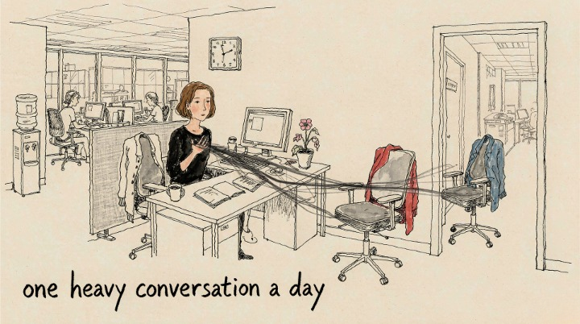
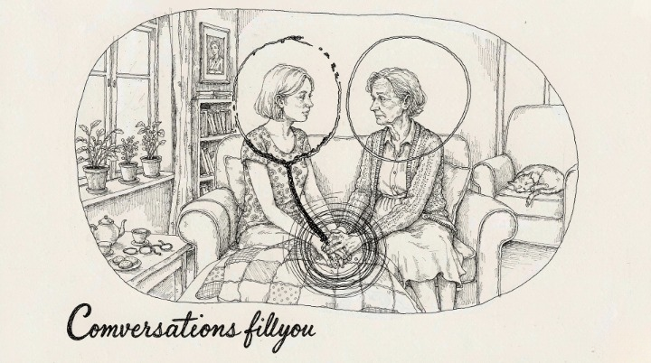
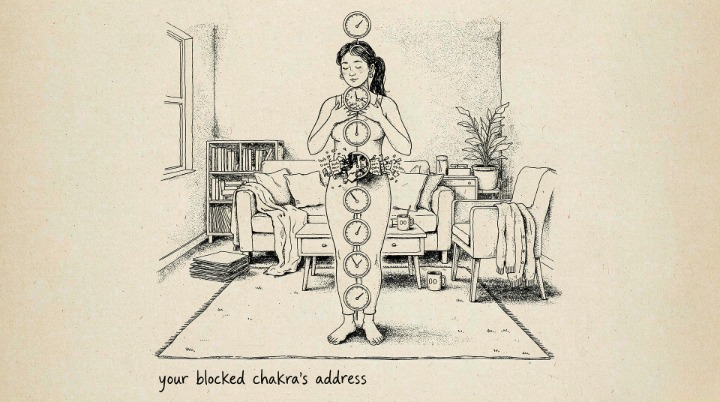
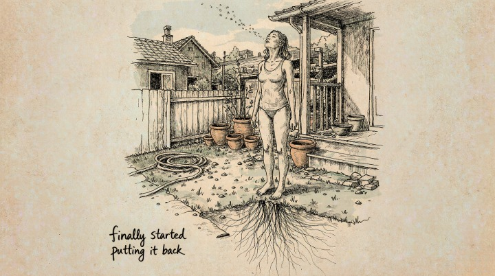

> You're not just a body having experiences. You're an energy system having a body.

## TL;DR

What we actually know is this: the subtle energy system is a map, not a literal anatomy — and it's a map with a long cross-cultural pedigree, described independently by Indian, Chinese, and indigenous traditions. The three parts are the aura (the field around you), the seven chakras (centers along the spine, each tied to a dimension of life), and the channels (pathways for life force). You can read the system literally or metaphorically and it works either way, because what it tracks is real: emotional state shapes physical state. The practical value is diagnostic — naming where your energy flows and where it's stuck.

---

Nina had a rule she never explained to anyone: she could only handle one "heavy" conversation per day. After that, she was done — not tired in the normal sense, but *drained*, like someone had pulled a plug. Her friends found it strange. "You just talk to people all day," they'd say. "Why does one conversation wreck you?"

Because Nina could feel it. When her colleague vented for forty minutes, she felt something leave her body. When her grandmother held her hand in silence, she felt something return. She wasn't imagining it — she was registering her energy system the way some people register hunger or weather.

The subtle energy system isn't a New Age invention. It's one of the oldest maps of human experience on the planet, described independently by traditions from India to China to indigenous cultures everywhere. It has three main parts — and once you understand them, a thousand everyday experiences suddenly make sense.

### 🫀 Your Body Has a Second Anatomy

Western medicine maps the physical body: organs, bones, blood, nerves. The subtle energy traditions map a second anatomy layered over the first — **a field of life force** that flows through and around you.

- **The aura** — the field of energy extending beyond your physical body.
- **The chakras** — seven energy centers along the spine, each governing a different dimension of life.
- **The channels** — the pathways (called *nadis* in Sanskrit, *meridians* in Chinese medicine) through which energy travels.

> Modern research keeps catching up to this ancient map. The gut-brain axis, the measurable effects of meditation on the nervous system, the physiology of trauma stored in the body — each discovery validates what energy traditions described thousands of years ago: your emotional state shapes your physical state, and the connection runs through systems the physical anatomy alone can't explain.

You can understand the system literally or metaphorically — the framework works either way. Think of it as a diagnostic map of where your life force is flowing, and where it's stuck. (For the wider landscape this sits inside — grounding, chakras, rituals — see our [energy and chakra hub](/energy/).)

---

### 🌈 The Aura: Your Energy Field

The aura is the layer of energy that surrounds your body — like a subtle atmosphere you carry into every room. You've experienced it constantly without naming it:

- The person whose presence feels warm and steady.
- The room that feels heavy before anyone says a word.
- The conversation that lifts you, and the one that empties you.

**The aura does two things.** It broadcasts — radiating your state before you speak — and it filters — registering the energy of people and places around you. That's why crowded malls exhaust some people and energize others: an open, porous field absorbs everything; a protected field deflects.

**How to feel your own field, right now:** hold your hands a few inches apart, palms facing each other. Slowly move them together and apart. Most people feel a subtle pressure or warmth between the palms — like a very weak magnet. That's your hands reading the edge of your own field.

---

### 🌈 The Seven Chakras: Your Energy Anatomy in One Table

The chakras are seven energy centers stacked along the spine, each governing a dimension of physical, emotional, and spiritual life. Think of them as **dials** — when a dial is spinning freely, that dimension flows; when it's stuck, that dimension shows symptoms.

| Chakra | Location | Governs | When blocked, you feel |
|--------|----------|---------|------------------------|
| 🔴 Root | Base of spine | Safety, survival, grounding | Chronic anxiety about money/housing; fatigue; disconnection from your body |
| 🟠 Sacral | Below navel | Creativity, pleasure, sexuality | Creative blocks; guilt around pleasure; emotional numbness |
| 🟡 Solar Plexus | Upper abdomen | Power, confidence, will | Self-doubt; people-pleasing; decision paralysis |
| 🟢 Heart | Center of chest | Love, connection, forgiveness | Trust issues; grudges; fear of intimacy |
| 🔵 Throat | Throat | Communication, truth | Difficulty speaking up; feeling unheard; stuck words |
| 🟣 Third Eye | Between eyebrows | Intuition, insight, vision | Overthinking; distrusting gut feelings; feeling lost |
| ⚪ Crown | Top of head | Purpose, transcendence | Cynicism; meaninglessness; spiritual disconnection |

**The fastest self-check:** scan your body root to crown right now. Where does your attention snag? Where is there tension, heaviness, or nothing at all? That's usually where the energy is stuck.

> The chakras aren't just esoteric — they map to real anatomy. The root corresponds to the base of the spine, the solar plexus to the digestive organs, the heart to the chest and upper back. The body stores what the mind won't process, and the chakra map is the address book for finding it.

---

### ⚡ How Energy Gets Blocked — and How It Flows

Energy isn't mysterious in how it behaves. It follows patterns you already know:

**What blocks energy:**
- **Suppressed emotion.** The words you don't say, the grief you don't let out, the anger you swallow — each one is energy parked in the body.
- **Chronic stress.** The nervous system stuck in "on" drains the field like a battery left running.
- **Draining environments and people.** Relationships that consistently leave you empty are energy leaks.
- **Disconnection from the body.** Living entirely in your head, ignoring physical signals, severs the circuit.

**What restores energy:**
- **Movement.** The body is the pump of the energy system; blocked energy needs physical release.
- **Grounding.** Direct contact with earth and body awareness resets the field faster than almost anything.
- **Sound and breath.** Vibration and rhythm move stuck energy that thought alone can't touch.
- **Truth-telling.** Saying the unsaid releases the single largest blockage most people carry — the words parked in the throat.

**The key insight:** blocked energy isn't broken energy. It's *parked* — waiting for permission to move. You don't need to fix yourself. You need to start letting things flow again.

---

### 🌿 Four Simple Practices to Keep the Energy Moving

You don't need an altar, a teacher, or an hour a day. Four practices, five minutes each:

**1. Grounding (root chakra).** Stand barefoot on grass or earth. Feel the ground. Imagine roots extending from your feet into the soil. Five minutes of this resets the nervous system faster than almost anything else. No grass? Sit with both feet flat, hands on thighs, and breathe into the base of your spine.

**2. Breath with color (all chakras).** Lie down. Visualize a color flowing through your body — red at the base, orange lower belly, yellow solar plexus, green chest, blue throat, indigo between the brows, violet at the crown. Three slow breaths per center. When a color feels dim or the breath tightens, that's a stuck center — stay there an extra minute.

**3. Sound (throat and heart).** Chanting a simple syllable — *om*, or the classic seed sounds (LAM, VAM, RAM, YAM, HAM) — vibrates stuck energy loose. Five minutes of humming does most of what chanting does: it's the vibration, not the ritual, that matters.

**4. The daily energy audit.** Once a day, ask: *What drained me today? What filled me? What did I not say that I wanted to say?* Naming the leak is the first step to stopping it.

---

#### 🧪 Quick Self-Check

* After which conversation do you feel most drained — and who's in it?
* Where in your body do you hold tension when you're stressed? That's your blocked chakra's address.
* When was the last time you were truly grounded — barefoot, present, slow? 
* What's the one thing you haven't said that's still parked in your throat?

---

## 🛒 Tools for Your Energy Practice

**A grounding routine, not a gadget.** Bare feet, earth, and five minutes are the highest-quality tool you'll ever own. Everything else is optional.

**A crystal set.** Seven tumbled stones — one per chakra — run about $15–$25 on Amazon or Etsy. Place them on the corresponding centers during meditation, or carry the one that matches your most blocked dial.

**A singing bowl.** A small hand-hammered bowl produces the kind of vibration that shifts stuck energy in minutes. $20–$40 on Amazon or specialty shops.

**An essential oil starter kit.** Lavender for the crown, peppermint for the throat, rose for the heart — four or five oils cover most blockages. Use them during grounding or breathwork.

And when you've done the self-work and still feel stuck — when you know the dial is jammed but can't move it alone — an energy worker or psychic reader can help identify what's blocking the flow. If you want that kind of second pair of eyes, <a href="https://wmorajmp.com/?pageName=intro&siteId=oranum&subSiteId=about&prm[psid]=HuMaster&prm[pstool]=606_1&prm[topic]=Live&prm[psprogram]=revs&prm[campaign_id]=&subAffId=" target="_blank" rel="sponsored nofollow noopener">Oranum's live intro space</a> lets you watch energy workers and psychic readers do live demonstration readings before you book anyone. Use them to locate the blockage, not to hand over the work of moving it.

---

Nina stopped explaining her one-heavy-conversation rule and started honoring it. She scheduled the heavy talks for mornings, when her energy was full. She grounded for five minutes before the draining meetings. She started saying the things she'd been swallowing — the throat-chakra release that took her months to learn and seconds to feel.

Six months later, she told me the rule was still there — but the drain was gone. "It's not that conversations stopped taking energy," she said. "It's that I finally started putting it back."

Your energy system has been running your whole life. You just haven't been reading the dashboard.

*Now that you know the map, learn to clear the blockages: [Chakra Balancing Techniques for Beginners](/energy/chakra-balancing-beginners/) walks you through all seven centers in depth, and [3 Morning Rituals to Strengthen Your Intuition](/energy/morning-rituals/) starts your day with the energy flowing.*
