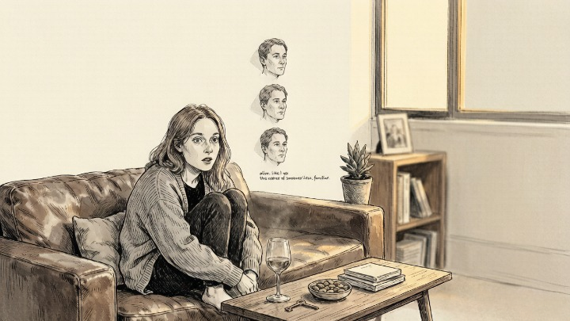
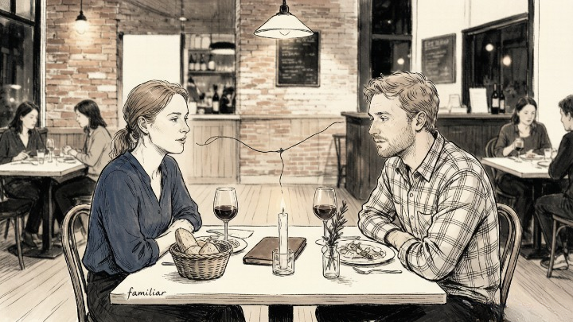
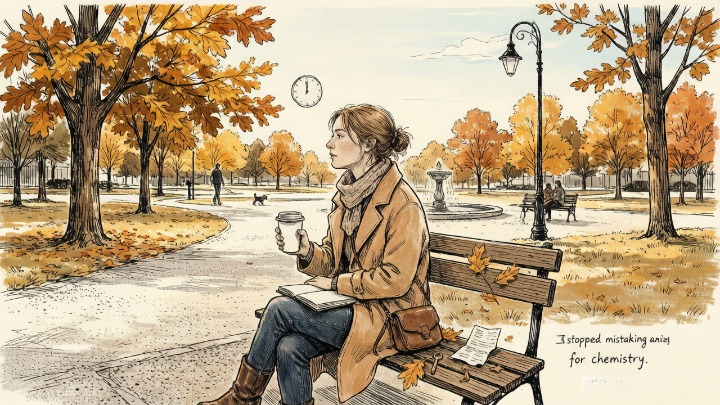

> You're not attracting the same person. You're responding to the same wound.

---

My friend Elena has a type. Emotionally unavailable. Intense at the beginning, distant by month three. The kind of man who texts "good morning beautiful" for two weeks and then disappears for three days without explanation.

After the third one, she sat on my couch and said: "I don't understand. I'm not choosing these men. They keep finding me."

I asked her what all three felt like in the beginning.

"Alive," she said. "Like anything could happen. Like I was the center of someone's world."

"And how did that feel?"

She thought about it. "Familiar," she said quietly. "The way my dad used to be when I was little — all in, completely focused on me, and then... gone. He traveled for work. I never knew when he was leaving or when he'd come back."

She stopped talking. The pattern had just named itself.

---

### 🌀 The Real Reason You Keep Ending Up Here

**The core answer:** You're not attracting the same type of person by accident. You're drawn to what feels familiar — and what feels familiar is often what hurt you first.

> Attachment theory, first developed by John Bowlby and Mary Ainsworth, identified that the way we bond with primary caregivers in childhood shapes our adult relationship patterns. If love felt unpredictable, you may be drawn to unpredictability. If love had to be earned through performance, you may be drawn to people who keep you performing. The pattern isn't who you're choosing — it's what your nervous system recognizes as "home."

The mechanism is unconscious. You meet someone and feel a spark — chemistry, connection, electricity. What you're actually feeling is *recognition.* Your nervous system has identified something familiar in this person — a rhythm, a distance, a way of relating — that matches the emotional template formed in your earliest relationships.

**The spark is not love. The spark is your past waving hello.**

---

### 🔥 Why "Just Choose Better" Doesn't Work

People love to give this advice: "You just need to pick a different type. Stop going for the unavailable ones. Choose the nice guy." It's well-meaning and completely useless.

Here's why: the "nice guy" who's consistent, emotionally available, and genuinely interested doesn't feel like home. He feels *wrong.* Boring. Too easy. Like something's missing. **That missing thing is the anxiety.** Your nervous system has confused anxiety with love for so long that its absence feels like a void.

> Carl Jung wrote that until you make the unconscious conscious, it will direct your life and you will call it fate. The partner you keep choosing isn't fate. It's an unconscious pattern running on a loop — and loops can be interrupted once they're seen.

> *Those who cannot remember the past are condemned to repeat it.* — George Santayana

### 🧩 The Four Most Common Patterns

### 🎭 Pattern #1: The Pursuer and the Distancer

**The core answer:** One person chases. One person withdraws. The pursuer feels abandoned. The distancer feels suffocated. Both are replaying childhood dynamics — just from opposite sides of the same wound.

This is the most common toxic cycle. The pursuer experienced inconsistent love as a child and learned to chase. The distancer experienced engulfing or intrusive love and learned to retreat. They find each other because their wounds fit together like puzzle pieces. Neither is the villain. Both are unconscious.

**The fix:** if you're the pursuer, learn to sit with the discomfort of not chasing. If you're the distancer, learn to stay present when someone gets close. Both require sitting with a feeling you've spent your life avoiding.

---

### 🛡️ Pattern #2: The Fixer and the Project

**The core answer:** You're drawn to people who need saving — not because you're a good person, but because fixing others lets you avoid fixing yourself.

The fixer finds partners who are struggling — career, mental health, addiction, the aftermath of a bad relationship. The fixer pours everything into helping them, and in doing so, avoids looking at their own unaddressed pain. The relationship feels meaningful because it's intense. But intensity isn't intimacy. It's distraction.

**The question to ask:** if this person were suddenly fine — completely, totally fine — would I still want to be with them? If the answer is no, you're not in love. You're in a project.

### 🪞 Pattern #3: The Familiar Wound

**The core answer:** You choose partners who recreate your earliest relational wound — not because you're a masochist, but because your psyche is trying to resolve it. You keep hoping that *this time* the unavailable person will show up. *This time* the critical person will accept you. *This time* you'll finally be enough.

But the unavailable person never shows up. The critical person never accepts you. Because the wound can't be healed by the person who resembles the one who caused it. **It can only be healed by you — by recognizing the pattern and choosing differently.**

---

### ⚖️ Pattern #4: The Overcorrection

**The core answer:** You've been hurt by a specific type, so you overcorrect — choosing someone who's the complete opposite. But opposites aren't necessarily healthy. They're just opposite.

After a chaotic relationship, you choose someone who's "stable" — but stable turns out to mean emotionally shut down. After someone controlling, you choose someone who's "laid back" — but laid back turns out to mean indifferent. **The overcorrection doesn't break the pattern. It just flips the polarity.**

---

#### 🧪 Quick Self-Check

Look at your last three relationships — significant ones. Ask yourself:

* What did all three feel like in the beginning? Name the feeling, not the person.
* What did all three feel like at the end? Same question.
* What quality did all three share that I told myself I was "done with" after the first one?
* If my best friend described my relationship history as if it were their own, what would I tell them?

**The pattern isn't hiding. You're just too close to see it.**

## 🔮 When You Need Help Seeing the Pattern

Sometimes the pattern is so embedded you can't see it from the inside. A skilled reader or therapist can hold up a mirror that shows you what you've been avoiding — not by telling you who to pick, but by helping you see *why* you keep picking what you pick.

Oranum screens every reader through a **live demonstration reading** before they accept clients. Refund policy: twenty-four hours, no questions. First session costs less than lunch. No subscription.

**Try it once.** Don't ask about a specific person. Ask about the pattern. "What am I repeating that I can't see?"

---

Elena stayed single for a year after that conversation on my couch. Not because she was giving up on love — but because she was finally ready to stop chasing the familiar ache of inconsistency. She dated a few "boring" men during that year — men who called when they said they would, who didn't disappear, who didn't make her stomach drop with every notification. It felt wrong at first. Then it didn't.

She's with someone now — consistent, present, emotionally available. She told me recently that it still surprises her. Not that he's great. That she can receive it without waiting for the other shoe to drop.

"You know what the difference is?" she said. "I stopped mistaking anxiety for chemistry. That was the whole thing. Just that."

---

*Tomorrow: six self-love rituals for healing after a breakup — the practical, non-toxic kind that actually works, starting with the one you can do tonight without leaving your bed.*
