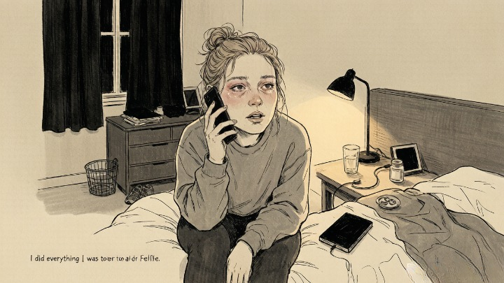
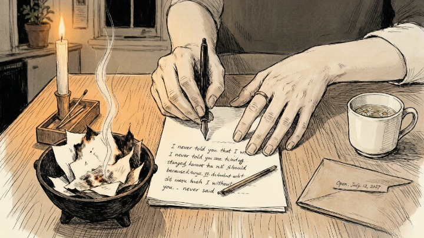
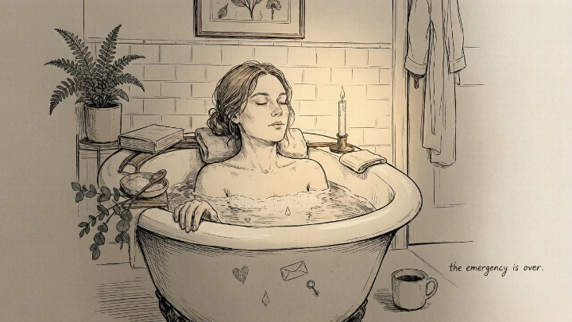

> Healing isn't about proving you're fine. It's about letting yourself not be.

---

After her breakup, Claire did everything right. Posted the "thriving" brunch photo. Cut six inches off her hair. Bought new sheets. Downloaded a dating app she immediately deleted because every profile made her stomach turn. She told her friends she was doing great. She told herself she was doing great.

A month in, she called me at midnight, crying. "I did everything I was supposed to do and I still feel terrible. What's wrong with me?"

"Nothing," I told her. "You just confused performance with healing. You've been proving you're okay instead of actually getting okay."

She went quiet. "So what do I do instead?"

---

### 🌑 Why Most Breakup Advice Fails

The standard breakup playbook is a checklist of external actions: hit the gym, redecorate, rebound, repeat positive affirmations in the mirror, post evidence of your happiness online. Every one of these is about *appearing* healed, not actually healing.

> Grief — and a breakup is grief — doesn't respond to performance. It responds to presence. You can't outrun it with a treadmill or drown it in a new haircut. It waits. It compounds. And eventually, when you're too exhausted to keep performing, it sits down next to you and says: *now will you listen?*

Real healing rituals don't distract you from the pain. They help you move *through* it.

> *The only way out is through.* — Robert Frost

---

### 🔥 Five Rituals That Actually Work

### 🕯️ Ritual #1: The Unsaid Letter

**The core answer:** Write everything you never said — not to send, not to be read, not to be judged. Write until the pen runs dry. Then burn it, bury it, or seal it in an envelope and put it somewhere you won't look for a year.

Most people carry the weight of things they never said. The apology they never gave. The anger they swallowed. The explanation that came three days too late. These unsaid words don't disappear. They calcify.

**What to do:** Sit down with paper and pen — not a phone, not a laptop. Write a letter to the person you lost. Say everything. The rage. The grief. The love that's still there. The things you miss. The things you don't. Don't edit. Don't worry about being fair. This isn't for them. It's for you.

When you're done, don't send it. Burn it in a safe place, watching the smoke carry what you've released. Or seal it in an envelope, write a date one year from now on the front, and hide it somewhere. The ritual isn't about them receiving the words. It's about you releasing them.

---

### 🛁 Ritual #2: The Body Reset Bath

**The core answer:** Grief lives in the body — tight shoulders, shallow breath, a chest that feels too heavy to expand. A deliberate bath with Epsom salt, candlelight, and one question can release what weeks of distraction can't.

The body holds what the mind avoids. After a breakup, your nervous system may still be in fight-or-flight — scanning for the person who's no longer there, bracing for conversations that won't happen. A hot bath with Epsom salts relaxes muscles, lowers cortisol, and gives your body a physical signal: *the emergency is over.*

**The ritual:** Run a bath as hot as you can stand. Add two cups of Epsom salt. Light one candle — just one. Get in. Close your eyes. Place one hand on your chest and one on your stomach. Breathe. Stay there for at least twenty minutes. Before you get out, ask yourself: *what is my body holding that my mind keeps avoiding?* Don't force an answer. Just ask. Let the water carry whatever surfaces.

### 🌱 Ritual #3: The One-Hour Grief Appointment

**The core answer:** Grief leaks into everything when it's not given its own space. Schedule one hour a day — no more — to feel everything. Cry. Rage. Journal. Stare at the wall. When the hour ends, close the door until tomorrow.

This sounds counterintuitive — why deliberately schedule pain? Because grief that isn't contained will spread. You'll be fine at work and suddenly crying in the bathroom. You'll be on a date and suddenly comparing them to someone who's not there. **Grief needs a container.** When you give it one, it stops leaking.

**The ritual:** Set a timer for sixty minutes. In that hour, you're allowed to do anything that processes the breakup — cry, journal, look at old photos, listen to the songs you're avoiding, scream into a pillow. When the timer goes off, stop. Close the journal. Put the photos away. The grief is still there — but it knows it has an appointment tomorrow. That containment is strangely freeing.

---

### 🪞 Ritual #4: The Identity Reclamation

**The core answer:** After a long relationship, part of your identity fused with theirs. Reclaiming yourself means rediscovering what you like — not what *we* liked — one small, deliberate choice at a time.

This ritual is practical and ongoing. Make a list of things you stopped doing during the relationship — not because they asked you to, but because the "we" identity slowly absorbed the "me" identity.

**The practice:** This week, do one thing from the list. Eat at a restaurant they didn't like. Watch a movie they would have mocked. Go to a place that was "yours" before it was "ours." Buy something for your space that reflects you, not a compromise. Each small reclamation is a message to yourself: *I still exist.*

### 🌅 Ritual #5: The Future Letter to Yourself

**The core answer:** Write a letter to yourself one year in the future — not predicting what will happen, but describing what you hope will be true. Seal it. Open it on the anniversary of the breakup.

This ritual is deceptively powerful because it creates a bridge between present pain and future possibility. You're not trying to feel better now. You're acknowledging that you won't feel this way forever — and leaving evidence for your future self to find.

**The ritual:** Sit down and write: "Dear future me, it's been a year. Here's what I hope is true for you now..." Be specific. Where do you live? Who are you with — or are you happily alone? What do you care about that you can't even imagine caring about right now? What have you released?

Seal the letter. Set a calendar reminder for one year from now. When you open it, you'll be holding a message from the version of you who was brave enough to believe things could get better.

---

#### 🧪 Quick Self-Check

Right now, in this moment:

* Am I performing recovery — or actually recovering?
* What's the one emotion I keep swallowing because it feels too big to express?
* If no one ever saw my "healing journey," what would I actually be doing differently?
* What do I need to release before I can genuinely move forward?

**Healing doesn't have an audience. The only person who needs to know you're okay is you.**

---

## 🔮 When You Need Help Processing What You're Carrying

Sometimes the weight is too heavy to carry alone. Sometimes you've journaled, bathed, cried, screamed into pillows — and the grief is still sitting on your chest.

A skilled psychic or tarot reader can help you see what's still holding you — not by predicting the future, but by reflecting back the emotional patterns you haven't been able to name. Oranum screens every reader through a **live demonstration reading** before they accept clients. Refund policy: twenty-four hours, no questions. First session costs less than lunch. No subscription.

**Try it once.** Don't ask about your ex. Ask about you. "What's still holding me that I haven't been able to release on my own?"

---

Claire did the letter. Three pages. She burned it in her backyard at sunset, watching the edges curl and blacken, and she told me later that something shifted — not dramatically, not overnight, but noticeably. A weight she'd been carrying in her chest for weeks felt lighter.

She didn't post about it. Didn't tell anyone. Didn't need to.

Six months later, she was dating someone new — not to prove anything, but because she was genuinely ready. She told me the difference was simple: "Last time, I was trying to fill a hole. This time, there isn't one."

---

*Tomorrow: what your zodiac sign needs in a partner — the traits each sign is actually looking for, and why your sun sign is only half the answer.*
