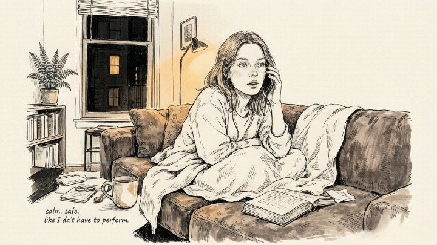
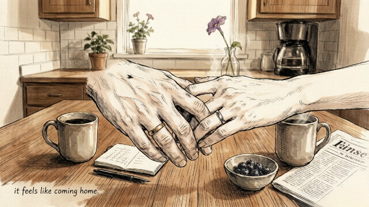
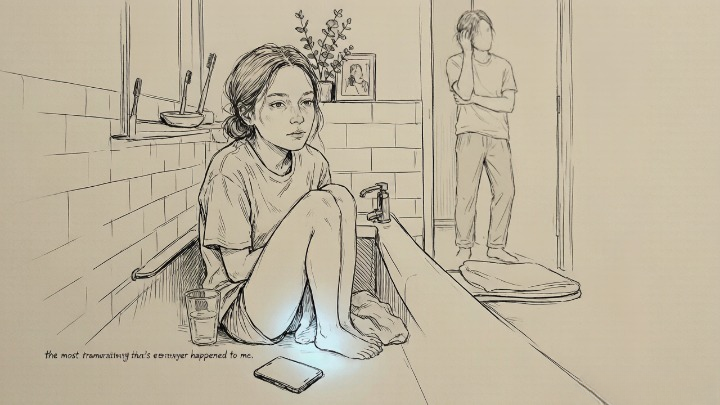

> A soulmate doesn't feel like lightning. It feels like coming home.

---

She called me three weeks into a new relationship, panicked. "I don't think this is it," she said. "There's no spark. No drama. No can't-eat-can't-sleep obsession. I think maybe we're just... friends."

I asked her how she felt when she was with him.

"Calm," she said. "Safe. Like I don't have to perform. Like I can say the wrong thing and he won't leave."

She paused.

"That's not love, though. Right?"

She'd been in relationships that felt like storms — the highs so high, the lows so low, the constant adrenaline of never knowing where she stood. She'd mistaken chaos for chemistry for so long that peace felt like a lack of feeling. It took her another month to accept that what she was experiencing wasn't the absence of passion. It was the presence of safety. And safety, it turns out, is what love actually feels like when it's real.

### 💔 The Soulmate Myth Is Hurting People

The word "soulmate" carries so much baggage it's almost unusable. It conjures images of gazing into each other's eyes across a candlelit table, finishing each other's sentences, feeling an instant electric charge the moment you lock eyes across a crowded room.

That's not a soulmate. That's a movie. And movies have done more damage to our ability to recognize real love than anything else.

> Carl Jung described the anima and animus as inner figures that we unconsciously project onto partners — the idealized masculine or feminine that exists in our own psyche. When we meet someone who mirrors that projection, it feels *intense.* Not because they're our soulmate, but because they're reflecting something we haven't integrated in ourselves. The charge isn't connection — it's recognition of a missing piece.

Real soulmate energy doesn't feel like a storm. It feels like walking into a room you've never been in before and knowing where the furniture is. It's familiar. It's easy. It's almost boring by comparison to the chaos you're used to — and that's exactly what makes it trustworthy.

> *We are most alive when we're in love.* — John Updike

---

### 🔥 The Eight Signs (That Actually Hold Up)

### 🌊 Sign #1: You Feel Calm, Not Anxious

**The core answer:** Real connection lowers your nervous system's baseline. If you're constantly anxious about where you stand, that's not passion — it's your body reacting to inconsistency.

Anxiety in relationships is often mistaken for chemistry. Your heart races. You can't stop thinking about them. You check your phone constantly. But that's not love — that's your attachment system firing because the connection feels *insecure.* Real security doesn't produce adrenaline. It produces calm.

If being with someone makes your nervous system settle instead of spike, pay attention. **Your body knows the difference between excitement and safety, even if your brain has confused the two.**

### 🪞 Sign #2: You Don't Have to Perform

**The core answer:** If you can be unedited — tired, unshowered, saying the wrong thing, admitting you don't know something — and they don't pull away, you're with someone who sees you, not the version of you that's trying to be impressive.

Most of us spend our early relationships performing. Best outfits. Most interesting stories. Most carefully curated version of ourselves. That's normal. But it's exhausting. And it's not sustainable.

**The test:** when was the last time you said something embarrassing in front of them and they made you feel *more* accepted, not less? If you can't remember a moment like that, you might still be performing.

---

### 🗝️ Sign #3: Conflict Feels Different

**The core answer:** Every couple fights. The difference is whether fighting feels like a battle to win or a puzzle to solve together.

In chaotic relationships, conflict escalates. Voices rise. Old wounds get weaponized. Someone threatens to leave. Someone shuts down.

In secure relationships, conflict is still uncomfortable — but it's contained. You're arguing about the dishes, not about whether you're fundamentally unlovable. **The fight stays about the fight. It doesn't become about the relationship.**

> *The meeting of two personalities is like the contact of two chemical substances: if there is any reaction, both are transformed.* — Carl Jung

---

### 🌱 Sign #4: They Make You Want to Grow — Not Change

**The core answer:** The right person doesn't try to fix you. But their presence makes you want to become a better version of yourself — not for them, but because their belief in you makes you believe in yourself.

Most people blur these two. There's a difference between someone who accepts you completely and someone who makes you complacent. The right person does both: they make you feel completely accepted *and* they make you want to grow. Not because you're not enough. Because you're inspired.

### 👁️ Sign #5: Your Intuition Is Quiet Around Them

**The core answer:** If you're constantly scanning for red flags, analyzing their texts, decoding their silences — your intuition isn't warning you. It's exhausted. Real connection doesn't require constant vigilance.

This ties back to the first week of articles. Your intuition speaks clearest when it's *not* shouting. If you find yourself having to override gut feelings repeatedly with someone, the gut feelings aren't the problem. **The relationship is.**

Conversely, if your intuition goes quiet around someone — not because you're ignoring it, but because there's nothing to flag — that's significant. Your nervous system has decided it's safe.

---

### 🧭 Sign #6: You Share Values, Not Just Interests

**The core answer:** You can love hiking and they can hate it. You can disagree on movies, music, and restaurant choices. None of that matters long-term. What matters is whether you agree on what a good life looks like.

Do you share the same orientation toward money? Family? Honesty? Growth? Conflict? These are the things you don't discover on a first date. They emerge over months. And when they align, the surface-level differences stop mattering.

---

### 🛡️ Sign #7: They Show Up When It's Inconvenient

**The core answer:** Anyone can be present when things are good. The question is whether they're still there when things are hard, boring, inconvenient, or uncomfortable — and whether being there feels like a choice they keep making, not an obligation they resent.

This is the test that can't be faked. Not grand gestures. Not romantic speeches. Just: do they show up? Week after week, month after month, when there's no reward for showing up except being with you?

---

### 🌅 Sign #8: You'd Choose Them Again

**The core answer:** Not because you're afraid of being alone. Not because it's comfortable. Not because you've invested too much time. But because, knowing everything you know now — the flaws, the fights, the hard days — you would still pick them.

This is the sign that separates attachment from alignment. Attachment says "I can't leave." Alignment says "I don't want to." The difference is everything.

---

#### 🧪 Quick Self-Check

If you're trying to figure out whether someone is right for you, ask yourself:

* Do I feel more like myself — or less — when I'm with them?
* If I knew they would never change, would I still want to stay?
* Am I staying because I'm aligned — or because I'm afraid of starting over?
* If my best friend described this relationship to me, what would I tell them?

**The answers to these questions are usually more honest than the story you've been telling yourself.**

---

## 🔮 When You Want a Second Opinion

Sometimes you're too close to your own relationship to see it clearly. You need someone outside the dynamic — someone who can look at the patterns without being tangled in the emotions.

A skilled psychic or tarot reader can help you identify what's really happening between you and someone else — what's connection, what's projection, what's fear. Oranum screens every reader through a **live demonstration reading** before they accept clients. Their refund policy: twenty-four hours, no questions. First session costs less than lunch. No subscription.

**Try it once.** Ask about the dynamic — not "are they the one," but "what energy are we actually creating together?"

---

She stayed with him. Married him three years later. Told me once, at the wedding, that the moment she knew was the night she got food poisoning and threw up in his bathroom while he held her hair back, and she didn't feel even slightly embarrassed.

"That's not romantic," I said.

"It's the most romantic thing that's ever happened to me," she said.

She was right.

---

*Tomorrow: [Venus retrograde](/astrology/venus-retrograde/) — why the planet of love moving backward might explain the chaos in your relationship, and what to actually do about it.*
