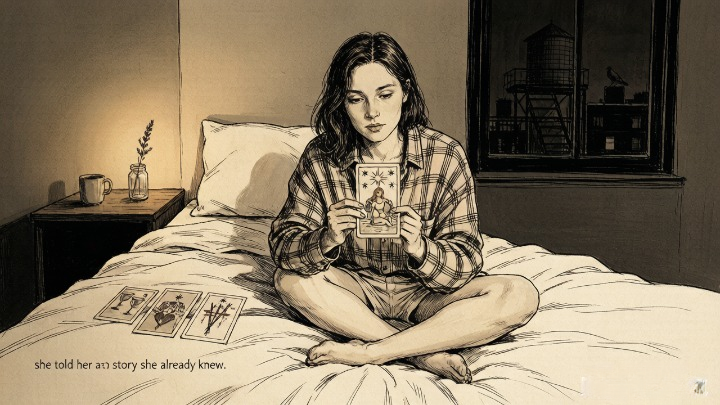
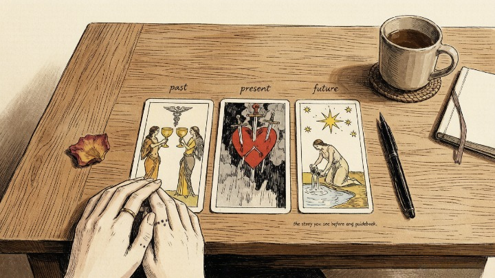
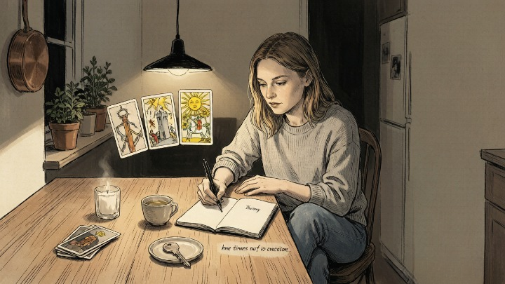

> Three cards. One question. That's all it takes to turn spiraling thoughts into something you can see.

---

She didn't believe in tarot. Not really. But it was 2 AM, her phone was face-down, and one question was circling so relentlessly that Google had nothing left to offer: *Is this relationship going anywhere?*

A friend had given her a deck months ago. It sat on her shelf, still wrapped. Tonight, she opened it.

She shuffled badly, laughed at herself, pulled three cards, and laid them out left to right. She had no idea what she was doing. But something about those three images — two figures holding cups, a heart pierced by swords, a woman pouring water under a starry sky — made her pause.

Not because they told her fortune. Because they told her a *story* she already knew, deep down, but hadn't let herself hear.

### 🃏 Why Three Cards?

Most people think tarot requires the Celtic Cross with its ten positions, or something that looks like it belongs in a velvet-curtained room. But the three-card spread is where tarot comes alive without being overwhelming.

**Three is the smallest number that creates a narrative.** One card is a snapshot. Two cards create tension. Three cards create *movement* — a beginning, a middle, and something unfolding. And humans are wired for narrative. We don't remember data points. We remember stories.

> The three-card spread hits the psychological sweet spot between simplicity and depth. It gives the unconscious just enough structure to project onto without being so rigid that intuition gets crowded out by memorized positions.

You don't need to know what "quintessence" means. You don't need to have memorized anything. You just need three cards, a quiet moment, and an honest question.

### 🕰️ The Classic: Past — Present — Future

**The layout:** Three cards in a row, left to right.

**Card 1 — Past (left):** Not your entire life history. The recent past — the energy, event, or influence that set the current situation in motion. Sometimes it reveals something you've already processed. Sometimes it uncovers a thread you didn't realize was still pulling.

**Card 2 — Present (center):** The heart of the reading. Where you actually stand — not where you *think* you are, not where you wish you were. This card can be confronting. It can also be oddly relieving when someone finally names what you've been carrying.

**Card 3 — Future (right):** Not a prophecy. Think of it as the direction your current energy is flowing. If nothing changes, this is where the river leads. But here's the thing — **you can always pick up the oar.**

---

### 💔 A Real Example

A friend asked: *"Where is this relationship headed?"*

Her three cards:
* **Past — Two of Cups.** Genuine connection at the start. Mutual attraction, real emotional reciprocity. This wasn't one-sided.
* **Present — Three of Swords.** Pain. Conflict. Maybe betrayal, maybe just the slow erosion of misunderstanding. Something had gone wrong, and it hurt.
* **Future — The Star.** Not a guarantee of reconciliation. But a promise that healing exists on the other side. The Star is hope after devastation — not naive hope, but the kind that comes from having walked through the dark and come out breathing.

**What made this reading powerful wasn't that it predicted an outcome. It honored the pain while pointing toward what was possible.** Good tarot doesn't bypass the hard parts. It walks through them with you.

---

### 🔥 Four More Ways to Use Three Cards

Once you're comfortable with Past-Present-Future, the real fun begins. The three-card spread is a framework, not a formula.

---

### ⚡ Situation — Action — Outcome

When you're staring at a decision and want clarity, not more thinking.

* **Situation:** What's actually happening — not your story about it, but the thing itself
* **Action:** What's aligned — not what's easiest, but what's true
* **Outcome:** Where that action is likely to lead

### 🧘 Mind — Body — Spirit

A wellness check for your whole self. Pull this when you feel *off* but can't pinpoint why.

* **Mind:** Your mental state and recurring thoughts
* **Body:** Your physical energy and what your body is trying to communicate
* **Spirit:** The deeper direction — the part of you that knows things your brain hasn't caught up with

---

### 💪 Strengths — Weaknesses — Advice

For honest self-reflection without self-judgment. This spread assumes you're not broken — just navigating.

* **Strengths:** What you already have going for you
* **Weaknesses:** Your blind spot — what you're not seeing
* **Advice:** What the cards suggest you do with both

---

### 👥 Me — You — Us

Built for relationships of any kind — romantic, friendship, family, professional.

* **Me:** The energy you're bringing
* **You:** The energy the other person is bringing
* **Us:** What those energies create together right now

---

### 👁️ The Technique That Makes Any Reading Deeper

The most common beginner mistake is treating each card like a separate sentence. But three cards together form a story arc.

**Read the flow, not the cards.** Look for movement: does the energy escalate? Reverse? Resolve? An Ace of Wands → Ten of Swords → The Sun isn't three random ideas. It's a journey: a spark of inspiration, a brutal collapse, a radiant new beginning. The middle card is the crisis point that makes the final card meaningful.

> *The whole is greater than the sum of its parts.* — Aristotle

Before you look up any meanings, spend thirty seconds just looking at all three cards together. What's the emotional arc? What changes from left to right? **Your first impression — the story you see before any guidebook gets involved — is usually the most accurate reading you'll get.**

---

#### 🧪 Quick Self-Check

If you have a deck nearby — or even if you don't — ask yourself:

* What's one question I've been circling that I can't seem to answer on my own?
* If I pulled three cards right now and trusted whatever I saw, what would I be most afraid they'd tell me?
* What would I do differently tomorrow if the cards confirmed something I already suspected?

**The question matters more than the cards. A clear question pulls clean answers. A vague question gets noise.**

---

## 🔮 When You Want Someone Else to Read the Spread

Pulling your own cards is one skill. Having someone pull for you — someone who can see the patterns you're too close to recognize — is a different experience entirely.

A skilled tarot reader can sit with your question, pull three cards, and reflect back connections you've been walking past for weeks. Oranum screens every reader through a **live demonstration reading** before they accept clients. Their refund policy: if it doesn't land, ask for your money back within twenty-four hours. First session costs less than lunch. No subscription.

**Try it once.** Ask the same question you've been asking yourself. See what someone else pulls. Sometimes the cards say the same thing from a different angle — and that angle is the one that finally gets through.

---

The woman at 2 AM? The one who pulled three cards with no idea what she was doing?

She stayed in the relationship for another three months. But something shifted that night. For the first time in a year, she stopped spinning inside her own head and let something outside herself reflect her situation back. She saw it. And seeing it — even the painful part — was the beginning of moving through it.

She's fine now. The relationship ended. It needed to. But she still pulls three cards when she's stuck. Not because the cards have magic. Because they help her see what she already knows.

---

*Tomorrow: Major Arcana vs Minor Arcana — the simple distinction that makes the entire deck finally make sense.*
