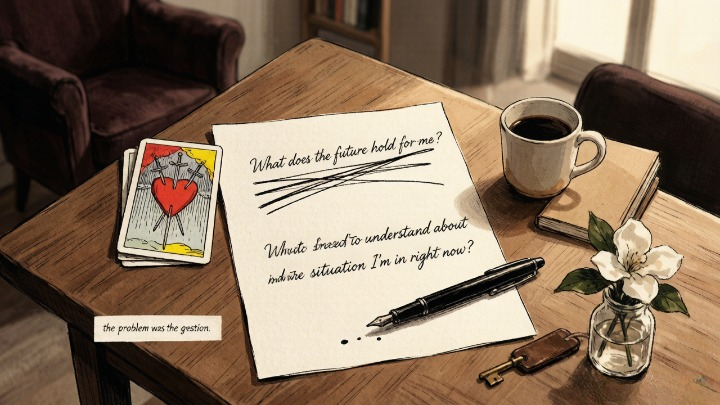
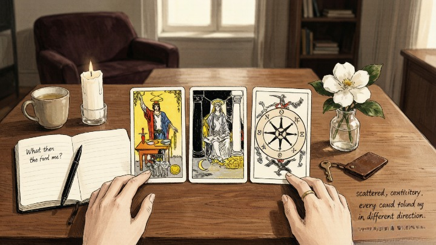
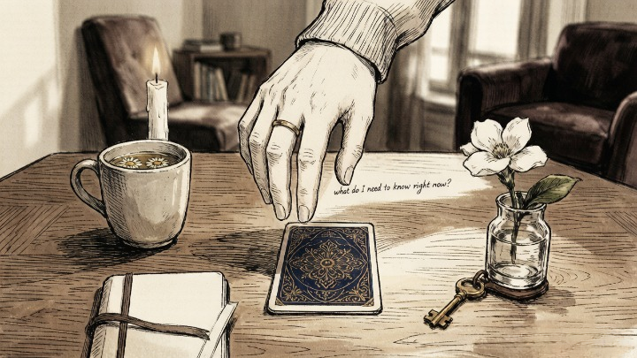

> The quality of your question determines the quality of your reading.

---

A woman came to me once with a reading that had gone nowhere. She'd asked the cards: *"What does the future hold for me?"*

The spread was a mess — scattered, contradictory, every card pulling in a different direction. She thought the deck was broken. She thought she wasn't "intuitive enough." She thought tarot just didn't work for her.

I asked her to reframe the question. Not "what does the future hold?" but *"What do I need to understand about the situation I'm in right now?"*

She pulled three cards. Same deck. Same shuffle. Completely different reading. Clear. Connected. Specific.

**The problem was never the deck. It was the question.** She'd asked something so broad that the cards couldn't help but give her a broad answer. When she asked something specific, the cards got specific.

---

### ❌ Why Most Questions Don't Work

Tarot is not a search engine. It's not designed to answer "should I" questions, "will they" questions, or "what will happen" questions. Those are passive questions — they cast you as the recipient of fate rather than the agent of your own life.

Here are the five most common question formats — and why they produce confusing readings:

* **"What will happen?"** The cards don't predict. They reflect current energy. The future isn't fixed — it's the direction your present momentum is flowing. Asking for a prediction is like asking a compass to tell you where you'll be in three years without knowing which direction you'll walk.
* **"Should I...?"** The cards don't make decisions for you. They give you information. "Should I leave my job?" puts the agency outside yourself. Better: "What would I gain by staying — and what would I gain by leaving?"
* **"Is he the one?"** The cards don't label people. They reveal dynamics. Instead of asking for a cosmic label, ask about the energy between you — what's real, what's projection, what's fear.
* **"When will...?"** Timing questions are notoriously unreliable in tarot. The cards work in psychological time, not calendar time. "When will I meet someone?" is less useful than "What's blocking me from being available for the relationship I want?"
* **"Why does this always happen to me?"** This isn't really a question — it's a complaint wearing a question mark. The cards will reflect the pattern, but the pattern won't shift until you ask from a place of agency rather than victimhood.

### ✅ How to Frame a Question the Cards Can Actually Work With

**The core answer:** A good tarot question is specific, rooted in your own agency, and focused on understanding rather than prediction. It asks about *you* — your patterns, your choices, your blind spots — rather than about what others will do or what will happen.

The pivot is simple:

| Instead of | Try |
|---|---|
| What will happen with my job? | What do I need to see about my current work situation? |
| Should I stay or go? | What would I gain from staying — and what would I gain from leaving? |
| Is this relationship right for me? | What energy am I bringing into this relationship, and what am I receiving? |
| Will I find love this year? | What's blocking me from being open to the connection I want? |
| Why does this keep happening? | What pattern am I repeating — and what would it take to break it? |

Notice the shift. Every one of those reframed questions puts you back in the driver's seat. **The cards aren't telling you what will happen. They're showing you what you need to understand to make your own choice.**

---

### 🗝️ The Seven-Word Question

**The core answer:** If you only remember one thing from this article, remember this question: *"What do I need to know right now?"*

Seven words. No specifics. No agenda. Just an open door.

This is the question I use when I don't know what to ask — when something feels off but I can't name it, when I'm circling a decision but haven't landed on the right framing, when I'm too tired or overwhelmed to craft a perfect question.

> *"What do I need to know right now?" works because it gives the unconscious permission to bring forward whatever is most pressing — not what you think you should be asking about, but what's actually occupying your inner landscape. The cards will show you what's there. Your job is just to receive it.*

Nine times out of ten, the answer to this question is more useful than the answer to a carefully crafted specific question — because it bypasses your conscious agenda and goes straight to what's actually alive.

> *The important thing is not to stop questioning.* — Albert Einstein

### 🧭 Three Questions Worth Asking in Any Situation

If you're stuck and the seven-word question feels too open, here are three that work in almost any context:

1. **"What am I not seeing about this situation?"** This question targets your blind spot — the thing you're too close to notice. It almost always produces a card that makes you uncomfortable. That's how you know it's working.
2. **"What energy am I carrying into this?"** Not what they're doing. Not what the situation is. What *you're* bringing. This question puts the agency back in your hands.
3. **"What would serve my growth right now?"** Not what's comfortable. Not what's easy. What would actually move you forward — even if it's hard. This is the growth question, and it pulls no punches.

---

#### 🧪 Quick Self-Check

Before your next reading, look at the question you're about to ask:

* Is it about me — or about what someone else will do?
* Does it assume I have agency — or am I casting myself as the passenger?
* If the cards give me an uncomfortable answer, am I ready to hear it?
* Would I ask this question differently if I knew no one else would ever see the reading?

**A good question feels a little vulnerable.** If your question is completely safe, it's probably not digging deep enough.

## 🔮 When You Want Someone to Ask the Questions For You

Sometimes the hardest part isn't interpreting the cards — it's knowing what to ask. You sense something is off but can't name it. You've got a tangle of feelings and none of them resolve into a clean question.

A skilled reader can help you find the question — and then answer it. Oranum screens every reader through a **live demonstration reading** before they accept clients. Their refund policy: twenty-four hours, no questions. First session costs less than lunch. No subscription.

**Try it once.** Go in with the seven-word question if you have nothing else: *"What do I need to know right now?"* See what the cards say when someone else is the one shuffling them.

---

The woman who started with "what does the future hold?" now opens every reading with "what do I need to know right now?" She told me it changed everything — not because the cards got more accurate, but because *she* got more honest.

When you stop asking the cards to predict your life and start asking them to reflect it back to you, something shifts. The answers aren't always comfortable. But they're almost always clear.

---

*Next week: astrology and symbols — angel numbers, zodiac signs, and the cosmic patterns that show up when you least expect them.*
