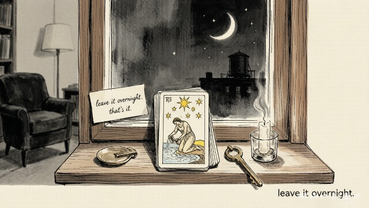
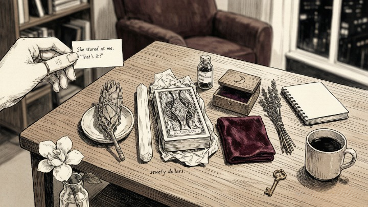
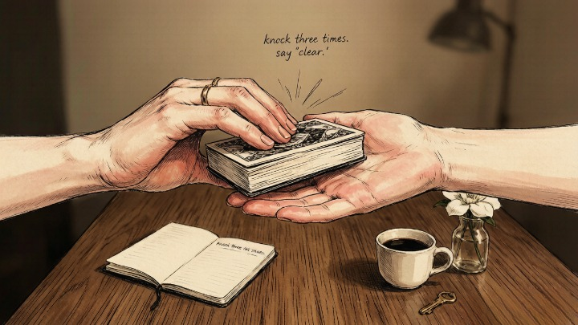

> Your deck doesn't need sage. It needs your attention.

---

A friend of mine spent seventy dollars on cleansing supplies before she'd done a single reading. Sage bundle. Selenite wand. Special cloth. A wooden box with a moon carved into the lid. She'd read somewhere that a tarot deck "absorbs energy" and needed to be "cleared" between every session — like spiritual hand sanitizer.

She asked me what I use to cleanse my deck.

I told her I knock on it three times and say "clear."

She stared at me. "That's it?"

"That's it."

She was simultaneously relieved and annoyed — relieved that the answer was simple, annoyed that she'd spent seventy dollars on supplies she didn't need.

## TL;DR

Seventy dollars of sage and selenite.
A moon-carved box she didn't need.
The deck wasn't dirty. She was just tired.

Three knuckles on cardstock. One word: clear.
One breath, exhaled across the top of the cards.
That's the whole ceremony.

The moonlight isn't charging anything.
It's reminding you to slow down.
The crystal isn't absorbing energy.
It's giving your mind a place to rest.

Knock three times. Say one word.
The boundary appears where your hand meets the cards.
No smoke, no moonlight, no price tag.
Just a pause — and then you read.

Five methods, one mechanism:
a boundary between then and now.
The deck never needed cleansing.
The reader did.

Your deck doesn't need sage.
It needs your attention.

---

### 🧹 What Cleansing Actually Does (and Doesn't Do)

Let's talk about what's real and what's theater.

Your [tarot deck](/tarot/tarot-for-beginners/) is seventy-eight pieces of cardstock. It doesn't "absorb" energy like a sponge. It doesn't hold grudges. It doesn't get spiritually dirty.

**What cleansing actually does is reset *your* relationship to the deck.** After an intense reading — something heavy, emotional, or confusing — you might feel a residue. Not in the cards. In you. It's your [intuition](/tarot/7-signs-intuition/) telling you the last reading is still open. The ritual of cleansing clears *your* head so you can approach the next reading with fresh eyes.

> The deck doesn't need to be cleansed. The reader does. The ritual is for you — a psychological reset that signals to your unconscious: previous reading is closed, new reading is open. The mechanism is psychological, not metaphysical. The effect is the same either way.

---

### 🔥 Five Methods — From Zero Effort to Full Ritual

### 👊 Method 1: The Knock (Zero Supplies, Five Seconds)

**The core answer:** Tap the deck three times with your knuckles. That's it. The knock is a reset signal — simple, physical, immediate. It works because it's a deliberate break between readings, not because of any special property of knocking.

This is what I use most of the time. Before a reading, I pick up the deck, knock on it three times, and say "clear" — out loud or silently. The ritual takes five seconds and costs nothing. **It's not the knocking that clears the deck. It's the intention behind it.** The physical action just anchors the intention.

Why it works: it's a clear, unambiguous transition. The moment you knock, the previous reading is over. Your brain registers the boundary.

### 🌬️ Method 2: The Breath (One Inhale, One Exhale)

**The core answer:** Hold the deck in both hands. Take one slow breath in. Exhale across the top of the cards. One breath. That's the whole method.

Breath is the oldest cleansing ritual there is — not because it's mystical, but because it forces you to pause. You can't rush a breath. The deck gets cleared in the time it takes your lungs to fill and empty.

This method is especially useful when you're reading for multiple people or doing back-to-back pulls. The breath resets your nervous system as much as it resets the deck.

---

### 🌙 Method 3: Moonlight (Eight Hours, Zero Effort)

**The core answer:** Place your deck on a windowsill during the full moon. Leave it overnight. That's it.

The moonlight method is popular for a reason — it's effortless and it feels significant. You're not doing anything. You're just placing the deck somewhere and letting time pass. The psychological effect is the same as any cleansing ritual: you've symbolically "reset" the deck, so you approach it differently in the morning.

**Practical note:** don't leave your deck outside. Dew, bugs, and curious raccoons are not part of the ritual. A windowsill works fine. Moonlight passes through glass the same way it passes through air.

---

### 🔮 Method 4: Selenite or Clear Quartz (Overnight, Passive)

**The core answer:** Place a piece of selenite or clear quartz on top of your deck. Leave it overnight. The crystal doesn't do anything to the cards — but it gives you a visual anchor that signals "this deck has been reset."

Crystals in tarot work the same way as every other cleansing method: **the power is in the ritual, not the mineral.** If placing a crystal on your deck makes you feel like it's been cleared, it's been cleared. The mechanism is psychological. The effect is real.

A small piece of selenite costs about five dollars. You don't need a wand, a tower, or a crystal grid. One piece. Deck. Overnight. Done.

### 🔥 Method 5: Smoke (The Full Ritual)

**The core answer:** Pass your deck through the smoke of burning sage, palo santo, or incense — one card at a time or as a full stack. This is the most "theatrical" method and the one most people start with. It's satisfying. It's also completely unnecessary.

Here's the thing about smoke cleansing: it works because it's dramatic. The sensory experience — the smell, the visual of smoke curling around the cards, the deliberate slowness of passing each card through — creates a powerful psychological boundary between one reading and the next. **The sage isn't doing the work. The ritual is.**

If you enjoy it, do it. If it feels like a chore, skip it. Your deck doesn't care either way.

> *Rituals are the formulas by which harmony is restored.* — Terry Tempest Williams

---

#### 🧪 Quick Self-Check

Before you buy anything, ask yourself:

* Do I feel like I *need* to cleanse my deck — or am I just anxious about "doing it wrong"?
* What's the simplest version of this ritual I'd actually do consistently?
* If no one ever saw me cleanse my deck, would I still feel the need to do it?

**The method that works is the one you'll actually use.** If the full sage ritual feels like too much, knock three times and move on. Your deck will work exactly the same.

---

### 🗂️ The Thirty-Second Routine

Keep it boring. Knock three times. Breathe once. Pull your [three-card spread](/tarot/3-card-spreads/). That's the whole routine — the version that fits between "wake up" and "leave for work."

Moonlight when the moon is full. Smoke when you want the theater of it. Selenite if you like looking at it. None of it is required.

The only cleansing that matters is the one that happens before every reading, not the one that happens once a month. Thirty seconds, every time, beats a grand ritual you skip.

---

## 🔮 When You Want a Reading Without the Ritual

Cleansing is about clearing your head so you can read clearly. But sometimes the blockage isn't the deck — it's you being too close to your own situation to see it.

A skilled reader brings fresh eyes to your questions — no cleansing required, because they're not carrying your history. <a href="https://wmorajmp.com/?pageName=home&siteId=oranum&subSiteId=tarot&prm[psid]=HuMaster&prm[pstool]=606_1&prm[topic]=Live&prm[psprogram]=revs&prm[campaign_id]=&subAffId=" target="_blank" rel="sponsored nofollow noopener">Oranum</a> screens every reader through a **live demonstration reading** before they accept clients. Their refund policy: if the session doesn't feel right, ask for your money back within twenty-four hours. First session costs less than lunch. No subscription.

**Try it once.** Ask a question you've been stuck on. See what comes back. Sometimes the best way to cleanse a deck is to let someone else shuffle it.

---

My friend who spent seventy dollars on supplies? She still uses the wooden box. It's beautiful. She keeps the deck in it. But she stopped cleansing between every reading — not because she stopped believing in the ritual, but because she realized the deck didn't need it.

Now she knocks three times, takes one breath, and pulls her cards.

She reads more often now. Funny how that works — when you stop treating the deck like something fragile that needs constant maintenance, you start reaching for it more.

---

*Tomorrow: [The Lovers card](/tarot/the-lovers-card/) — why the most misunderstood card in tarot isn't actually about romance at all.*
