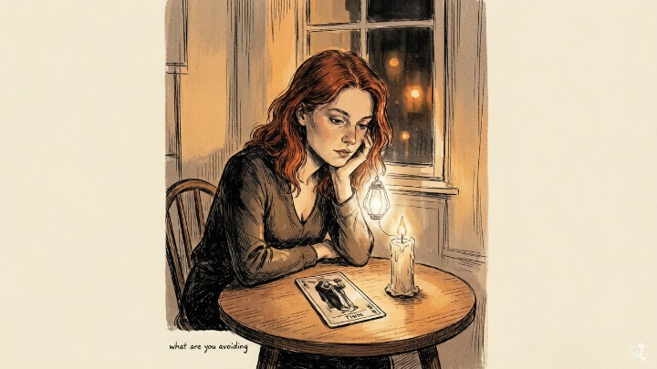
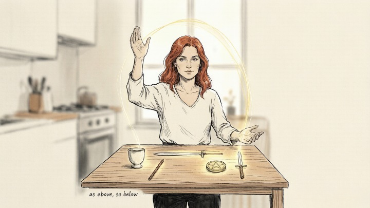
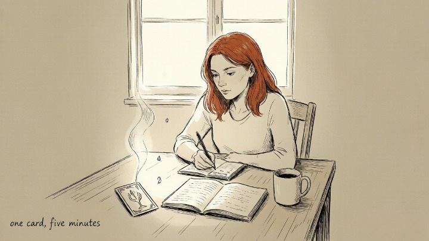

> The Major Arcana isn't about predicting your future. It's about revealing who you already are.

---

She pulled The Hermit three days in a row and started panicking. "Does this mean I'm going to end up alone?"

She'd been reading tarot for about six months — long enough to know the cards, not long enough to trust them. The Hermit, in her mind, meant isolation. Withdrawal. A lonely old man on a mountain with a lantern and no company. She was terrified the cards were predicting her future: single, solitary, cut off from everyone she loved.

I asked her what The Hermit was actually doing in the image. She looked closer. "He's holding a light," she said. "And he's not hiding. He's... looking for something."

"Exactly. He's not running away from people. He's going inward to find something only he can bring back. He's not alone. He's *deliberate.*"

She stopped panicking. Two weeks later, she started therapy — not because the cards told her to, but because The Hermit kept appearing until she recognized what it was really asking: *what truth are you avoiding by staying busy?*

### 🃏 Tarot as the Microscope of the Psyche

Most people encounter tarot as fortune-telling. That's the surface. Beneath the surface is something older, deeper, and more psychologically sophisticated than most modern self-help frameworks.

> Carl Jung encountered tarot in the 1930s and recognized it immediately for what it was: a visual encyclopedia of archetypes — the universal patterns of human experience that reside in what he called the collective unconscious. The Fool, The Magician, The High Priestess, Death, The Tower — these aren't supernatural entities. They're patterns of being that every human, in every culture, in every era, has experienced. The cards give them form so we can recognize them in ourselves.

The Major Arcana's twenty-two cards tell a single story — the Fool's Journey — from innocence through experience to integration. Jung called this process **individuation:** the lifelong work of becoming fully, consciously yourself. The Fool doesn't just learn lessons. The Fool encounters every major archetype of the human experience, integrates what each one teaches, and arrives at the end not as someone different, but as someone *whole.*

---

### 🎭 The Core Archetypes Decoded

---

### 🎒 The Fool: The Innocent at the Threshold

**Archetype:** The Innocent, The Beginner, The Leap of Faith.

**The core insight:** The Fool isn't naive. The Fool is the only card in the deck willing to begin without knowing how it ends. Numbered zero because it exists outside the sequence — it is both the first step and the last, the beginning and the return.

The traditional image: a figure at the edge of a cliff, small bag over shoulder, white rose in hand, a dog at their heels, the sun rising behind them. The dog is instinct — the animal knowing that senses danger but also recognizes safety. The cliff isn't a warning. It's a threshold. **The Fool doesn't fall. The Fool steps — because growth only happens when you leave the ground you know.**

When The Fool appears in your reading, ask: *what am I being called to begin, even though I don't feel ready?*

### 🪄 The Magician: The Alchemist of Consciousness

**Archetype:** The Creator, The Alchemist, The One Who Channels Will Into Form.

**The core insight:** The Magician represents the moment when intention becomes action. All four suits are present on the table — cup, sword, wand, pentacle — because the Magician has access to every tool. The wand points upward, the hand points downward: *as above, so below.* What you can conceive, you can create.

The Magician isn't about magic tricks. It's about **conscious agency.** The recognition that you have everything you need — the skills, the resources, the will — and the only missing piece is the decision to act.

When The Magician appears, the question isn't *can I do this?* It's *will I?*

---

### 🌙 The High Priestess: Guardian of the Unconscious

**Archetype:** The Keeper of Mysteries, The Unconscious, The Inner Knowing.

**The core insight:** The High Priestess sits between two pillars — light and dark, conscious and unconscious — holding a scroll of hidden knowledge. She doesn't speak. She doesn't explain. She waits for you to get quiet enough to hear what you already know.

> In Jungian terms, The High Priestess represents the anima — the inner feminine that mediates between the conscious ego and the depths of the unconscious. She is intuition in its purest form: knowledge that arrives without evidence, truth that can't be proven but can't be denied.

When The High Priestess appears, the world is too loud. Stop asking. Stop researching. Sit in silence. The answer is already there. You just can't hear it over the noise.

### 🏔️ The Hermit: The Seeker Who Withdraws to Find

**Archetype:** The Sage, The Seeker, The Inner Guide.

**The core insight:** The Hermit climbs the mountain not to escape the world, but to find something the world can't give: **clarity.** The lantern isn't for others. It's for the path ahead. The Hermit's solitude isn't loneliness. It's pilgrimage.

This card appears when external answers have failed. You've asked everyone. You've googled everything. You've crowdsourced every decision. **The next step can only be found by going inward.** Not forever. Just long enough to hear what the noise has been drowning out.

When The Hermit appears, the question isn't *what should I do?* It's *what do I already know that I've been too afraid to act on?*

---

### 🌀 The Fool's Journey: Individuation in 22 Cards

The 22 Major Arcana cards aren't a list. They're a story — the single most complete map of psychological development ever encoded in images.

**Phase One — Innocence (Cards 0–7):** The Fool sets out. Meets the Magician and High Priestess (skill and intuition). Encounters the Empress and Emperor (nurture and structure). Learns from the Hierophant (tradition). Falls in love (The Lovers). Rides out in the Chariot (willpower and victory). This is the phase of building an ego — discovering who you are in the world.

**Phase Two — Descent (Cards 8–14):** Strength teaches endurance. The Hermit demands withdrawal. The Wheel of Fortune turns — and the Fool learns that control is an illusion. Justice arrives with consequences. The Hanged Man inverts everything. Death ends what must end. Temperance finds balance. **This is the phase of crisis and transformation** — what Jung called confronting the shadow.

**Phase Three — Integration (Cards 15–21):** The Devil exposes attachment. The Tower collapses what was false. The Star offers hope after devastation. The Moon reveals the unconscious. The Sun brings clarity. Judgment calls for awakening. And The World — the final card — is not an ending. It's wholeness. Integration. The Fool has met every archetype, faced every shadow, and emerged not perfect, but *complete.*

---

### 🔮 Using the Major Arcana for Daily Self-Exploration

You don't need a full spread. You don't need a question. You need one card and five minutes.

**The practice:**

1. Separate the 22 Major Arcana from your deck. Shuffle just those.
2. Each morning, pull one card. Look at the image. Don't reach for the guidebook.
3. Ask: *what archetype is active in my life right now?*
4. Write one sentence — the first thing that comes to mind.
5. At the end of the day, look back. How did that archetype show up?

After a week, patterns emerge. After a month, you'll see the story unfolding — which phase you're in, which archetype keeps returning, which one you're avoiding.

**The cards don't predict. They reflect.** And what they reflect is more honest than what you tell yourself in the mirror.

---

#### 🧪 Quick Self-Check

Think about the past week:

* Which archetype have I been living in — The Fool's innocence, The Hermit's withdrawal, The Magician's creative power?
* What card scares me most — and what might that fear be trying to tell me?
* If my life right now were a Major Arcana card, which one would it be?
* Where am I in the Fool's Journey — building, descending, or integrating?

---

## 🛒 Tools to Deepen Your Practice

The archetypes come alive when you spend time with them. A few tools that make that easier:

**A quality deck.** The Rider-Waite-Smith remains the gold standard for Major Arcana study — every symbol is intentional, every color carries meaning. For a modern take, the Modern Witch Tarot or the Light Seer's Tarot offer vivid, relatable imagery without losing the traditional structure. Find them on Amazon, often under $25.

**A dedicated journal.** Not a notebook you also use for grocery lists. Something beautiful enough that you want to reach for it. A blank journal invites the cards to speak. Date each entry. Record the card, your first impression, and the one-word answer to "what archetype was active today." After a month, read back through. You'll see your own individuation unfolding in ink.

**A reading to go deeper.** Sometimes the cards you pull for yourself are filtered through your own blind spots. Oranum screens every reader through a live demonstration reading before they accept clients. Refund policy: twenty-four hours, no questions. First session costs less than lunch.

---

She doesn't panic when The Hermit shows up anymore. She pulls it now and smiles — not because she's figured everything out, but because she knows what it's asking. *Go inward. The answer is already there. Come back when you've found it.*

Last month she pulled The Star for the first time — the card after The Tower, the card of hope after devastation. "I think I'm in the integration phase," she said. "It took a year, but I think I'm almost whole."

The cards had been telling her the whole time. She just needed to learn the language.

---

*Explore the remaining Major Arcana archetypes in our full guide to the Fool's Journey, or dive into Shadow Work to begin the descent phase of your own individuation.*
