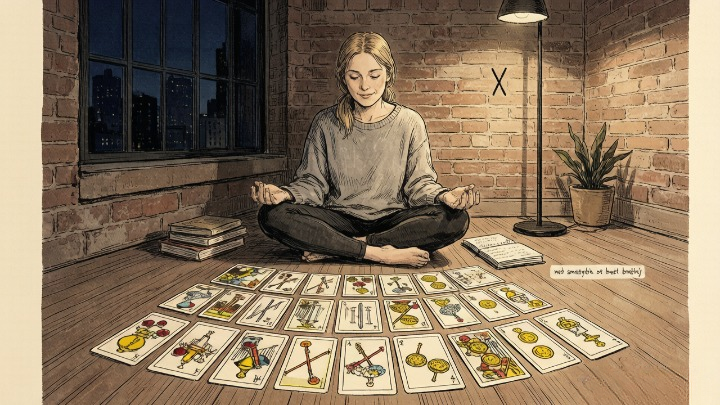
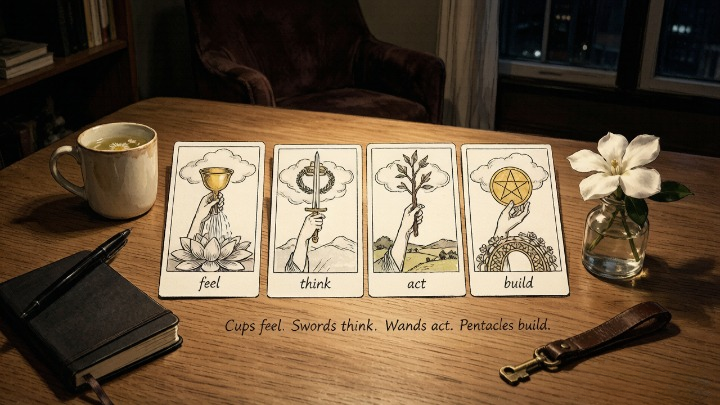
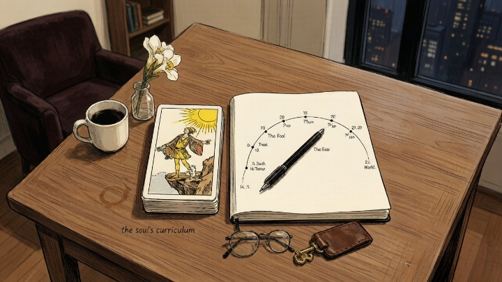

> The Major Arcana is your soul's curriculum. The Minor Arcana is your daily homework.

---

## TL;DR

**What we actually know is** that a standard 78-card tarot deck splits into two groups that answer two different questions. The twenty-two Major Arcana cards carry archetypal themes — endings, awakenings, deep shifts — and signal that something larger than your day-to-day choices is in motion. The fifty-six Minor Arcana cards, arranged in four suits of fourteen, describe the texture of ordinary life: feelings, thoughts, actions, and material circumstances. A quick rule that holds up in practice: count the Majors. Zero or one points to a practical situation you can steer with your choices; three or more points to a bigger transition worth sitting with. The cards don't carry information on their own — this framing is a sorting tool, and it's the one that makes seventy-eight cards feel manageable.

---

A client once pulled ten cards for a career question and every single one was from the Minor Arcana. Not a single Major. She looked disappointed — she'd been hoping for something dramatic, some sign from the universe that her burnout meant something significant.

I asked her: "Do you want this to be a spiritual crisis — or just a job you need to leave?"

She paused. Then laughed. "Just a job I need to leave."

The cards had been telling her exactly that. No cosmic drama. No fate. Just a practical situation that required a practical decision. **That's the difference between the Major and Minor Arcana in one pull — and once you understand it, the entire deck clicks into place.**

---

### 🎭 The Major Arcana: Life's Big Chapters

The twenty-two Major Arcana cards are the archetypes. They represent the universal human experiences — birth, death, love, loss, awakening, transformation. The forces that shape us whether we cooperate or not.

> Carl Jung saw the Major Arcana as a map of individuation — the psychological journey from unconscious wholeness (The Fool) through confrontation with the shadow (The Devil, Death, The Tower) to conscious integration (The World). Each card is a station on that path.

When Major Arcana cards dominate a reading, the situation isn't just about your choices. Larger forces are in play. The current runs deeper than your individual decisions. **Majors say: this matters. Pay attention. Something fundamental is shifting.**

The Major Arcana in order tells a story: The Fool sets out. Meets the Magician and High Priestess (skill and intuition). Encounters the Emperor and Hierophant (structure and tradition). Falls in love (The Lovers). Faces death, the devil, the tower (crisis, shadow, collapse). Finds the Star, the Moon, the Sun (hope, mystery, clarity). And arrives at the World (completion).

Once you see that story, you never need to memorize the Major Arcana again. You know where each card lives in the arc.

### 📋 The Minor Arcana: Daily Life in Four Suits

The fifty-six Minor Arcana cards aren't less important — they're just more specific. They describe the texture of daily existence: emotions, thoughts, actions, material circumstances. The stuff you actually deal with on a Tuesday.

**The four suits are four lenses on the same life:**

* **Cups (emotions):** Love, grief, joy, connection, heartbreak. The inner world. When Cups dominate, the heart is running the show — whether that's beautiful or overwhelming.
* **Swords (thoughts):** Conflict, decisions, clarity, anxiety, truth. The mind in motion. Swords readings often signal mental overdrive — overthinking, difficult conversations, breakthroughs that come through confrontation.
* **Wands (action):** Creativity, momentum, ambition, burnout, inspiration. Energy in motion. Wands are about what you're building, chasing, burning for — or burning out on.
* **Pentacles (material world):** Money, body, home, career, health. The tangible. Pentacles ground the reading in what you can touch — your job, your savings, your physical well-being.

Each suit runs Ace through Ten, then Page, Knight, Queen, King. That's a story too — from the spark of an idea (Ace) to its full expression (Ten), with the court cards representing stages of mastery or people in your life.

### ⚖️ When Majors Dominate vs. When Minors Dominate

Here's the simplest diagnostic I know:

* **Three or more Major Arcana in a spread:** This is a big-picture moment. A life chapter is opening or closing. The forces at work are larger than your personal preferences. Your choices matter, but the current is stronger than your paddle. This isn't cause for panic — it's a call for presence.
* **All Minor Arcana:** This situation lives in the realm of daily action. No cosmic lesson. No fate. Just choices — what you say, where you go, how you respond. **You are the deciding factor.** This is actually good news most of the time, because it means you have more control than you think.
* **One Major anchoring a Minor spread:** The Major sets the theme. The Minors show how it's playing out. Death surrounded by Pentacles isn't literal death — it's a financial or career transformation. The Lovers surrounded by Swords isn't a romance — it's a decision you're agonizing over.

> *The big print giveth, and the fine print taketh away.* — Fulton J. Sheen

---

### 🧭 A Working Cheat Sheet

When a reading feels murky, sort it with three questions rather than reaching for the guidebook:

| The question | Major Arcana answer | Minor Arcana answer |
|---|---|---|
| What's the time scale? | Months to years — a chapter | Days to weeks — a scene |
| Where does the leverage sit? | Forces larger than your choices | Your next decision |
| How should you respond? | Sit with it, don't rush | Act on it, then move on |

**A common mistake is treating Minors as "minor" in importance.** They're not. A Cups card about a conversation you've been avoiding can change a relationship faster than any Tower. "Minor" describes the *scale* of the situation, not its weight. The Minor Arcana is where most real life actually happens — which is why a reading full of Minors is usually more useful than one full of Majors: it's telling you the problem is within reach.

**Another is assuming Majors mean fate.** Three Majors don't mean you've lost agency. They mean the stakes have risen — the decision matters more, which is precisely when your choice carries the most weight. The cards frame the situation. They don't make the call. That part stays yours.

---

### 🎴 The Court Cards: People, Parts of Yourself, or Stages

The sixteen court cards — Page, Knight, Queen, King in each suit — are the most confusing part of the Minor Arcana. Every book has a different interpretation. Here's what's actually useful:

**They can represent three things, and the context tells you which:**

1. **A person in your life.** The Queen of Cups might be your empathetic friend. The Knight of Swords might be the colleague who charges into every conversation with an opinion.
2. **An aspect of yourself.** The Page of Wands isn't someone else — it's your own creative spark, your beginner's enthusiasm, the part of you that wants to start something new.
3. **A stage of development.** Pages are beginners. Knights are in motion. Queens have internal mastery. Kings have external mastery.

**The simplest approach:** when a court card appears, ask yourself: *is this someone I know, a part of me I'm not owning, or a stage of this situation?* The first answer that comes is usually right.

#### 🧪 Quick Self-Check

Next time you do a reading, before you interpret anything, count the Majors:

* Zero or one Major: This is a practical situation. Your choices are the deciding factor. Act accordingly.
* Two Majors: A transition is underway. Both choice and fate are in play.
* Three or more Majors: Something significant is shifting. Sit with it. Don't rush to a decision.

**The count alone tells you the weight of the reading before you've interpreted a single card.**

---

## 🔮 When You Want Help Interpreting What You Pulled

You've pulled your cards. You've counted the Majors. You've got a rough sense of the story — but something isn't clicking. That's normal. Reading for yourself means reading through your own blind spots.

A skilled tarot reader can look at the same spread and see connections you missed — not because they're more intuitive, but because they're not carrying your history. The <a href="https://wmorajmp.com/?pageName=home&siteId=oranum&subSiteId=tarot&prm[psid]=HuMaster&prm[pstool]=606_1&prm[topic]=Live&prm[psprogram]=revs&prm[campaign_id]=&subAffId=" target="_blank" rel="sponsored nofollow noopener">Oranum tarot space</a> collects live readers who can sit with your spread and reflect back what you walked past. Use them as a second set of eyes, not a verdict.

**Try it once.** Pull your own three cards. Note your impressions. Then have someone else read the same spread. The gap between what you saw and what they saw will teach you more than any article.

---

*Tomorrow: [how to cleanse your tarot deck](/tarot/cleanse-tarot-deck/) — five methods that actually matter, and why most of the advice online is overcomplicating something your deck doesn't actually need. For the psychology behind those twenty-two Major cards, see our [Jungian guide to the Major Arcana archetypes](/tarot/major-arcana-archetypes/).*
