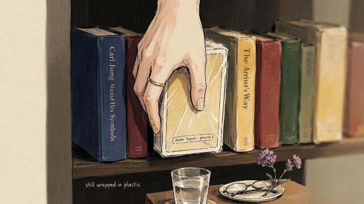
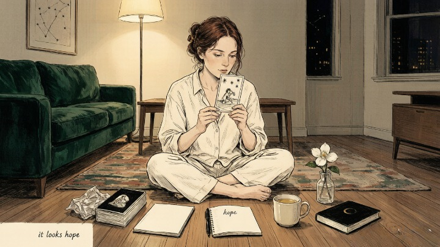
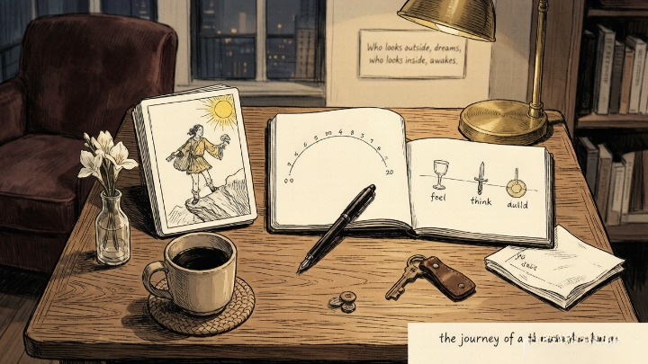

> Tarot isn't a test you have to pass before you're allowed to start.

---

A friend of mine kept a tarot deck on her bookshelf for three years. Still wrapped in plastic. She bought it after a breakup — some impulse at a metaphysical shop she wandered into because it smelled like incense and she didn't want to go home yet.

Every few months she'd look at it and think *I should learn how to use this.* Then she'd imagine memorizing seventy-eight cards, learning reversed meanings, mastering the Celtic Cross — and she'd put it back on the shelf.

When she finally opened it, I asked what changed. She said: "I realized I don't need to be good at it. I just need to start."

---

## 🃏 What Tarot Actually Is (and What It Isn't)

Before we go anywhere near a deck, let's clear the biggest misconception.

Tarot is not fortune-telling. It's not predicting the future. It's not a Ouija board or a conduit for spirits you didn't invite.

> Carl Jung considered the tarot archetypes a direct map of the human psyche — each card representing a psychological state, a stage of growth, a pattern of behavior. The cards don't tell you what will happen. They reflect what's already happening inside you, in symbols your conscious mind can finally see.

**Think of tarot as a mirror that speaks in pictures.** You lay down a few cards, look at the images, and notice what catches your attention. That's it. The "magic" isn't in the cards. It's in you — your associations, your intuition, your willingness to sit with a question and see what surfaces.

### 🎴 The Anatomy of a Deck

A standard tarot deck has seventy-eight cards split into two groups. That number sounds intimidating. It's not — because you don't need to memorize anything.

- [ ] **Major Arcana** (22 cards): The big archetypes — The Fool, The Lovers, Death, The Star. These represent major life themes, psychological transitions, spiritual lessons.
- [ ] **Minor Arcana** (56 cards): Divided into four suits — Cups (emotions), Swords (thoughts), Wands (action), Pentacles (material world). These represent everyday situations and daily experiences.
- [ ] **Court Cards** (16 of the 56): Pages, Knights, Queens, Kings — representing personality types, stages of development, or people in your life.

**You don't need to know any of this to pull your first card.** The image itself will tell you more than memorized meanings ever could. Start with the image. The meanings come later.

---

### 🛒 Choosing Your First Deck

**The core answer:** Pick a deck whose artwork pulls you in. Not the one someone recommended. Not the "beginner" deck. The one you want to look at. That's the deck you'll actually use.

The Rider-Waite-Smith is the standard reference. Almost every book, online course, and tutorial uses its imagery. The scenes on each card tell clear emotional stories, which makes intuitive reading possible long before you've memorized anything.

But honestly? **Any deck based on the Waite-Smith tradition will work.** What matters is that the images speak to you — that you want to spend time with them. A deck you love looking at is a deck you'll reach for.

Here's what I'd look for as a first-timer:

* Art that makes you feel something — curiosity, comfort, intrigue
* Card stock that feels good to shuffle
* A guidebook included (even a basic one)
* Under thirty dollars — no need to invest heavily before you know if the practice fits

### 🤲 Your First Pull: The Interview Spread

**The core answer:** Before you ask the cards anything about your life, do one simple pull to get comfortable with the deck. No question. Just: "What do I need to know right now?"

Shuffle however feels natural. There's no wrong way. Overhand shuffle, riffle shuffle, spread them on the table and mix them around. Cut the deck once. Pull the top card.

Look at it for thirty seconds. Don't reach for the guidebook.

Ask yourself:
* What's the first thing I notice in this image?
* What emotion does this card evoke?
* If this card were a message about my life right now, what would it be saying?

Write down one word. One sentence. That's the reading. **You just did tarot.**

The guidebook can come later — for context, for nuance, for the traditional meanings you'll absorb over time. But your first impression matters more than any author's interpretation, because your psyche chose what to notice.

---

### 📖 How to Actually Learn (Without Memorizing)

Most beginner guides tell you to study one card a day. Draw it, read the meaning, journal about it. That works. It's also slow, and speed isn't the point, but I've seen too many people quit because seventy-eight days felt like forever.

Here's a faster path that still respects the depth:

1. **Learn the Major Arcana story first.** The twenty-two Major cards aren't a list — they're a journey. The Fool starts out innocent, encounters teachers and challenges, faces Death and The Tower, and arrives at The World transformed. Read them like a graphic novel. The story will anchor the meanings better than flashcards ever could.
2. **Learn the four suits as personalities.** Cups feel. Swords think. Wands act. Pentacles build. Once you know that, every Minor card makes intuitive sense — Two of Cups is an emotional connection, Five of Swords is mental conflict, Ace of Wands is a burst of creative energy.
3. **Pull a card every morning.** One card. Thirty seconds. No guidebook. Write one word. After two weeks, you'll have fourteen cards, fourteen associations, fourteen moments where the card you pulled connected to something in your day. **That's not coincidence. That's pattern recognition waking up.**

> *The journey of a thousand miles begins with a single step.* — Lao Tzu

#### 🧪 Quick Self-Check

If you've never touched a tarot deck, ask yourself:

* Am I waiting to feel "ready" before I start?
* Do I believe I need to memorize seventy-eight meanings first?
* What's the worst that could happen if I pulled a card right now with no preparation?

**The only prerequisite for tarot is curiosity.** You already have that, or you wouldn't be here.

---

## 🔮 When You Want Guidance on What You Pull

Pulling a card yourself is one experience. Having someone pull cards for you — someone trained to read the patterns you're too close to see — is another entirely.

A skilled tarot reader can help you interpret what keeps showing up in your own pulls, or give you a reading that covers ground you haven't thought to ask about. Oranum screens every reader through a **live demonstration reading** before they can accept paid clients. Their refund policy is clear: if the session doesn't feel right, ask for your money back within twenty-four hours. First session costs less than lunch. No commitment beyond curiosity.

**Try it once.** Pull a card yourself first. Then have someone read for you. Comparing the two experiences — what you saw versus what they saw — will teach you more about tarot than any guidebook.

---

My friend with the three-year-old deck finally opened it on a Tuesday night. She shuffled awkwardly, laughed at herself, pulled one card — The Star — and stared at it for about two minutes without knowing what it meant.

Then she said out loud: "It looks like hope. Like someone who's been through something hard and made it out."

She didn't know the traditional meaning. She didn't need to. She'd just done a tarot reading — and it was accurate.

She reads for herself now, three or four times a week. Still doesn't know all seventy-eight meanings. Doesn't matter. She's not studying tarot. She's using it.

---

*Tomorrow: [the Fool card](/tarot/the-fool-card/) — why the card everyone dismisses as "the beginner" is actually the most radical card in the entire deck.*
