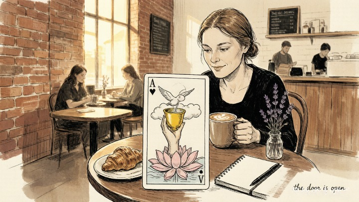
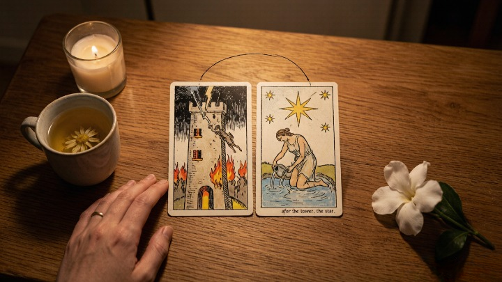
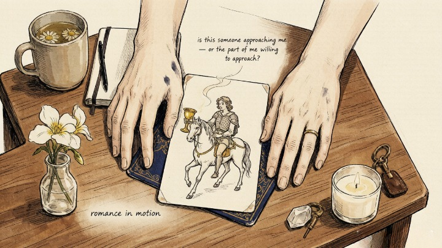

> There's a quiet space here for you. If you've been pulling card after card hoping for news about love, you're not doing anything wrong — you're just longing, and longing has a way of blurring what's actually in front of us. This guide won't promise you a timeline or a person. It'll help you see the difference between a card that speaks about love and a card you've decided must be about love. The truth is usually gentler than the story we're afraid to put down.

---

> The cards that signal new love rarely look the way you expect.

---

A client pulled the Two of Cups and practically squealed. "New relationship," she declared. "Definitely. Love is coming."

A week later, she pulled the Three of Swords — heartbreak, betrayal, sorrow — and her face fell. Two of Cups was supposed to mean love. Why was the deck now showing her pain?

I asked her: "What if the Two of Cups wasn't a prediction? What if it was asking whether you're open to love in the first place — and the Three of Swords was answering honestly?"

She'd been pulling cards for months, assigning every vaguely positive one to "new relationship" and every difficult one to "old baggage." But the deck wasn't sending mixed messages. She was filtering everything through a single lens. **The cards don't lie. But we do — every time we twist their meaning to fit what we want to hear.**

---

### 🃏 The Cards That Actually Signal Love (and Why Most Lists Are Wrong)

Most "tarot cards for love" articles list The Lovers, the Two of Cups, the Ace of Cups, and the Ten of Cups. That's not wrong — those cards *can* indicate love. But they can also mean about a dozen other things, and most people latch onto the romantic interpretation because it's the one they're hoping for.

Here's a more honest framework: **a love card doesn't predict a relationship. It describes the energy you're currently carrying.** If you're closed off, guarded, or still grieving, pulling a "love card" means something completely different than if you're open and available. The card reflects *you,* not your future.

### 💕 The Two of Cups: Connection, Not Destiny

**The core answer:** The Two of Cups signals genuine emotional reciprocity — a meeting of equals. It can mean a new relationship, but more often it means you're *capable* of one right now. The distinction matters.

Two of Cups is the card of mutual attraction. Two figures hold cups toward each other, a winged lion above them, a caduceus between — symbols of balanced exchange. It's the card of "I see you, you see me, and we're both showing up."

But here's what most interpretations skip: **the Two of Cups describes a dynamic, not a promise.** It means you and someone else are in an open, reciprocal exchange. It doesn't mean that exchange will last. It doesn't mean they're your soulmate. It means: right now, there's genuine connection. What you build from it is up to you.

This is where it helps to remember how [Carl Jung understood the shadow](/psych/shadow-work/carl-jung-shadow/) — the parts of ourselves we'd rather not see. When we long for love, we tend to project the relationship we *want* onto the card we've pulled, and miss what it's actually showing us. Jung called this projection, and he was blunt about it: what we refuse to see in ourselves, we assign to the world outside us. The card is a mirror. The question is whether we're willing to look.

---

### 💖 The Ace of Cups: Opening, Not Arrival

**The core answer:** The Ace of Cups is the card of emotional readiness — the beginning of love, not the love itself. It signals that your heart is open. What flows into that opening hasn't been decided yet.

A hand emerges from a cloud, holding a cup overflowing with water. A dove descends. The image is about *offering,* not receiving. **The Ace of Cups says you're available. It doesn't say what — or who — is coming.**

If you pull this card while single, it's genuinely good news — not because a relationship is imminent, but because you've done the internal work to become open to one. That's the prerequisite most people skip. The card is telling you: the door is open. Walk through it.

### 🌟 The Star: Healing Before Love

**The core answer:** The Star is the most underrated "love card" in tarot. It appears when you've survived something painful and are finally ready to trust again. It doesn't promise a new partner. It promises that you're whole enough to meet one.

After The Tower — the card of collapse, destruction, everything falling apart — comes The Star. A naked woman kneels beside a pool, pouring water. She's vulnerable. She's been through something. But she's still here, and she's still offering.

**The Star is the card of post-traumatic hope.** If you're pulling it while asking about love, the message is clear: you've healed enough. You're ready. The next relationship won't be a repeat of the last one — not because the next person will be different, but because *you* are different.

There's a quiet psychological truth under this card. The psychiatrist Judith Herman, who mapped how people recover from rupture, noticed that healing doesn't erase what happened — it changes what you carry it as. That's the difference between a wound that keeps reopening and one that's finally become a scar. The Star doesn't promise a clean slate. It promises [a self you can trust to love again](/psych/shadow-work/shadow-work-guide/).

> *The wound is the place where the Light enters you.* — Rumi

---

### ⚔️ The Knight of Cups: Romance in Motion

**The core answer:** The Knight of Cups represents romantic pursuit — either someone approaching you with romantic intentions, or your own willingness to pursue love. It's one of the few cards that often indicates an actual person entering your life.

The Knight rides a white horse, holding a cup. He's not charging like the Knight of Swords or building like the Knight of Pentacles. He's *offering.* His energy is romantic, idealistic, sometimes a little dramatic. He believes in love and isn't afraid to show it.

When this card appears, ask: is this someone approaching me — or the part of myself that's finally willing to approach someone else? Either answer is valuable.

---

### 🌞 The Sun: Joy Without Conditions

**The core answer:** The Sun is the card of pure, uncomplicated happiness. In love readings, it signals a relationship — or a phase within one — that brings genuine joy without the anxiety, drama, or conditions that define so many partnerships.

A child rides a white horse under a giant sun. Sunflowers line the background. The card radiates warmth without effort. It's not about passion or intensity. It's about simple, lasting happiness.

**The Sun in love readings is rare — and when it appears, it's worth paying attention.** This isn't the card of infatuation. It's the card of genuine delight in someone's presence, week after week, without the need for crisis to feel connected.

#### 🧪 Quick Self-Check

Before you interpret your next love pull:

* Am I interpreting this card based on what it actually means — or what I'm hoping it means?
* If I pulled this card about my career instead of love, what would it be telling me?
* Am I open to a relationship — or am I just lonely and projecting that onto every card?
* What's the difference between the card's message and what I want it to say?

**The cards don't need you to twist their meaning. They need you to be honest about what you see.**

---

## 🔮 When You Want Someone to Read the Cards For You

Reading love cards for yourself is notoriously difficult — because you're emotionally invested in the outcome. A skilled reader can interpret the same spread without the filter of your hopes and fears.

<a href="https://wmorajmp.com/?pageName=home&siteId=oranum&subSiteId=tarot&prm[psid]=HuMaster&prm[pstool]=606_1&prm[topic]=Live&prm[psprogram]=revs&prm[campaign_id]=&subAffId=" target="_blank" rel="sponsored nofollow noopener">Oranum</a> screens every reader through a **live demonstration reading** before they accept clients. Refund policy: twenty-four hours, no questions. First session costs less than lunch. No subscription.

**Try it once.** Pull three cards yourself — then have someone else read the same spread. The gap between your interpretation and theirs will tell you more than the cards alone ever could.

---

*Tomorrow: [why you keep attracting the same type of partner](/energy/same-type-partner/) — and the psychological pattern that keeps recreating the same relationship with different faces.*
