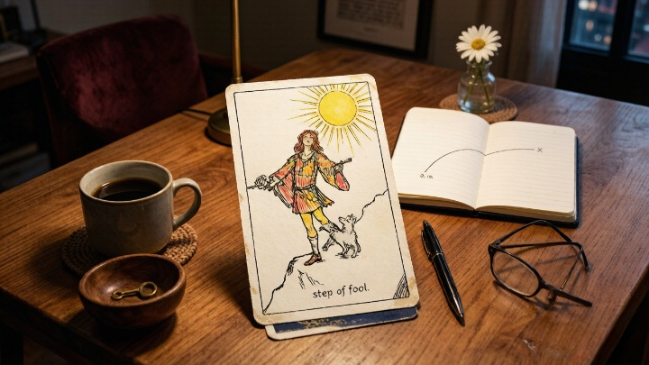
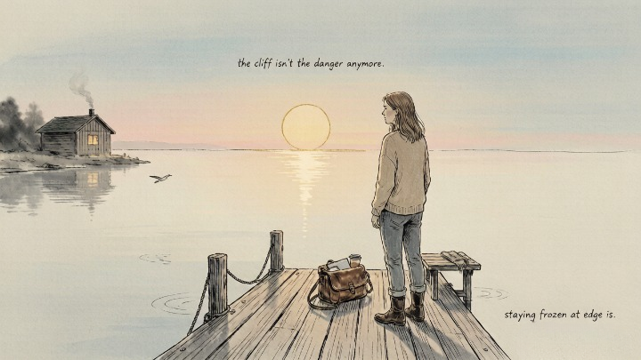
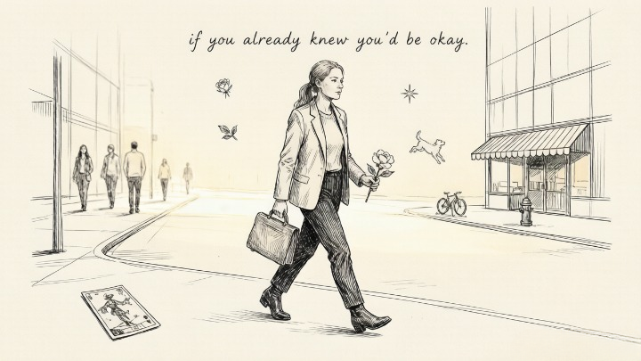

> The Fool isn't about being naive. It's about trusting yourself before you have proof.

---

A client pulled The Fool three times in one week. Three different readings, three different decks, same card. She was about to quit her job to start a business and every logical voice in her head was screaming *this is stupid. You don't have enough saved. You don't have a plan. People will think you've lost your mind.*

She wanted the cards to tell her to be careful.

The Fool kept showing up instead — and every time, she read it as a warning. *Don't be reckless. Don't jump without looking. Don't be a fool.*

When I told her what The Fool actually means, she started crying. Not because she was sad. Because she'd been waiting for permission to trust herself — and the card she'd been reading as a warning was actually a green light.

---

### 🎒 What The Fool Really Represents

The Fool is card zero in the Major Arcana — the only card that doesn't have a number, because it exists outside the sequence. It's the beginning and the end. The first step and the last. Step zero of [the Fool's Journey](/tarot/fools-journey-complete-guide/), the 22-card arc that starts at this cliff edge and ends at the World. The card of leaping without knowing where you'll land.

> In Jungian terms, The Fool represents the archetype of the innocent — not naive, but free from the accumulated fear and cynicism that experience layers on top of instinct. The Fool hasn't been hurt yet. The Fool still trusts the universe. The dog at The Fool's heels isn't warning them away from the cliff — it's accompanying them on a journey they were always meant to take.

The traditional image shows a figure at the edge of a cliff, small bag over shoulder, white rose in hand, a dog at their heels, the sun rising behind them. The dog is loyalty — instinct, animal knowing, the part of you that senses danger and the part of you that knows safety. The rose is purity of intention. The cliff isn't a warning. It's a threshold.

Not every card carries this kind of weight. The gap between [the Major and Minor Arcana](/tarot/major-vs-minor-arcana/) is roughly the gap between a season and a weather report.

**The Fool doesn't fall off the cliff. The Fool steps off it — because what's on the other side can only be reached by letting go of the ground you're standing on.**

### 🔥 When The Fool Appears in a Reading

**The core answer:** The Fool signals the beginning of something that requires faith — not blind faith, but the specific kind of trust you can only access after you've exhausted logic and the answer still isn't clear.

Here's what The Fool is actually telling you in different contexts:

* **Career:** You're on the edge of a leap. Everyone around you might think it's reckless. They're not wrong — it *is* a risk. But the card is telling you that staying where you are carries a bigger one: the risk of never finding out what happens when you jump.
* **Love:** Something new is beginning. Not necessarily a person — sometimes a new phase, a new willingness, a new openness after a period of being closed. The Fool in love readings is permission to be vulnerable before you have evidence that it's safe.
* **Spiritual growth:** You're being asked to trust a process you don't fully understand yet. The book isn't written. The path isn't mapped. The only way forward is forward.

> *A ship in harbor is safe, but that is not what ships are built for.* — John A. Shedd

---

### 🪞 The Fool Reversed: What You're Really Afraid Of

**The core answer:** The Fool reversed isn't about recklessness — it's about paralysis. The fear of looking stupid, failing publicly, or disappointing yourself is so strong that you've stopped moving altogether.

When The Fool shows up reversed, it's almost never telling you to slow down. It's telling you that *you've already stopped.* The cliff isn't the danger anymore. **Staying frozen at the edge is.**

The reversed Fool often appears when:
* You've been overthinking a decision for months
* You keep asking for signs but ignore every one you get
* You're waiting for certainty that will never arrive
* Fear of judgment is masquerading as prudence

The antidote isn't recklessness. It's a single step. Not the whole leap — just one honest move in the direction you already know you need to go.

---

### ✨ The Fool and New Beginnings: Why This Card Keeps Showing Up

**The core answer:** The Fool repeats when you're standing at the edge of a genuine transition and the only thing holding you back is the belief that you need more information before you can act.

I've noticed a pattern with clients who keep pulling The Fool. They're almost never at the beginning of something — they're at the *end* of a long period of deliberation. The decision is already made. They're just not admitting it yet. The Fool isn't telling them to leap. It's telling them they've already decided to.

Leaping is one kind of hard. Standing between two things you both want is another — that's [The Lovers](/tarot/the-lovers-card/), and it turns up when the step forward was never the problem.

> *Leap, and the net will appear.* — John Burroughs

Here's a question worth sitting with: **if you already knew you'd be okay — if the outcome was guaranteed — what would you do differently tomorrow?** Whatever your answer is, that's the direction The Fool is pointing. The card isn't asking you to be reckless. It's asking you to stop pretending you don't already know.

#### 🧪 Quick Self-Check

If The Fool keeps appearing for you, ask yourself:

* Am I delaying a decision because I want certainty that will never come?
* What's the worst realistic outcome — not the catastrophic fantasy, but what's *likely* to happen if this goes sideways?
* If a friend came to me with this exact situation, what would I tell them to do?
* What would I do tomorrow if I trusted myself completely?

**The distance between what you'd tell a friend and what you're telling yourself — that gap? That's where The Fool lives.**

---

## 🔮 When You Want a Second Set of Eyes on the Leap

Sometimes you're too close to your own threshold to see it clearly. A skilled tarot reader can reflect back what you already know but haven't been willing to act on — often in a single session.

That story doesn't end here. Some readers on <a href="https://wmorajmp.com/?pageName=home&siteId=oranum&subSiteId=tarot&prm[psid]=HuMaster&prm[pstool]=606_1&prm[topic]=Live&prm[psprogram]=revs&prm[campaign_id]=&subAffId=" target="_blank" rel="sponsored nofollow noopener">Oranum</a> can help you write the next chapter — they screen every reader through a live demonstration reading before they take a client, and if the session doesn't land, you can ask for your money back within twenty-four hours. First session costs less than lunch.

Ask about the leap. See what comes back. The Fool might show up for you too — and this time, you'll know what it actually means.

My client quit her job. Not the day after our session — about six weeks later, after she'd saved a bit more and had a few concrete clients lined up. The business didn't explode overnight. It grew slowly, steadily, the way real things do.

But something shifted in those six weeks. The fear didn't disappear. She just stopped letting it drive. The Fool stopped showing up in her readings — not because she'd "solved" anything, but because she'd already taken the step the card had been pointing at all along.

She pulls The Fool now only occasionally, when she's on the edge of something new. And every time, she smiles. Because she knows what it's really saying.

---

*Tomorrow: [the three-card spread](/tarot/3-card-spreads/) — the simplest, most powerful tarot layout you'll ever learn, and the only one most people ever need.*
