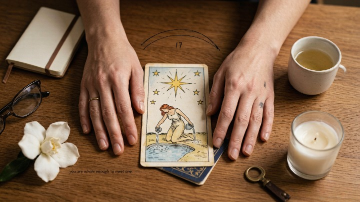
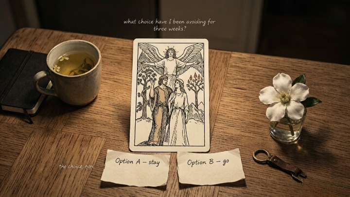

> The Lovers isn't about finding the right person. It's about making the right choice.

---

A client pulled The Lovers during a career reading and immediately deflated. "I'm not even dating anyone," she said. "This must be a mistake."

I asked her what decision she'd been avoiding.

She went quiet for about ten seconds. Then she told me she'd been offered a promotion — one that would move her to a different city, away from her family, into a role she wasn't sure she wanted. She'd been sitting on the offer for three weeks, telling herself she was "weighing options" when really she was avoiding the discomfort of choosing.

The Lovers wasn't predicting romance. It was pointing directly at the choice she'd been dodging — the one where her head said one thing, her heart said another, and neither answer felt completely right.

---

### 💔 What The Lovers Actually Represents

The Lovers is card six in the Major Arcana — and it's the most consistently misread card in the deck. Everyone sees two people, a winged figure above them, and assumes: *romance.* Soulmate. Twin flame. Love is coming.

That interpretation isn't wrong — but it's incomplete in a way that misses the card's deeper meaning entirely.

> In the Rider-Waite-Smith imagery, The Lovers depicts a man and woman standing beneath an angel — but the original Renaissance decks depicted a man standing between two women, choosing. One represents virtue. The other represents desire. The card has always been about choice — specifically, the choice between what feels good and what *is* good.

The angel above isn't blessing a union. It's witnessing a decision. The mountain in the background isn't a romantic backdrop — it's the difficult path that follows once the choice is made. **The Lovers is the card of the crossroads where love and values collide — and you can't have both.**

### 🔥 When The Lovers Appears in a Reading

**The core answer:** The Lovers signals a choice that carries moral or emotional weight — a decision where no option is entirely wrong and no option is entirely right, and the act of choosing will define something about who you are.

Here's what The Lovers actually indicates in different contexts:

* **Love and relationships:** This is the one time the romantic reading applies — but even here, the card is about choice, not destiny. The Lovers asks: *is this relationship aligned with who you want to become?* Not "is this your soulmate?" but "are you choosing this person with your whole self?"
* **Career:** You're at a fork. Two paths. One is safer, more comfortable, aligned with what others expect. One is riskier, truer, aligned with something you haven't fully admitted you want. The Lovers doesn't tell you which to pick. It tells you that either choice will cost something — and the cost you're willing to pay says something about who you are.
* **Spiritual growth:** A value system is being tested. Something you believe is being challenged by something you feel, and you can't keep both. The card asks: *what are you willing to sacrifice to stay aligned with yourself?*

> *When you have to make a choice and don't make it, that is in itself a choice.* — William James

---

### 🪞 The Lovers Reversed: When You're Avoiding the Choice

**The core answer:** The Lovers reversed doesn't mean a bad relationship or a wrong choice. It means *refusing to choose.* The discomfort of the crossroads has become so unbearable that you've opted out — staying in limbo, staying in a relationship you've outgrown, staying in a job you resent, telling yourself you're "still deciding" when really you've decided to do nothing.

The reversed Lovers is one of the most uncomfortable cards to sit with because it removes the illusion of being stuck. **You are not stuck. You are avoiding.** That's a harder truth, but it's also a more useful one — because avoidance is a choice, and choices can be changed.

Some questions the reversed Lovers might be asking:
* What decision have I been postponing because both options scare me?
* Am I staying in something not because it's right, but because leaving is hard?
* If I already knew what I was going to choose, what would I be afraid of?

### ✨ What The Lovers Is Not

Let's clear a few things:

* The Lovers does **not** mean someone is your soulmate. It means you're at a choice point in a relationship. That choice could be to deepen it, to leave it, or to redefine it.
* The Lovers does **not** guarantee a happy ending. Some choices The Lovers brings are painful. The card isn't promising comfort — it's promising clarity, which is often uncomfortable first.
* The Lovers does **not** mean you'll find love soon. If you're single and pull The Lovers, look for the *choice* you're wrestling with — not the person you're waiting to meet.

---

#### 🧪 Quick Self-Check

If The Lovers appears in your reading, ask yourself:

* What decision am I sitting on right now?
* If I already knew what the "right" choice was, what would I be afraid of?
* Am I confusing comfort with alignment?
* What would I choose if no one else's opinion mattered?

**The Lovers isn't asking who you belong with. It's asking who you're becoming — and whether your choices are getting you there.**

## 🔮 When You Need Help Making the Choice

Some crossroads are too close to see. You've weighed every option, written every pro-con list, asked every friend — and the answer still isn't clear. That's not failure. It's proximity.

A skilled tarot reader can lay out your situation in symbols and reflect back the choice you've been avoiding — often in the first three cards. Oranum screens every reader through a **live demonstration reading** before they accept clients. Their refund policy: twenty-four hours, no questions. First session costs less than lunch. No subscription.

**Try it once.** Ask about the crossroads. See what the cards show. Sometimes what you need isn't more information — it's someone to hold up the mirror.

---

My client took the promotion. Moved cities. Left her family behind — not permanently, but in a way that was hard and lonely for the first few months.

She told me later that the hardest part wasn't the move. It was admitting that she wanted the job more than she wanted to stay comfortable. The Lovers didn't make the decision for her. It just made it impossible to pretend she didn't already know what she was going to choose.

She's still in that city. Still in that role. She pulls The Lovers now and then — but these days it shows up during smaller choices. What to prioritize. Where to put her energy. The card doesn't scare her anymore. It just asks: *are you choosing with your whole self?*

---

*Tomorrow: how to ask tarot better questions — the single skill that separates confused readings from clear ones, and why "what should I do?" is almost never the right thing to ask.*
